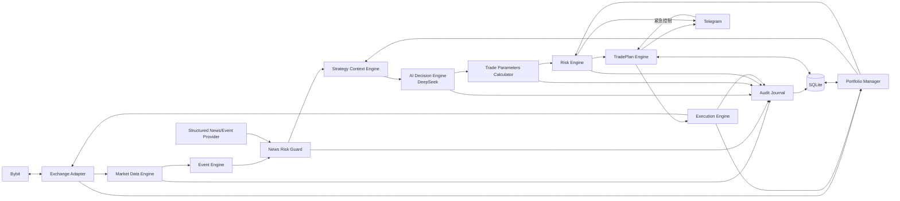
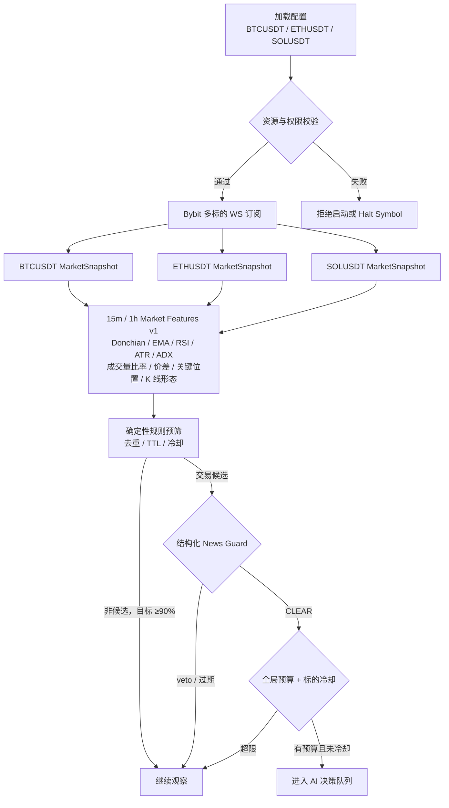
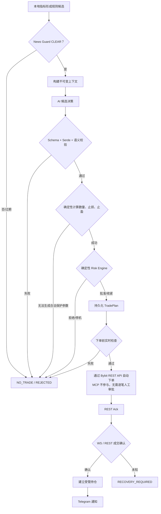
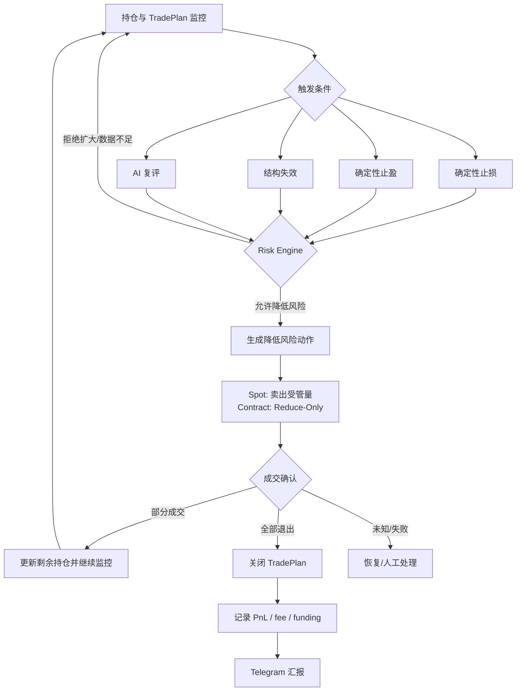
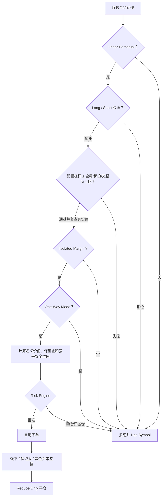
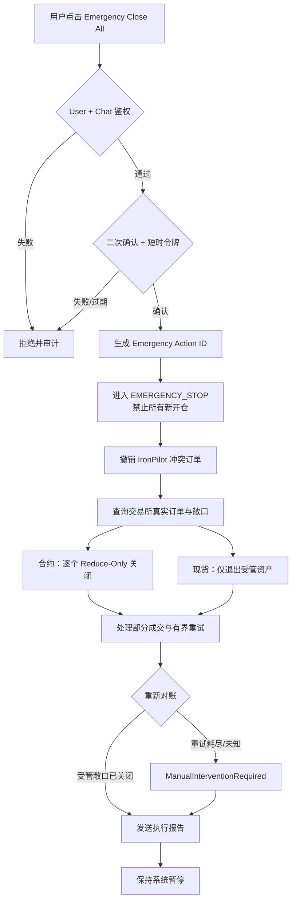
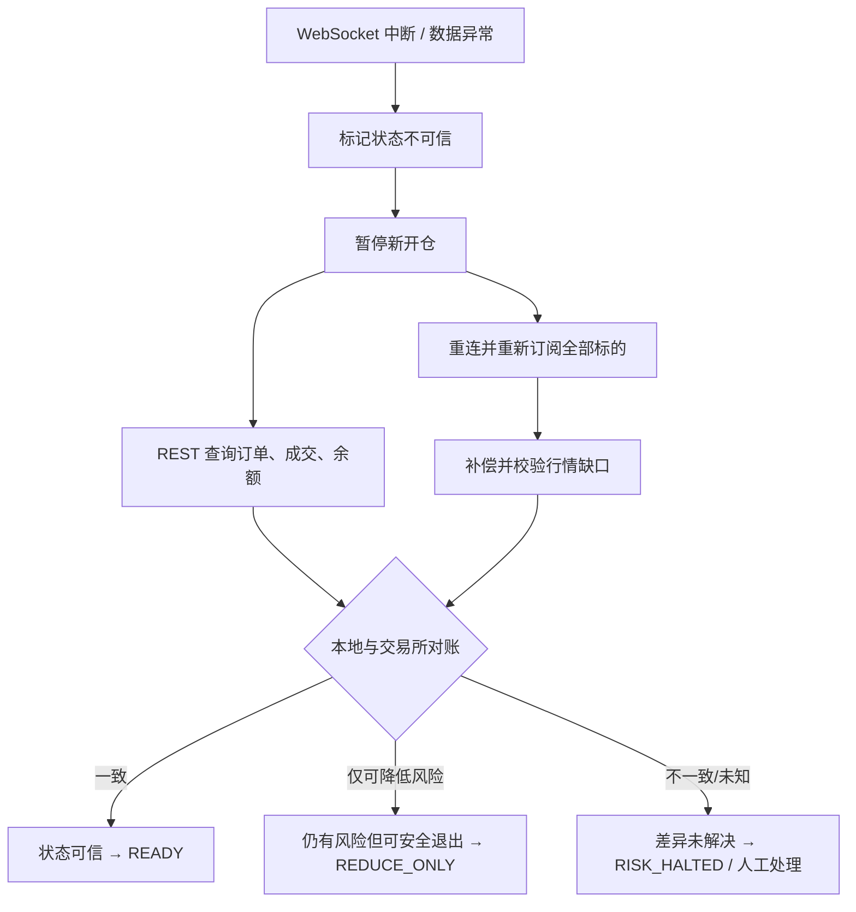
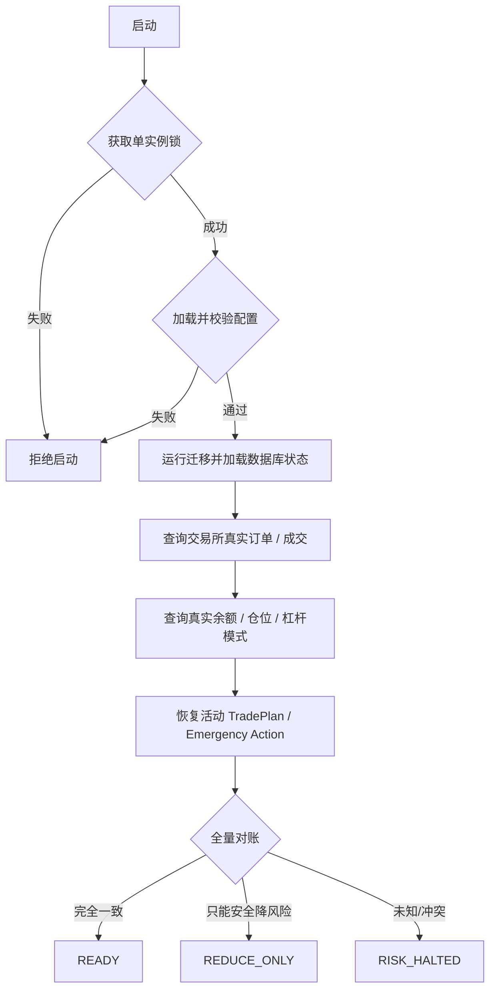
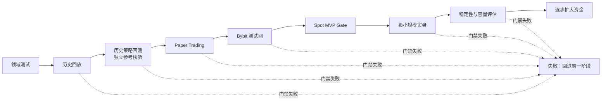

# IronPilot 开发任务计划

> 文档状态：`ACTIVE`
> 版本：`1.3.0`
> 基线日期：2026-07-24
> 当前阶段：`P0 — Architecture Baseline`
> 唯一权威来源：本文件是后续开发任务、依赖、状态、验收证据和阶段进度的唯一基准。

## 0. 计划治理与使用规则

### 0.1 权威性

1. 任何实现工作开始前，必须引用本文件中的稳定 Task ID。
2. 新需求必须先映射到已有 Task ID；无法映射时，先修改本计划，再修改代码。
3. 任务状态、依赖、范围或验收门槛只在本文件更新；Issue、聊天和 Commit 只作为证据，不替代本文件。
4. 同一时间最多一个任务处于 `IN_PROGRESS`；可并行的验证子项记录在任务证据中，不拆成隐形任务。
5. 只有交付物、测试、文档与验收证据全部满足，任务才能标记 `DONE`。
6. 仓库内低风险开发可以按依赖连续推进；真实资金、部署、密钥配置、测试网/实盘账户写操作及不可逆外部动作，必须在执行当时获得明确授权。
7. 任何失败关闭（fail closed）门禁不得由实现者自行降低标准；无法满足时标记 `BLOCKED` 并记录证据。

### 0.2 状态定义

| 状态 | 含义 | 允许动作 |
|---|---|---|
| `PLANNED` | 范围和验收已定义，依赖尚未满足 | 只读研究、依赖准备 |
| `READY` | 前置依赖全部完成，可开始 | 将其切换为唯一 `IN_PROGRESS` |
| `IN_PROGRESS` | 正在实现或验证 | 修改范围内代码、测试和本计划证据 |
| `BLOCKED` | 存在无法在授权范围内消除的阻塞 | 记录阻塞、保持安全默认值 |
| `DONE` | 交付物与全部门禁通过 | 允许解锁直接依赖任务 |
| `DEFERRED` | 已作出明确范围决策，当前版本不实施 | 只能通过计划变更重新激活 |

### 0.3 每次开发的闭环

`选择 READY Task → 更新为 IN_PROGRESS → 实现最小充分改动 → 窄范围验证 → 记录命令与结果 → 更新设计/迁移说明 → 标记 DONE 或 BLOCKED → 解锁下一 Task`

### 0.4 计划变更控制

- 资金安全、幂等、对账、状态机和审计门禁只能收紧；放宽必须记录独立决策及反例测试。
- MVP 范围变化、交易产品变化、真实资金门禁、交易所/LLM Provider 变化必须更新 ADR 或等价决策记录。
- 任务重排必须保持 Task ID 不变；被替代任务标记 `DEFERRED`，不得复用其 ID 表示新语义。
- `DONE` 任务若发现验收证据失效，回退为 `READY`，并记录失效原因和受影响下游任务。

### 0.5 当前进度总表

| Task ID | 名称 | 阶段 | 状态 | 直接依赖 | 完成证据 |
|---|---|---|---|---|---|
| `P0-01` | 架构基线与权威计划 | P0 | `DONE` | 无 | 本文、`CONTEXT.md`、ADR-0001/0002/0003/0004 |
| `P1-01` | Rust 工程骨架与质量门禁 | P1 | `READY` | `P0-01` | 尚未执行 |
| `P1-02` | 核心领域类型与状态机 | P1 | `PLANNED` | `P1-01` | 尚未执行 |
| `P1-03` | 配置、多标的与启动校验 | P1 | `PLANNED` | `P1-02` | 尚未执行 |
| `P1-04` | SQLite、迁移、审计与单实例锁 | P1 | `PLANNED` | `P1-02` | 尚未执行 |
| `P1-05` | 可观测性与运行时监督 | P1 | `PLANNED` | `P1-01`,`P1-04` | 尚未执行 |
| `P2-01` | Bybit 公共 REST 元数据 | P2 | `PLANNED` | `P1-03` | 尚未执行 |
| `P2-02` | 多标的公共 WebSocket | P2 | `PLANNED` | `P2-01`,`P1-05` | 尚未执行 |
| `P2-03` | Market Data 与 Event Engine | P2 | `PLANNED` | `P2-02` | 尚未执行 |
| `P2-04` | 历史回放与可复现快照 | P2 | `PLANNED` | `P2-03`,`P1-04` | 尚未执行 |
| `P2-05` | 结构化 News Risk Guard | P2 | `PLANNED` | `P2-03`,`P2-04` | 尚未执行 |
| `P3-01` | Portfolio、受管资产账本与对账 | P3 | `PLANNED` | `P1-04`,`P2-01` | 尚未执行 |
| `P3-02` | 确定性 Risk Engine | P3 | `PLANNED` | `P1-02`,`P3-01` | 尚未执行 |
| `P3-09` | 确定性 Trade Parameters Calculator | P3 | `PLANNED` | `P2-03`,`P3-01` | 尚未执行 |
| `P3-03` | TradePlan Engine 与持仓管理 | P3 | `PLANNED` | `P1-02`,`P3-02`,`P3-09` | 尚未执行 |
| `P3-04` | DeepSeek Decision Provider | P3 | `PLANNED` | `P2-04`,`P2-05`,`P3-02` | 尚未执行 |
| `P3-05` | 现货 Paper Execution | P3 | `PLANNED` | `P3-01`,`P3-03` | 尚未执行 |
| `P3-10` | 历史策略回测与独立参考 | P3 | `PLANNED` | `P2-04`,`P3-02`,`P3-05`,`P3-09` | 尚未执行 |
| `P3-06` | AI 驱动现货 Paper 闭环 | P3 | `PLANNED` | `P3-04`,`P3-05`,`P3-09`,`P3-10` | 尚未执行 |
| `P3-07` | Telegram 通知与只读查询 | P3 | `PLANNED` | `P1-05`,`P3-03` | 尚未执行 |
| `P3-08` | 紧急撤单与现货退出 | P3 | `PLANNED` | `P3-01`,`P3-05`,`P3-07` | 尚未执行 |
| `P4-01` | Bybit 私有流与现货订单同步 | P4 | `PLANNED` | `P2-02`,`P3-01` | 尚未执行 |
| `P4-02` | Bybit 现货测试网执行 | P4 | `PLANNED` | `P4-01`,`P3-08` | 尚未执行 |
| `P4-03` | 故障恢复与长期稳定性 | P4 | `PLANNED` | `P4-02` | 尚未执行 |
| `P4-04` | Spot MVP Release Gate | P4 | `PLANNED` | `P4-03` | 尚未执行 |
| `P5-01` | 永续合约领域扩展 | P5 | `DEFERRED` | `P4-04` | Spot MVP 后 |
| `P5-02` | 合约 Paper/Testnet 执行与风险 | P5 | `DEFERRED` | `P5-01` | Spot MVP 后 |
| `P6-01` | 极小规模实盘准备 | P6 | `DEFERRED` | `P4-04` 或 `P5-02` | 独立授权 |
| `P6-02` | 容量评估与资金扩容 | P6 | `DEFERRED` | `P6-01` | 独立授权 |

### 0.6 修订记录

| 版本 | 日期 | 变更 |
|---|---|---|
| `1.0.0` | 2026-07-24 | 建立 Spot-first MVP、任务和阶段门禁 |
| `1.0.1` | 2026-07-24 | 将“流行、活跃、许可证兼容的开源依赖优先”升级为强制原则；DeepSeek 改用 `async-openai`，Telegram 首选 `teloxide`，Bybit 增加 SDK-first 评估门禁 |
| `1.1.0` | 2026-07-24 | 冻结“技术指标 → 规则预筛 → 结构化新闻守卫 → LLM 候选 → 确定性交易参数 → Bybit API 执行”业务链；新增 `P2-05`、`P3-09` 和 ADR-0002 |
| `1.2.0` | 2026-07-24 | 迁移 alphaMind 中可复算的指标与 K 线形态语义合同；冻结 `ironpilot-market-features-v1`、15m/1h 周期职责、失败语义、开源指标库选型门禁和 ADR-0003 |
| `1.3.0` | 2026-07-24 | 新增 `P3-10` 历史策略回测与独立参考；采用“复用 IronPilot 领域链 + 开源框架能力验证 + Freqtrade 离线参考”的组合方案，新增 ADR-0004 |

---

## 1. 执行摘要

IronPilot 是以自动执行为核心的受限自治交易系统。本地先对已闭合 15m/1h K 线计算版本化 Donchian、EMA、RSI、ATR、ADX、成交量比率、EMA 排列、关键位置和 K 线形态语义，并结合实时价差形成可信市场特征；确定性规则过滤绝大多数无交易价值场景，结构化 News Risk Guard 只负责否决风险事件。只有形成交易候选时才调用 AI，AI 只产生语义 `CandidateDecision`；数量、止损和止盈由确定性代码计算，最终再由 `RiskEngine`、状态机、账户真实状态和执行前检查共同决定是否允许产生订单。任何无法确认的状态都默认拒绝新开仓。

最终推荐为 Rust 模块化单体、Tokio 有界事件管道、SQLite WAL、Bybit V5 Adapter、DeepSeek 单 Provider、Telegram 通知/紧急控制和单容器 Linux 部署。首个 Spot MVP 支持多标的配置，但通过资源预算限制启用数量；完成可复现行情回放、完整历史策略回测、实时 Paper Trading 和 Bybit 测试网闭环后结束。回测复用 IronPilot 自身领域链，先验证 NautilusTrader、Barter 等开源框架的可嵌入能力，并使用 Freqtrade 作为确定性子集的离线独立参考；任何回测框架都不成为生产订单权威。USDT 本位线性永续合约、极小规模实盘和资金扩容分别位于后续独立阶段。

系统不承诺盈利。优先级固定为：资金安全 → 风险边界 → 状态一致性 → 可恢复性 → 可审计性 → 执行纪律 → 策略收益。

## 2. 项目定位

IronPilot 验证的不是“AI 能否预测市场”，而是“AI 候选决策能否在不可绕过的确定性约束下持续完成可恢复、可审计的交易闭环”。系统允许错过交易，不允许因数据陈旧、状态不可信、重复请求或模型异常而错误交易。

目标部署为 2 核 CPU、2 GB RAM 的 Linux 主机。架构不绑定数百 USDT；风险使用净值比例、风险预算、流动性和名义价值上限，未来可增加订单拆分和容量模型而不重写领域层。

## 3. 与 alphaMind 的业务边界

| 维度 | IronPilot | alphaMind |
|---|---|---|
| 核心目的 | 受限自治执行闭环 | 研究、分析、策略辅助和人机协作 |
| AI 权限 | 仅提交候选决策 | 可用于研究与辅助判断 |
| 正常审批 | 确定性规则自动审批 | 依其自身产品流程 |
| 交易执行 | 审批后自动执行 | 不是 IronPilot 的执行依赖 |
| 代码/数据 | 独立仓库、独立配置、独立审计 | 不共享运行时状态 |
| 关系 | 无运行时依赖 | 不是上游或子模块 |

IronPilot 允许在标明来源后迁移 alphaMind 中有用且可复算的指标公式、受控枚举和脱敏测试向量，但必须在本仓库重新版本化、独立实现并通过 parity tests；这不构成运行时依赖，也不让 alphaMind 成为数据或决策权威。不得复制 alphaMind 的隐藏状态、凭据、Prompt、模型输出或交易结论作为 IronPilot 的可信输入。未来若发生运行时数据集成，仍必须作为不可信外部输入重新校验。

## 4. 目标与非目标

### 4.1 Spot MVP 目标

- 单 Bybit 专用子账户，多现货标的配置和并发行情订阅。
- `BTCUSDT`、`ETHUSDT`、`SOLUSDT` 等只是配置示例，不是硬编码白名单。
- 15m 主决策周期与 1h 趋势确认周期；按 `ironpilot-market-features-v1` 计算 Donchian、EMA、RSI、ATR、ADX、成交量比率、EMA 排列、关键位置、K 线形态语义和实时价差。
- 确定性规则预筛，目标是在代表性 Replay/Paper 数据中阻止至少 90% 非候选场景进入 LLM；硬预算仍是最终成本上限。
- 一个结构化新闻/事件源和 veto-only `NewsRiskGuard`；数据过期或不可用时默认禁止新的 AI 开仓。
- DeepSeek 结构化候选决策，Schema、Serde、语义、时效和动作合法性校验。
- 确定性 Trade Parameters Calculator 计算最终数量、止损和止盈；Risk Engine 审批，TradePlan 状态机持久化。
- 受管资产账本、幂等 Bybit API 执行和完整审计。
- 历史行情回放、复用生产领域语义的完整历史策略回测、实时 Paper Trading、Bybit 测试网现货闭环。
- Telegram 通知、只读查询、暂停、撤单和受管资产紧急退出。
- 实盘默认关闭，测试网验收不自动升级为实盘。

### 4.2 Spot MVP 非目标

- USDT 永续合约、杠杆、强平管理和资金费率的可运行实现。
- 真实资金交易、共用账户、多账户、多交易所。
- 高频、网格、Martingale、无限补仓、跨所套利、多腿、期权。
- 强化学习、多智能体、自动训练、实盘自动调参或自动切换模型。
- 复刻 Freqtrade 的 Web UI、Hyperopt、插件市场等完整产品能力，或由回测结果自动修改生产策略/风险配置。
- 微服务、Kafka、Redis、Kubernetes、复杂前端、移动 App。
- Telegram 自然语言下单、逐笔审批或风险参数修改。

### 4.3 MVP 后目标

`P5` 在不改变 Spot 语义的前提下增加 `LinearPerpetual`、Long/Short、Isolated Margin、One-Way Mode、可配置杠杆、资金费率和 Reduce-Only；`P6` 才讨论极小规模实盘与资金扩容。

## 5. 已确认决策与设计原则

### 5.1 已确认决策

1. 首个闭环是 AI 驱动现货，合约推迟至 Spot MVP 后。
2. Spot MVP 以 Bybit 测试网验收结束，实盘单独放行。
3. MVP 仅实现 DeepSeek，保留 `DecisionProvider` 边界。
4. 使用专用 Bybit 子账户和本地受管数量账本。
5. 后续开发按 Task ID 与证据门禁连续推进；外部高风险动作即时授权。
6. 实现优先采用流行、维护活跃、许可证兼容的开源库；自研只限领域差异与没有合格依赖覆盖的最小协议层。
7. News Risk Guard 使用结构化事件源且只能否决；LLM 不产生可执行仓位、止损或止盈。
8. 生产执行只走 Bybit REST/Private WebSocket API Adapter；MCP 只可用于开发期只读诊断，不能持有运行时交易权限。
9. 迁移 alphaMind 的有用指标与形态计算合同，但不建立代码、配置、数据库或运行时依赖；IronPilot 使用独立版本、实现和证据链。
10. 历史策略回测复用 IronPilot 的 Market Feature、Rule Prefilter、Trade Parameters、Risk、TradePlan 和 Paper Execution 领域链；开源框架作为可替换组件或独立参考，不得建立第二套生产订单权威。

### 5.2 不可妥协原则

- **Fail closed**：解析、数据、时钟、连接、账户或订单状态不确定时禁止新开仓。
- **Exchange is external truth**：交易所真实订单/成交/余额是外部事实源；本地数据库是审计和恢复源，二者冲突时进入对账流程，不能静默覆盖。
- **AI has no authority**：AI 不能访问密钥、交易所、文件系统或 Shell，不能修改配置、杠杆、风险和 Prompt。
- **Deterministic executable parameters**：AI 只描述市场语义和候选动作，最终数量、止损、止盈、价格量化和订单参数全部由可复现的确定性代码生成。
- **Veto-only news**：新闻守卫只允许拒绝、观察、只减仓或停机；不得因为新闻“利好”批准原本不成立的交易。
- **Exactly-once business effect, not transport fantasy**：网络只能提供至少一次或未知结果；通过稳定幂等键、查询确认和状态机实现一次业务效果。
- **Bounded resources**：channel、任务数、历史窗口、LLM 并发、队列和数据库增长均有硬上限。
- **Audit before action**：下单意图、风险裁决和幂等键必须先持久化；持久化失败不得下单。
- **No automatic recovery to trading**：严重异常、紧急退出和实盘门禁不得仅因进程恢复而自动开启交易。
- **Open-source first, evidence first**：HTTP、WebSocket、LLM Client、Schema、数据库、Telegram、配置、密码学和可观测性优先使用成熟开源库，不重复实现已有通用能力；“开源”本身不等于可用，仍必须通过维护、安全、许可证、资源和协议能力评估。
- **Versioned market semantics**：指标公式、窗口、平滑、warm-up、量化、缺失值、形态优先级和受控语义必须随 `feature_version` 冻结；不得在版本不变时静默改变含义。
- **Research is evidence, not authority**：回测数据、撮合假设、模型 stub、参数、代码和报告必须绑定不可变 manifest；回测盈利不能覆盖安全失败，也不能直接修改生产配置或授权实盘。

### 5.3 权威业务主链

```text
Bybit REST / WebSocket 行情与账户事实
→ 本地 15m / 1h Market Features v1（Donchian / EMA / RSI / ATR / ADX / 成交量比率 / 关键位置 / K 线形态）+ 实时价差
→ 确定性 Rule Prefilter 过滤绝大多数非候选
→ 结构化 News Risk Guard（veto-only）
→ 仅候选调用 DeepSeek
→ Schema / Serde / 语义校验
→ 确定性 Trade Parameters Calculator 计算数量、止损、止盈
→ Risk Engine 审批或收紧
→ 持久化 TradePlan 与执行前检查
→ Bybit REST API 下单、Private WebSocket / REST 确认和对账
→ Telegram 通知已确认结果
```

MCP 不在生产主链中。它最多用于开发期只读诊断，不能持有交易密钥、不能被 LLM 调用，也不能绕过 `ExchangeAdapter`、Risk Engine、TradePlan 或审计。

## 6. 总体架构

### 6.1 推荐方案

采用单进程模块化单体：

- 单进程避免分布式事务和消息系统开销，适合 2 核 2 GB。
- 模块通过领域类型与内部 Trait 解耦，不通过网络拆服务。
- Tokio 有界 `mpsc` 管道承载行情、市场事件和执行事件；`watch` 传播只读运行状态；监督器负责取消与有界关闭。
- SQLite 使用 WAL、显式 `busy_timeout`、小连接池和短事务；交易关键写入使用单写者策略。
- Axum 只提供本机/受保护管理面、health/readiness，不暴露交易命令。

### 6.2 允许的依赖方向

```text
runtime/api/notification
        ↓
application services (event, strategy_context, trade_plan, execution, reconciliation)
        ↓
domain (types, state machines, risk rules, invariants)
        ↑
ports (ExchangeAdapter, repositories, DecisionProvider, NotificationService)
        ↑
adapters (Bybit, DeepSeek, SQLite, Telegram)
```

规则：

- `domain` 不依赖 Bybit JSON、SQLx、HTTP、Telegram 或 LLM SDK。
- Adapter 负责将外部字段映射为领域类型，原始响应只能进入审计存储。
- `risk` 可读不可变快照，不调用交易所、不调用 LLM、不写数据库。
- `execution` 只能消费已持久化且获批的 `TradePlan` 操作。
- `notification` 观察领域事件，不参与正常交易批准。
- MCP 不属于生产依赖方向；运行时 `ExchangeAdapter` 直接使用 Bybit API，LLM 永远不能持有或间接调用交易 Adapter。

### 6.3 推荐技术栈

| 能力 | MVP 选择 | 取舍 |
|---|---|---|
| Rust async | Tokio | 成熟；必须使用有界队列和受监督任务 |
| HTTP | reqwest + rustls | 成熟开源传输层；由上层 SDK/Adapter 注入并统一配置连接池、超时和 TLS |
| WebSocket | tokio-tungstenite | 成熟开源 WS 基础设施；Bybit Adapter 只实现交易所协议映射与状态语义 |
| 管理 API | Axum | 仅 health/readiness/受鉴权只读与紧急端点 |
| 序列化 | serde + serde_json | 外部数值字符串先解析为 Decimal |
| JSON Schema | schemars + jsonschema | 从类型生成 Schema，并使用独立 validator 做本地严格校验 |
| Decimal | rust_decimal | 禁止交易金额使用 `f64` |
| 技术指标 | 活跃开源 Rust TA 库优先，否则 `rust_decimal` 最小递推 | 库必须复现冻结公式、warm-up 和失败语义；不得为了使用库而改变领域合同 |
| 历史策略回测 | IronPilot 领域链 + 经 `P3-10` 验证的开源组件 + Freqtrade 离线参考 | 当前没有预设“Freqtrade 的 Rust 等价物”；框架不得接管生产订单、配置或数据库 |
| 数据库 | SQLite + SQLx | WAL、小连接池、迁移；达到迁移门槛后评估 PostgreSQL |
| 日志 | tracing + JSON formatter | 全链路 Correlation ID，禁止敏感字段 |
| 配置 | config + serde + YAML/环境变量 | 复用成熟分层配置；密钥只来自环境/Secret |
| 结构化新闻 | Provider SDK 优先，否则 reqwest 薄 Adapter | 只接收有来源、发布时间、影响范围和过期时间的结构化事件 |
| LLM | async-openai + DeepSeek-compatible base URL | 复用开源 Chat Completions client；`DecisionProvider` 只做边界映射，本地仍严格校验 |
| Telegram | teloxide | 复用 callback query、dispatcher 与 Bot API 类型；紧急状态仍落 SQLite |
| 部署 | 单容器 + 持久卷 | 不引入编排集群 |
| CI | GitHub Actions | fmt、clippy、单元、集成、依赖与密钥扫描 |

### 6.3.1 开源依赖优先与选型门禁

每个通用能力按以下顺序选择：

1. 官方维护且满足协议、安全和资源要求的开源 SDK。
2. Rust 生态中流行、维护活跃、接口边界清晰的开源库。
3. 基于成熟基础库实现最薄的项目 Adapter。
4. 只有前三者均不满足时，才允许自研通用协议能力。

候选依赖必须在 `P1-01` 或首次引入它的 Task 中记录：

- crate、repository、许可证与拟锁定版本。
- 最近 release/commit、维护者活跃度、下载量/依赖者/Star 等多维采用度；不得用单一 Star 数决定。
- RustSec/advisory、`unsafe` 使用、传递依赖、MSRV、二进制体积和 2C2G 资源影响。
- timeout、retry、proxy、TLS、日志脱敏和测试注入是否可控。
- 是否完整覆盖目标协议；未覆盖部分必须明确到字段/endpoint，不能笼统写“自研 Adapter”。
- 替换成本、退出方案和 contract test 范围。

项目仍保留 `ExchangeAdapter`、`DecisionProvider`、`NotificationService` 等反腐层；这些层负责领域映射、权限和错误分类，不重新实现 HTTP client、WebSocket runtime、JSON Schema engine、Telegram dispatcher 或通用重试算法。

如果跳过已有成熟库，Task 必须提交 Dependency Decision Record，列出被评估候选、拒绝证据、自研最小范围、额外测试与维护责任。没有该记录不得合并。低采用度或停更的“现成 SDK”不自动优于 `reqwest`、`tokio-tungstenite` 等成熟基础库。

### 6.3.2 首批推荐依赖边界

| 场景 | 首选 | 边界 |
|---|---|---|
| DeepSeek | `async-openai` | 使用 `OpenAIConfig::with_api_base` 指向 DeepSeek；禁止手写请求/响应 DTO 和 raw HTTP 调用 |
| AI Schema | `schemars` + `jsonschema` + `serde` | Provider JSON 模式不能替代本地 Schema 与语义校验 |
| News Risk Guard | 先评估结构化 Provider SDK；否则 `reqwest` | Adapter 只做事件 DTO 映射；守卫规则必须是本地确定性代码 |
| Telegram | `teloxide` | 使用 callback query/dispatcher；业务鉴权、nonce 和 EmergencyAction 仍由 IronPilot 管理 |
| Bybit REST | 先评估合格开源 Bybit Rust SDK；否则 `reqwest` | SDK/基础库之上只保留签名、DTO 映射、错误分类和对账语义 |
| Bybit WebSocket | 先评估同一 SDK 的 WS 能力；否则 `tokio-tungstenite` | 不自研 WS framing、TLS、heartbeat runtime；只实现 topic/auth/事件映射 |
| 技术指标 | 首先评估活跃、流行且许可证兼容的 Rust TA crate | 必须以 alphaMind 迁移向量和独立参考向量验证 Wilder/EMA/Donchian 语义；不满足时只自研缺失的最小递推，不创建通用 TA 框架 |
| 历史策略回测 | `P3-10` 先验证 NautilusTrader、Barter 与 Freqtrade 离线参考 | NautilusTrader 能力完整但依赖面较大；Barter 是模块化 Rust 库而非开箱即用 Freqtrade；Freqtrade 只用于无密钥独立参考。未完成能力/许可证/资源/语义评估前不锁定框架 |
| 配置 | `config` + `serde` | 不自研配置合并、环境覆盖和反序列化框架 |
| 密钥内存保护 | `secrecy` | 禁止 Secret 通过 `Debug`/`Display` 泄漏 |
| 错误类型 | `thiserror` | 保持可分类错误，不用自由字符串驱动重试 |

DeepSeek 首选 `async-openai`，因为当前能力覆盖自定义 `api_base`、HTTP client 注入、backoff 和 Chat `response_format`，同时保持比完整 Agent framework 更窄的依赖面。`rig-core` 的原生 DeepSeek Provider 作为备选，但 MVP 不需要其 Agent、tool 或 RAG 抽象；raw `reqwest` 自行构造 Chat Completions 已明确拒绝。`P1-01/P3-04` 仍需用当时版本重新核对许可证、维护状态和 DeepSeek contract test。

版本策略：在 `P1-01` 锁定 `rust-toolchain.toml` 和 `Cargo.lock`；依赖升级单独提交并重新运行门禁。当前文档只锁定能力和首选库，不猜测未来 crate 版本号；真正引入前必须按上述门禁复核当前版本。

### 6.4 资源预算

| 资源 | Spot MVP 默认上限 | 超限行为 |
|---|---:|---|
| 启用标的 | 5 | 启动失败并列出超限配置 |
| 同时活动 TradePlan | 3 | 新候选被 Risk Engine 拒绝 |
| 每标的行情 channel | 1,024 events | 合并可丢行情；关键私有事件不得丢并触发 halt |
| 全局关键事件队列 | 256 | 低优先级丢弃并计数；高优先级触发降级 |
| LLM 并发 | 1 | 排队到 TTL，过期转 `NO_TRADE` |
| 每标的 LLM 调用 | 默认 4/hour | 进入观察模式 |
| 全局 LLM 调用 | 默认 40/day | 只做确定性持仓管理 |
| K 线内存窗口 | 每标的每周期 500 根 | 滚动淘汰 |
| SQLite pool | 2–4 connections | 等待到超时，关键写失败触发 halt |
| 进程内存软门槛 | 1.4 GB | 禁止新 LLM/新开仓并告警 |

这些是安全默认值，必须由配置校验；不是策略收益参数。

## 7. 多交易对配置模型

### 7.1 配置分层

```yaml
runtime:
  mode: paper
  max_enabled_instruments: 5
  max_active_trade_plans: 3

exchange:
  provider: bybit
  environment: testnet
  account_scope: dedicated_subaccount

llm:
  provider: deepseek
  model: deepseek-chat
  max_concurrency: 1
  daily_call_limit: 40
  daily_token_limit: 200000
  daily_cost_limit_usd: "2.00"

risk:
  max_portfolio_exposure_pct: "0.30"
  max_single_trade_risk_pct: "0.005"
  max_daily_loss_pct: "0.02"
  max_drawdown_pct: "0.08"
  max_open_positions: 3

trading:
  instruments:
    - id: bybit:spot:BTCUSDT
      symbol: BTCUSDT
      instrument_type: spot
      enabled: true
      allowed_sides: [buy]
      ai_entry_enabled: true
      reduce_only: false
      observe_only: false
      max_position_pct: "0.10"
      max_notional_usdt: "500"
      risk_budget_pct: "0.003"
      min_order_amount_usdt: "10"
      max_slippage_bps: 20
      timeframes: [15m, 1h]
      feature_profile: ironpilot-market-features-v1
      strategy_profile: trend_default
      llm_cooldown_seconds: 900
      trade_cooldown_seconds: 3600
      max_daily_entries: 3
      risk_group: crypto_major
```

### 7.2 校验规则

- `InstrumentId = exchange + instrument_type + symbol`，全局唯一。
- Spot 只允许 `Buy/OpenLongEquivalent` 和卖出已受管数量；不得 `OPEN_SHORT`。
- `observe_only=true` 或 `ai_entry_enabled=false` 时，任何开仓候选均拒绝。
- `reduce_only=true` 时只允许降低受管数量。
- 本地最小/最大金额只是更严格上限，不能替代交易所动态约束。
- 启动时查询 Bybit `instruments-info`，校验 `Trading` 状态、`tickSize`、最小金额、数量精度和最大数量；缓存带 `fetched_at` 与版本摘要。
- Spot MVP 的 `feature_profile` 固定为 `ironpilot-market-features-v1`，必须包含 15m 主周期和 1h 确认周期；窗口、平滑、量化和形态阈值不能按标的私自覆盖。实验性参数必须使用新 feature version 并先进入 Replay/Paper。
- 配置热加载在 MVP 仅允许降低风险或关闭标的；扩大权限需要重启、审计和启动检查。
- 删除有活动 TradePlan 或受管余额的标的配置必须失败。

### 7.3 并发与组合风险

- 每标的维护独立 `MarketSnapshot`，共享全局风险快照。
- `risk_group` 为相关性扩展点；MVP 使用静态分组上限，不实时计算相关矩阵。
- 全局优先级：紧急/私有成交/风险边界 > 对账 > 持仓复评 > 开仓事件 > 定时观察。
- 同一标的最多一个活动 TradePlan；全账户再受最大活动计划与最大敞口限制。
- LLM 预算先做全局原子预留，再做标的冷却；调用失败也计入调用次数和成本审计。

## 8. 现货与合约产品模型

### 8.1 共享模型

共享 `InstrumentId`、`Money`、`Price`、`Quantity`、`OrderIntent`、`OrderState`、`Fill`、`TradePlan`、幂等键、审计元数据和风险快照。外部 Decimal 必须保留交易所精度，任何舍入使用产品约束明确指定方向。

### 8.2 不可强行统一的语义

| 语义 | Spot | Linear Perpetual |
|---|---|---|
| 持有对象 | `SpotBalance` / 受管数量 | `DerivativePosition` |
| 方向 | 买入资产、卖出受管资产 | Long / Short |
| 敞口 | 数量 × 价格 | 合约数量 × 标记价格 |
| 保证金 | 无杠杆现货现金 | 初始/维持保证金 |
| 杠杆 | 不适用 | 部署配置，AI 无权修改 |
| 退出保护 | 卖出受管数量 | `reduce_only=true` |
| 强平/资金费率 | 不适用 | 必须监控 |

### 8.3 合约阶段最终推荐

`P5` 默认只支持 USDT Linear Perpetual、Isolated Margin、One-Way Mode；禁止 Cross/Portfolio Margin 和 Hedge Mode。配置杠杆同时受全局、标的和交易所最大值约束。启动、开仓前、重启恢复时都查询真实杠杆/模式；已有仓位时不得自动修改不一致配置。平仓订单必须显式 `reduce_only`，止损保护无法建立时立即进入降低风险流程。

## 9. 数据流

1. Config Loader 解析并静态校验标的、风险、预算和运行模式。
2. Exchange Adapter 通过 Bybit REST 获取动态交易规则、服务器时间和账户快照，通过 WebSocket 接收行情与私有事件。
3. Market Data Engine 构建每标的 `MarketSnapshot`，只对已闭合 15m/1h K 线计算 `ironpilot-market-features-v1`，并独立维护实时价差。
4. Rule Prefilter 使用确定性阈值、数据质量、冷却和持仓状态过滤绝大多数场景，只为潜在候选创建带 TTL 的 `MarketEvent`。
5. News Risk Guard 查询或匹配结构化风险事件；高风险、过期或来源不可用时 veto，禁止新的 AI 开仓。
6. 只有通过预筛与新闻守卫的候选，Strategy Context Engine 才组合市场、账户、TradePlan、数据质量和允许动作。
7. DeepSeek 产生不含可执行数量、止损和止盈的语义 `CandidateDecision`；原始响应先审计后校验。
8. Trade Parameters Calculator 根据结构、ATR、配置风险预算、最小风险回报比、费用、滑点和交易所精度，确定性计算数量、止损和止盈。
9. Risk Engine 使用不可变快照审批或进一步收紧 `TradeParameters`，不得扩大风险。
10. 获批结果创建或推进持久化 TradePlan；Execution 再做实时前置检查。
11. 执行先写幂等意图，再通过 Bybit REST API 提交订单；MCP 不参与生产执行，REST ack 不等于成交。
12. Bybit 私有 WebSocket 与 REST 对账确认订单、成交和余额。
13. Portfolio 与 TradePlan 更新，Audit Journal 形成完整链路，Telegram 在结果确认后异步通知。

关键数据必须携带 `correlation_id`、`snapshot_id`、`event_id`、`decision_id`、`risk_decision_id`、`trade_plan_id` 和适用的 `order_link_id`。

### 9.1 `ironpilot-market-features-v1`

`ironpilot-market-features-v1` 迁移 alphaMind 中已经冻结且对 IronPilot 有用的指标公式与形态语义，但重新绑定到 IronPilot 的 15m/1h 数据质量、版本和审计合同。alphaMind 代码、数据库、Prompt 和运行时服务不参与生产链路；只允许使用标明来源、无凭据、无交易结论的公式、枚举和测试向量作为迁移证据。

每个 `MarketFeatureSnapshot` 只能绑定一个 `InstrumentId`、一个 timeframe、一个最后闭合时间、一个 `feature_version`、完整参数文档与规范化输入 hash。15m 和 1h 必须分别计算，不能把两个周期的 candle 混入同一递推。默认只使用每周期最近 500 根连续已闭合 K 线；重启、REST 补缺、WebSocket 实时路径和 Replay 必须对相同规范化窗口产生相同结果。

| 字段 | `v1` 冻结定义 | 当前 K 线 |
|---|---|---|
| `donchian_upper` | 当前 K 线之前 20 根已闭合 K 线的最高价 | 排除 |
| `donchian_lower` | 当前 K 线之前 10 根已闭合 K 线的最低价 | 排除 |
| `atr` | `ATR(20)`；True Range 以简单均值播种，随后使用 Wilder/RMA | 包含 |
| `ema_fast` | `EMA(20)`；前 20 个 close 以简单均值播种，随后使用 `2 / 21` | 包含 |
| `ema_slow` | `EMA(50)`；前 50 个 close 以简单均值播种，随后使用 `2 / 51` | 包含 |
| `volume_ratio` | 当前 volume ÷ 前 20 根已闭合 K 线平均 volume | 分子包含，基线排除 |
| `rsi` | Wilder `RSI(14)`；平均 gain/loss 以 14 个 delta 播种后 RMA | 包含 |
| `adx` | Wilder `ADX(14)`；TR、`+DM`、`-DM` 与 DX 使用 RMA，首值至少需要 28 根 K 线 | 包含 |
| `ema_alignment` | `close > EMA20 > EMA50` 为 `bullish`，反向为 `bearish`；EMA 间距达到 `0.5 × ATR20` 升级为 `strong_*`，其他为 `mixed` | 包含 |
| `key_location` | 当前 close/extreme 距 Donchian 上下轨或方向合法的 EMA50 不超过 `0.25 × ATR20` 时为 `support`/`resistance`，否则为 `none` | 包含 |
| `spread_bps` | 最新可信 best bid/ask 的相对价差；带独立 tick-level `as_of`，不得伪装成 K 线指标 | 不适用 |

数值指标的规范输出使用 Decimal，最多保留 8 位小数并采用 half-even；交易价格和数量仍按交易所精度向降低风险方向量化，二者不能混用。`RSI`/`ADX` 合法范围为 `[0,100]`。RSI 的平均 gain/loss 同时为零、ATR/TR 不可计算、成交量基线或当前成交量为零时，对应字段为不可用，不得伪造中性值。

### 9.2 K 线形态与受控语义

K 线形态是确定性 `PatternObservation`，不是开仓、平仓或反转指令。只有 `key_location` 为 `support` 或 `resistance` 时才允许输出形态；普通区间噪音输出 `null`。同一周期同时命中多个形态时只保留固定优先级最高的一项。

| `candlestick_pattern` | 冻结规则 | `pattern_semantic` |
|---|---|---|
| `bullish_engulfing` | 前阴后阳，当前实体完整包含前一实体 | `bullish_reversal` |
| `bearish_engulfing` | 前阳后阴，当前实体完整包含前一实体 | `bearish_reversal` |
| `bullish_harami` | 前阴实体至少 `1 × ATR`，当前小阳实体不超过前一实体的 0.5 且被包含 | `bearish_momentum_exhaustion` |
| `bearish_harami` | 前阳实体至少 `1 × ATR`，当前小阴实体不超过前一实体的 0.5 且被包含 | `bullish_momentum_exhaustion` |
| `big_bullish` | 阳线实体严格大于 `2 × ATR` | `bullish_attack` |
| `big_bearish` | 阴线实体严格大于 `2 × ATR` | `bearish_attack` |
| `hammer` | support；下影严格大于 `2 × body`，上影严格小于 `0.1 × body` | `bullish_support_rejection` |
| `hanging_man` | resistance；下影严格大于 `2 × body`，上影严格小于 `0.1 × body` | `bearish_exhaustion` |
| `shooting_star` | resistance；上影严格大于 `2 × body`，下影严格小于 `0.1 × body` | `bearish_resistance_rejection` |
| `inverted_hammer` | support；上影严格大于 `2 × body`，下影严格小于 `0.1 × body` | `bullish_support_test` |
| `doji` | 非零振幅且实体严格小于 `0.1 × range` | `indecision` |

冲突优先级固定为表中顺序：吞没 → 孕线 → 大实体 → 位置相关影线 → doji。零振幅不识别形态；零实体只可能识别为 doji，不参与需要实体分母的比例判断。`candlestick_pattern=null` 是“未命中或不在关键位置”的合法观察，不等于数据错误。

### 9.3 周期职责、完整性和失败语义

- Bybit WebSocket 持续监听并更新未闭合 candle、成交和盘口；未闭合 candle 只用于展示和执行前价格检查，不进入指标、结构、形态或候选生成。
- 每个 15m 收盘事件更新完整 15m 特征并触发一次 Rule Prefilter；它是 Spot MVP 的主决策周期。
- 每个 1h 收盘事件更新完整 1h 特征；15m 候选只读取最近一根已闭合且未过期的 1h 快照作为趋势确认，不等待下一根 1h candle。
- 任一 timeframe 的 snapshot 在 `as_of - completed_at > timeframe` 时视为陈旧。15m 主快照或所需 1h 确认快照缺失、陈旧、跨市场、跨周期、重复、乱序、有 gap、含 future candle 或输入 hash 不匹配时，不得产生新的 AI 开仓候选。
- EMA50 是最长基础窗口，因此至少需要 50 根连续已闭合 K 线；每个指标仍保留自己的 warm-up reason。核心字段 `Donchian/ATR/EMA/volume_ratio/RSI/ADX/ema_alignment` 任一不可用时 snapshot 不可用于扩大风险。
- 形态和语义必须由本地代码产生，LLM 不读取原始 K 线后自行命名形态；AI 只接收受控数值、枚举、时间、版本和数据质量。
- 指标库选择遵循开源优先门禁。`P2-03` 必须先证明候选库能复现本合同及迁移 fixtures；如果没有合格库，只允许基于 `rust_decimal` 实现缺失的最小递推，并提交 Dependency Decision Record，不能自建通用技术分析框架。

## 10. 核心领域模型

### 10.1 值对象与实体

| 类型 | 关键不变量 |
|---|---|
| `InstrumentId` | 交易所、产品、symbol 均不可空；不可只用 symbol 比较 |
| `MarketSnapshot` | 单标的、单 `as_of`、带数据质量与来源序列 |
| `MarketFeatureSnapshot` | 单标的、单 timeframe、只绑定连续已闭合 K 线；包含 feature/参数版本、输入 hash、freshness 和不可用原因 |
| `PatternObservation` | 只能来自版本化确定性规则和合法关键位置；`null` 表示未命中，不产生交易权限 |
| `NewsRiskEvent` | 来源、外部事件 ID、发布时间、接收时间、影响标的/风险组、严重度和过期时间不可缺失 |
| `CandidateDecision` | 绑定 snapshot/event/prompt/model；不包含 API 权限、数量、止损或止盈 |
| `TradeParameters` | 由确定性版本化算法生成数量、止损、止盈、费用和滑点缓冲；不接受 AI 数值 |
| `RiskDecisionRecord` | 输入摘要、规则版本、命中规则、原值和调整值不可变 |
| `TradePlan` | 一个标的最多一个活动实例；状态只能合法迁移 |
| `OrderIntent` | 绑定 TradePlan action version 和唯一幂等键 |
| `ManagedLot` | 来源 Fill、剩余数量、成本、状态可追溯 |
| `PortfolioSnapshot` | 交易所事实与本地受管视图分层保存 |
| `ReconciliationRun` | 比较范围、差异、决议、恢复状态不可变 |
| `EmergencyAction` | 鉴权主体、确认令牌、幂等 ID、每步结果可恢复 |
| `BacktestManifest` | 数据、新闻、模型桩、配置、算法、执行模型、费用、随机种子和代码版本全部冻结并可校验 hash |
| `BacktestReport` | 绑定唯一 manifest；交易账本、权益曲线、指标、基准、假设、告警和跨引擎差异不可拆分 |

### 10.2 金额与风险公式

- Spot 名义价值：`notional = quantity × execution_price`。
- 单笔计划风险：`risk_amount = managed_quantity × abs(entry_price - stop_price) + estimated_fees + slippage_buffer`。
- 账户净值风险比例：`risk_pct = risk_amount / trusted_equity`。
- Spot 敞口比例：`exposure_pct = managed_asset_market_value / trusted_equity`。
- 回撤：`drawdown = max(0, peak_equity - current_equity) / peak_equity`。
- 合约后续：`initial_margin ≈ notional / leverage`，但交易所真实保证金与维持保证金必须以 API 结果校验，不能只依赖本地近似。

分母为零、负数、过期或不可信时，风险计算返回不可审批，不返回零风险。

## 11. 模块划分与目录

```text
src/
  config/           # YAML、环境变量、静态与动态校验
  domain/           # 值对象、实体、不变量、状态机
  exchange/         # ExchangeAdapter port 与 Bybit adapter
  market_data/      # 聚合、完整性、MarketSnapshot 与实时价差
  market_features/  # 版本化指标、关键位置、形态语义与迁移 parity
  event/            # 检测、去重、优先级、TTL
  news_guard/       # 结构化新闻事件、时效和 veto-only 规则
  strategy_context/ # 构建紧凑且受限的 AI 上下文
  ai/               # DecisionProvider、DeepSeek、Schema 校验
  trade_parameters/ # 确定性数量、止损、止盈和价格量化
  risk/             # 纯确定性规则与组合审批
  trade_plan/       # TradePlan 生命周期与持仓管理
  backtest/         # 历史策略编排、框架适配、报告与独立参考比较
  execution/        # Paper/Bybit 执行、订单幂等与恢复
  portfolio/        # 余额、受管账本、净值、敞口
  reconciliation/  # 本地与交易所状态比较和恢复
  notification/    # Telegram 通知与只读查询
  emergency/       # 暂停、撤单、紧急退出编排
  storage/         # SQLx repositories、迁移与事务边界
  audit/            # 不可变审计事件与脱敏
  api/              # health/readiness/受保护管理面
  runtime/          # 启动、监督、关闭、系统状态
migrations/
tests/
  contract/
  integration/
  replay/
  backtest/
docs/
  adr/
prompts/
  versions/
config/
  examples/
```

纯单元测试优先模块：`domain`、指标计算、`event` 预筛、`news_guard` 规则、`trade_parameters`、`risk`、`trade_plan` 状态机、金额/精度计算、AI 语义校验。外部依赖模块必须通过 contract/integration test 验证，不能用 mock 成功替代真实协议门禁。

## 12. 系统状态机

### 12.1 状态

| 状态 | 新开仓 | 降低风险 | 进入条件 |
|---|---:|---:|---|
| `STARTING` | 否 | 否 | 进程启动 |
| `SYNCING` | 否 | 仅恢复动作 | 配置、DB、交易所同步中 |
| `READY` | 否 | 是 | 状态可信但交易未启用 |
| `OBSERVING` | 否 | 是 | 行情观察/LLM 预算耗尽 |
| `TRADING_ENABLED` | 是 | 是 | 全部门禁通过 |
| `PAUSED` | 否 | 仅显式允许 | 人工暂停 |
| `REDUCE_ONLY` | 否 | 是 | 风险阈值或部分降级 |
| `RISK_HALTED` | 否 | 按恢复计划 | 风险/状态不可信 |
| `EMERGENCY_STOP` | 否 | 仅紧急退出 | 紧急操作已确认 |
| `ERROR_RECOVERY` | 否 | 按恢复计划 | 连接/存储/未知订单恢复 |

### 12.2 合法迁移

- `STARTING → SYNCING`：取得单实例锁并加载配置。
- `SYNCING → READY`：数据库迁移、时间、元数据、余额、订单和受管账本对账通过。
- `READY → TRADING_ENABLED`：运行模式允许且风险/数据门禁通过。
- `READY/TRADING_ENABLED → OBSERVING`：AI 入口关闭或预算耗尽，但状态可信。
- 任意非终止状态 → `PAUSED`：授权暂停。
- `TRADING_ENABLED/OBSERVING → REDUCE_ONLY`：达到风险阈值、数据降级但仍可安全退出。
- 任意状态 → `RISK_HALTED`：不可确认的账户/风险状态。
- 任意状态 → `EMERGENCY_STOP`：已鉴权且二次确认的紧急退出。
- `ERROR_RECOVERY → READY/REDUCE_ONLY/RISK_HALTED`：根据对账结果决定。

非法迁移必须返回领域错误、写审计、保持原状态；不得“为了恢复”跳过 `SYNCING` 或对账。`EMERGENCY_STOP` 不自动恢复，只能经全量启动检查进入 `READY`。

## 13. TradePlan 状态机

### 13.1 状态与迁移

```text
DRAFTED → RISK_REVIEW → APPROVED → ENTRY_PENDING
RISK_REVIEW → REJECTED
APPROVED → CANCELLED
ENTRY_PENDING → PARTIALLY_FILLED → POSITION_OPEN
ENTRY_PENDING → POSITION_OPEN
ENTRY_PENDING/PARTIALLY_FILLED → RECOVERY_REQUIRED
POSITION_OPEN → REDUCING → POSITION_OPEN
POSITION_OPEN/REDUCING → EXIT_PENDING → CLOSED
任意非终态 → RECOVERY_REQUIRED
RECOVERY_REQUIRED → 前一可信状态 / REDUCING / CLOSED / CANCELLED
```

### 13.2 规则

- `DRAFTED` 只能由通过本地校验的 Candidate Decision 创建。
- `APPROVED` 必须引用同一快照版本的 Risk Decision；超出 TTL 后重新审批。
- 每次执行动作递增 `action_version`，幂等键由 `trade_plan_id + action_version + purpose` 派生。
- 部分成交产生受管 Lot；剩余订单与已成交数量分别管理。
- `CLOSED` 只有在真实订单、余额、费用与本地受管数量对账后成立。
- 未知订单状态进入 `RECOVERY_REQUIRED`，禁止生成同目的新订单。

## 14. News Risk Guard 与 AI 决策协议

### 14.1 News Risk Guard 合同

`NewsRiskEvent` 必须是结构化数据，至少包含 `provider`、`external_event_id`、`published_at`、`received_at`、`event_type`、`severity`、`affected_instruments/risk_groups`、`expires_at` 和 payload hash。守卫输出固定为：

- `CLEAR`：未发现活动风险事件，可以继续后续候选流程。
- `OBSERVE_ONLY`：保留行情观察，禁止新的 AI 开仓调用。
- `HALT_SYMBOL`：受影响标的停止新开仓。
- `HALT_RISK_GROUP`：同一风险组停止新开仓。
- `HALT_SYSTEM`：全局高严重度事件或新闻源完整性失效。

守卫只能维持或降低权限，不能因为利好新闻创建 Candidate、提高 confidence、放大仓位或解除其他风险门禁。默认 freshness 超时进入 `OBSERVE_ONLY`；已有持仓继续由止损、止盈和紧急退出等确定性逻辑管理。系统不得宣称能够识别所有黑天鹅。

### 14.2 AI 输入

输入只包含经过压缩和标记的数据：标的、产品类型、UTC 时间、snapshot TTL、`feature_version`、输入 hash、15m/1h Donchian/EMA/RSI/ATR/ADX/成交量比率、EMA 排列、关键位置、受控 K 线形态/语义、实时价差、多周期一致性、受管余额、活动 TradePlan、风险预算、最近有限交易摘要、数据质量、允许动作，以及 `NewsGuardDecision` 的结果与结构化事件 ID。原始 K 线和原始新闻文本不进入 MVP Prompt；新闻数据不能改变系统指令，LLM 也不能重新计算或重命名本地指标与形态。

### 14.3 AI 输出草案

```json
{
  "schema_version": "1.0",
  "decision_id": "uuid",
  "snapshot_id": "uuid",
  "action": "NO_TRADE|OPEN_LONG|HOLD|REDUCE|EXIT",
  "instrument_id": "bybit:spot:BTCUSDT",
  "confidence": "0.00..1.00",
  "market_regime": "trend|range|breakout|uncertain",
  "thesis": "short bounded text",
  "entry_conditions": [],
  "invalidation_conditions": [],
  "expected_holding_seconds": 3600,
  "next_review_trigger": {},
  "data_quality_assessment": "acceptable|insufficient",
  "risks": []
}
```

Spot Schema 不接受 `OPEN_SHORT`、leverage、margin mode、shell command、provider/model、quantity、position size、stop loss、take profit、order type 或任何可执行价格字段。未知字段默认拒绝，防止协议悄然扩权。

### 14.4 AI 校验流水线

1. HTTP 状态、超时、响应大小和 content-type。
2. 空内容检测；DeepSeek JSON Output 的空内容视为失败。
3. JSON 解析和严格 Schema（`additionalProperties=false`）。
4. Serde 强类型、Decimal、枚举和长度限制。
5. `decision_id` 唯一，snapshot/event/prompt/model 完全匹配。
6. 数据 TTL、系统状态、标的状态和允许动作。
7. action、市场状态、entry/invalidation 语义和持仓状态的逻辑一致性。
8. 通过校验后才调用 Trade Parameters Calculator；不读取或推断模型提供的执行数值。

任何失败结果归一为 `NO_TRADE` + 审计原因，不自动换模型，不用自由文本补救。

### 14.5 DeepSeek MVP 约束

- `DecisionProvider` 通过 `async-openai` 的 `OpenAIConfig::with_api_base` 接入 DeepSeek，使用固定模型和非流式 Chat Completions；不手写 raw HTTP 请求、认证 header 或通用响应 DTO。
- 向 `async-openai` 注入统一配置的 `reqwest::Client`，显式设定 rustls、连接/请求超时、响应大小和代理策略；SDK backoff 必须显式配置，禁止接受不可审计的默认重试。
- 使用 `response_format=json_object` 获取 JSON，再由 `jsonschema`、Serde 和领域语义校验独立验证；SDK 成功不等于 Candidate Decision 合法。
- Prompt 必须包含 JSON 约束和示例，但示例不替代本地 Schema。
- 记录 Prompt hash/版本、模型、请求摘要、原始响应密文策略、Token usage、费用估算、延迟和错误。
- 重试只针对可分类的瞬时错误，最多有界次数，且不跨事件 TTL；429/长延迟触发预算退避。
- `P3-04` 必须完成真实 DeepSeek smoke test 与 usage 对账；离线 mock 不能关闭该门禁。

## 15. 确定性交易参数与硬编码风控规则

### 15.1 Trade Parameters Calculator

输入为已校验 Candidate Decision、它绑定的 `MarketSnapshot`/`MarketFeatureSnapshot`、Portfolio、Instrument Constraints 和 Risk Config。输出 `TradeParameters`，算法版本必须持久化并可在 Replay 中复现。

- **参考入场**：根据订单策略、最佳买卖价和允许滑点计算；下单前仍需重新检查。
- **止损**：由本地市场结构失效位与 ATR buffer 计算，并受最小/最大止损距离约束。不存在合法止损时拒绝交易。
- **止盈**：根据配置的最小风险回报比、下一结构目标和费用缓冲计算；结构目标无法满足最低风险回报比时拒绝交易，而不是压低门槛。
- **每单位风险**：`unit_risk = abs(reference_entry - stop_price) + fee_per_unit + slippage_buffer_per_unit`。
- **数量**：`quantity = min(risk_budget / unit_risk, max_position_qty, max_notional / reference_entry, available_quote_budget / reference_entry)`。
- **量化**：价格和数量始终向降低风险方向对齐交易所 `tickSize`、`qtyStep` 和最小金额。
- **不可变边界**：AI、News Risk Guard 和 Telegram 均无权覆盖计算结果；Risk Engine 只能拒绝或进一步收紧。

所有交易参数必须引用同一 `ironpilot-market-features-v1` 快照；不得用另一个周期、更新后的 ATR 或未闭合结构替换部分字段。指标定义、lookback、warm-up、缺失值、形态优先级和 K 线闭合规则以第 9 节为权威合同；未达到 warm-up 或输入不可信时不得形成交易候选。

### 15.2 审批顺序

`系统状态 → 数据可信度 → Rule Prefilter → News Risk Guard → 配置权限 → TradePlan 互斥 → TradeParameters 算法版本 → 账户净值 → 单笔风险 → 标的敞口 → 组合敞口/风险组 → 损失/回撤 → 冷却/次数 → 交易所约束 → 流动性/滑点 → 止损可建立性`

先失败的规则不能掩盖其他命中项；审计记录全部命中规则，但输出采用最严格结果。

### 15.3 结果

| 结果 | 含义 |
|---|---|
| `APPROVED` | 原候选在确定性限制内 |
| `ADJUSTED` | 数量/价格/保护条件被收紧，必须记录前后值 |
| `REJECTED` | 本次候选不得执行 |
| `REDUCE_ONLY` | 只允许降低现有敞口 |
| `HALT_SYMBOL` | 单标的停止新开仓 |
| `HALT_SYSTEM` | 全系统停止新开仓并进入风险处理 |

### 15.4 Spot MVP 规则

- 单笔风险、单标的敞口、风险组敞口、全账户敞口、最大活动计划和最大持仓数。
- 日/周损失、峰值回撤、连续亏损、全局/标的冷却、每日开仓次数。
- 最小/最大订单金额、动态交易所精度、最大价差和最大滑点。
- 最低可用 USDT、行情最大延迟、时钟偏差、公共/私有连接健康。
- AI confidence 门槛只作为拒绝条件，不作为扩大仓位依据。
- 止损保护无法建立、DB 关键写失败、未知订单、对账差异、预算数据缺失均禁止新开仓。
- 禁止亏损加仓、Martingale、重复订单和同一 Decision 重复执行。

规则版本使用内容 hash；每个 Risk Decision 保存精确版本与输入快照 ID。

## 16. 交易执行流程

### 16.1 正常现货开仓

1. 只接受 `TradePlanState::APPROVED`、未过期且绑定确定性 `trade_parameters_version` 的计划。
2. 从数据库事务内预留 `action_version`、生成 `order_link_id` 并写 `OrderIntent::Prepared`。
3. 重新读取最新价格、交易规则、可用余额、系统状态和风险快照。
4. 将数量向降低风险方向量化到 `qtyStep`，重新计算名义价值和风险；量化后低于最小金额则拒绝。
5. 在事务内写 `SubmissionStarted`，随后通过 Exchange Adapter 调用 Bybit API；MCP 不是运行时执行路径。
6. REST 成功仅标记 `AcknowledgedUnknownFinal`；通过私有 WebSocket 或 REST 查询确认最终状态。
7. 超时或连接断开时，先按 `order_link_id` 查询；状态未知期间禁止创建同目的新订单。
8. 成交后生成 `Fill` 和 `ManagedLot`，更新 TradePlan、Portfolio 和审计。

### 16.2 订单类型策略

- 正常入场默认使用带超时的 Limit；价格偏离或未成交后重新审批，不无限追价。
- Market 只允许配置明确许可、深度/价差满足且风险缓冲覆盖的场景。
- 正常退出可使用 Limit → 激进 Limit → Market 的有界升级，升级前重算滑点。
- 止损和紧急退出优先“确定退出”而非追求低滑点，但仍受交易所价格保护和受管数量上限约束。
- Spot Market Buy 必须明确 `marketUnit`，不能依赖交易所默认“按报价币金额”语义。

### 16.3 幂等与未知结果

`order_link_id` 必须稳定且可从业务动作重建；网络重试复用同一 ID。系统永远不把 timeout 等同于失败。查询不到订单时，在配置的可见性等待窗内继续对账；超过窗口进入 `RECOVERY_REQUIRED` 和 `RISK_HALTED`，由人工证据决定，不创建猜测性补单。

## 17. 合约杠杆和保证金管理

本节是 `P5` 的设计约束，不属于 Spot MVP 完成条件。

### 17.1 配置与上限

`effective_leverage = min(configured_leverage, symbol_risk_cap, global_risk_cap, exchange_max_leverage)`。任何值缺失、不合法或无法从交易所确认都禁止开仓。AI 输出 Schema 不包含 leverage。

### 17.2 启动与下单门禁

- 产品必须为 `LinearPerpetual`，结算币为 USDT，交易状态为 `Trading`。
- 账户必须是允许的 Unified Account，保证金模式为 Isolated，持仓模式为 One-Way。
- Bybit One-Way 下 `buyLeverage == sellLeverage`；设置后必须重新查询确认。
- 已有仓位时不自动切换 leverage/margin/position mode；差异进入 `REDUCE_ONLY` 或人工处理。
- 计算名义价值、预估初始保证金、维持保证金、安全余量和强平距离；再以交易所返回状态复核。
- 开仓成功但止损/保护单未确认时，不得把 TradePlan 视为正常持仓，必须执行降低风险流程。

### 17.3 平仓

所有合约退出订单显式 `reduce_only=true`；One-Way 使用 `positionIdx=0`。订单数量不得超过交易所真实仓位。紧急关闭支持分片、有界重试、部分成交后重新查询；`closeOnTrigger` 只在明确验证 Bybit 语义后使用，不作为 Reduce-Only 的替代。

## 18. Telegram 通知与紧急控制

### 18.1 权限边界

Telegram 负责通知、只读查询和有限紧急控制，不参与正常开仓/平仓审批。禁止自然语言下单、修改风险、修改止损以扩大亏损、切换模型、提升杠杆或启用标的。

### 18.2 通知

通知分为 `INFO`、`ACTION`、`RISK`、`CRITICAL`，均包含 UTC 时间、环境、系统状态和关联 ID。开仓/平仓通知包含标的、产品、方向、价格、数量、名义价值、费用、TradePlan、AI/Risk 摘要；合约阶段增加 leverage、margin、funding 和 liquidation risk。

通知投递失败不得阻塞交易状态落库；失败进入有界 outbox 重试并暴露指标。敏感字段、Prompt 原文和密钥永不发送。

### 18.3 只读查询

允许：系统状态、可信度、账户净值、可用余额、受管资产、活动 TradePlan、当日 PnL/回撤、最近风险/订单/对账、连接与预算状态。所有结果标注 `as_of` 和数据是否可信。

### 18.4 紧急操作

| 操作 | 行为 |
|---|---|
| `Pause New Entries` | 转 `PAUSED`，不影响已有保护 |
| `Resume` | 仅发起完整恢复检查，不能直接切 `TRADING_ENABLED` |
| `Cancel All Orders` | 只撤销 IronPilot 可证明归属的活动订单 |
| `Emergency Close All` | 转 `EMERGENCY_STOP`，撤冲突订单并退出受管敞口 |
| `System Status` | 只读，无状态变化 |

紧急操作要求 Telegram user/chat 双白名单、一次性短时令牌、二次确认、`EmergencyActionId` 幂等、重复点击合并、冷静期、逐步审计和完整报告。Telegram 不可用时，备用路径为本机受保护 CLI 或 loopback-only 管理 API；两者复用同一 `EmergencyController`，不得实现旁路逻辑。

## 19. 数据库设计

### 19.1 SQLite 策略

- WAL、`foreign_keys=ON`、显式 `busy_timeout`、2–4 连接；关键写入短事务。
- schema migration 在启动时单实例执行；失败停在 `STARTING`。
- 数据库文件、WAL、备份和临时文件位于持久卷；磁盘空间低于硬门槛进入 `RISK_HALTED`。
- 大型原始行情不无限保存；审计、订单、成交、风险和紧急操作不可自动删除。

### 19.2 主要表

| 表 | 核心字段 | PK / FK / 唯一与索引 | 保留 |
|---|---|---|---|
| `system_state` | state, reason, version, changed_at | PK `singleton_id`; index changed_at | 永久状态变更另入 audit |
| `configured_instruments` | instrument_id, config_hash, enabled, payload, effective_at | PK instrument_id+version; unique config_hash | 永久 |
| `market_candles` | instrument_id, timeframe, open_time, OHLCV, complete | PK instrument+tf+open; index time | 默认 180 天，可导出后清理 |
| `market_feature_snapshots` | snapshot_id, instrument_id, timeframe, completed_at, feature_version, parameters_hash, input_hash, features, quality | PK snapshot_id; unique instrument+tf+completed+feature_version+input_hash; index instrument/time | 默认 365 天；被决策引用的永久 |
| `market_events` | event_id, market_snapshot_id, primary/confirmation_feature_snapshot_id, type, priority, expires_at, payload_hash | PK event_id; unique dedupe_key; index instrument/time | 默认 365 天 |
| `news_risk_events` | provider, external_event_id, published/received/expires_at, type, severity, scope, payload_hash | PK provider+external_event_id; index scope/severity/expires | 2 年；命中交易的永久 |
| `news_guard_decisions` | guard_id, event_id, market_event_id, result, rule_version, reasons, decided_at | PK; FK news/market event; unique market_event+rule_version | 永久 |
| `ai_decisions` | decision_id, event_id, feature_set_hash, prompt_version, model, raw_ref, parsed, usage, status | PK; FK event; unique provider_request_id; index instrument/time | 永久；原始大字段可归档 |
| `trade_parameters` | parameters_id, decision_id, algorithm_version, entry_ref, qty, stop, take_profit, risk, inputs_hash | PK; FK ai_decision; unique decision+algorithm_version | 永久 |
| `trade_plans` | plan_id, instrument_id, state, action_version, risk_id, timestamps, PnL | PK; FK risk; unique active instrument partial constraint由事务保证 | 永久 |
| `risk_decisions` | risk_id, decision_id, rule_version, result, hits, before/after | PK; FK ai_decision; unique decision+rule_version | 永久 |
| `order_intents` | intent_id, plan_id, action_version, purpose, idempotency_key, state | PK; FK plan; unique idempotency_key; index plan/state | 永久 |
| `orders` | order_id, order_link_id, exchange_id, intent_id, state, qty, price, raw_ref | PK; FK intent; unique order_link_id/exchange_id | 永久 |
| `order_events` | event_id, order_id, exchange_seq, status, occurred_at, payload_hash | PK; FK order; unique source+dedupe_key; index order/time | 永久 |
| `fills` | fill_id, order_id, exchange_fill_id, qty, price, fee, occurred_at | PK; FK order; unique exchange_fill_id | 永久 |
| `managed_lots` | lot_id, fill_id, instrument_id, acquired, remaining, cost, state | PK; FK fill; index instrument/state | 永久 |
| `spot_balances` | snapshot_id, asset, wallet, locked, managed, as_of | PK snapshot+asset; index as_of | 默认 365 天；日末永久 |
| `derivative_positions` | snapshot_id, instrument, side, qty, leverage, margin, liq, pnl | PK snapshot+instrument+side | `P5` 起永久日末/事件 |
| `portfolio_snapshots` | snapshot_id, equity, available, exposure, drawdown, trusted | PK; index as_of | 分钟级 90 天，日末永久 |
| `notifications` | notification_id, event_ref, channel, status, attempts | PK; unique event_ref+template+recipient | 365 天 |
| `emergency_actions` | action_id, actor, nonce_hash, state, requested/confirmed/completed | PK; unique nonce_hash | 永久 |
| `emergency_steps` | action_id, step_no, target, state, attempt, result | PK action+step; FK action | 永久 |
| `audit_logs` | audit_id, correlation_id, actor, action, object, before/after hash, time | PK; index correlation/object/time | 永久、append-only |
| `configuration_history` | version, config_hash, redacted_payload, actor, time | PK version; unique hash | 永久 |
| `daily_performance` | day, equity, realized, unrealized, fees, drawdown, trades | PK day+environment | 永久 |
| `reconciliation_runs` | run_id, scope, expected_hash, actual_hash, differences, result | PK; index time/result | 永久 |
| `backtest_runs` | run_id, manifest_hash, engine, code_version, status, started/completed_at, warnings | PK; unique manifest_hash+engine+code_version; index status/time | 永久元数据；大型产物外部归档 |
| `backtest_trades` | run_id, sequence, plan/action/order/fill refs, instrument, side, qty, price, fee, slippage, pnl | PK run+sequence; FK run; index instrument/time | 默认 2 年；Gate 证据永久 |
| `backtest_metrics` | run_id, scope, metric, value, unit, method_version | PK run+scope+metric; FK run | 永久 |
| `llm_usage` | call_id, decision_id, tokens, estimated_cost, provider_usage, time | PK; FK decision; index day | 永久汇总；明细 2 年 |
| `outbox` | message_id, type, payload_ref, state, attempts, next_attempt | PK; unique business_key; index state/time | 成功 30 天，失败永久 |

SQLite 不直接支持跨行“每标的一个活动 TradePlan”的通用 partial invariant 时，使用事务内查询 + 唯一 active slot 表 `active_trade_plan_slots(instrument_id PK, plan_id UNIQUE FK)` 强制执行，不能只依赖应用层先查后写。

### 19.3 增长与迁移门槛

每日记录 DB 大小、WAL checkpoint 时长和写锁等待。满足任一条件即评估 PostgreSQL：持续写锁影响关键事件、压缩后 DB 超过运维可控容量、需要多进程写入/远程高可用、备份恢复无法满足 RTO。迁移前保持 Repository Trait，不提前引入双写。

## 20. 安全设计

### 20.1 密钥与账户

- 专用 Bybit 子账户；API Key 只授予读取和交易，明确禁用提现。
- 测试网与实盘使用不同密钥、不同数据库、不同配置和不同容器卷。
- 密钥只从环境变量/Docker Secret 读取，不写配置、日志、审计、panic 或 Telegram。
- 推荐 IP 白名单；启动时验证账户 ID/环境指纹，防止测试配置连到主网。
- `.env`、数据库、日志和 Prompt 原始响应加入 `.gitignore` 并做 secret scan。

### 20.2 应用安全

- 管理 API 默认绑定 loopback；远程访问必须通过独立强鉴权和 TLS 反向代理。
- Telegram 回调验证 user/chat、nonce、TTL 和幂等，拒绝自由文本触发交易。
- LLM 只接收最小上下文，不接收密钥或可执行工具；Prompt/模型/Schema 由只读版本配置锁定。
- MVP 不把原始新闻文本交给 LLM；News Provider payload 先做大小/字段/时效校验，只以结构化守卫结论进入 AI 上下文。
- Bybit MCP 不得部署到生产运行时、不得持有交易 API Key，也不得作为 Execution Engine 的备用旁路。
- 对所有外部响应设置大小、深度、字符串长度、数值范围和超时限制。
- Cargo 依赖锁定、`cargo audit`/供应链扫描、许可证检查、Dependency Decision Record、容器非 root、只读 rootfs、最小 capability。
- 数据库在线备份加密并做恢复演练；备份未验证不能视为可恢复。

### 20.3 实盘防误启

实盘需同时满足：编译时不默认、配置 `mode=live`、环境指纹主网、专用账户、人工一次性启用令牌、启动检查全绿、Release Gate 已批准。任何单一开关都不能启用实盘。

## 21. 故障模式与恢复

### 21.1 状态策略

- `RO`：禁止新开仓，只允许经过校验的降低风险动作。
- `HALT`：禁止自动交易，进入对账/人工处理。
- `EMG`：保持 `EMERGENCY_STOP`，只执行同一紧急 Action 的恢复步骤。
- 所有恢复先读取交易所真实状态，再决定本地迁移；不得靠重放下单请求“试试看”。

### 21.2 Failure Modes 矩阵

| 失败模式 | 检测 | 默认行为（新开仓/退出/状态） | 恢复、去重与防扩大 | 人工与通知 |
|---|---|---|---|---|
| 公共 WS 中断 | heartbeat/last message TTL | 禁止；已有保护继续；`ERROR_RECOVERY` | REST 补缺、重连重订阅、K线连续性校验 | 超重试阈值告警 |
| 私有 WS 中断 | heartbeat/topic TTL | 禁止；谨慎退出；`RO` | REST 查订单/成交/余额，恢复后全量对账 | 立即 CRITICAL |
| REST 超时 | client timeout | 禁止相关新动作；未知写请求 `HALT` | 同 idempotency key 查询，不盲重发 | 多次失败人工 |
| 交易所未知错误 | retCode 分类失败 | 禁止；`HALT_SYMBOL` 或 `HALT` | 保存原始响应，人工分类前不自动降级为可重试 | CRITICAL |
| 下单成功但响应丢失 | timeout + 无 ack | 禁止同目的动作；`RECOVERY_REQUIRED` | 按 order_link_id 查私有流/REST | 超可见窗人工 |
| 本地失败但实际成交 | 对账发现 Fill | 禁止；可降低风险；`RO` | 导入真实订单/成交，重建 ManagedLot | CRITICAL |
| 部分成交 | order/fill qty 差 | 禁止重复入场；管理已成交部分 | 剩余与已成交分离，撤单/继续须新审批 | ACTION |
| 止损订单失败 | ack/私有状态 | 禁止新仓；立即降低风险；`RO` | 有界激进退出，按真实余额重算 | CRITICAL |
| Reduce-Only 失败 | retCode/状态 | 禁止；保持 `RO/EMG` | 重查仓位、精度、模式，分片重试 | 必须人工跟踪 |
| 杠杆设置失败 | API/复查不一致 | 合约禁开；现货不受影响 | 不创建仓位；已有仓位只减 | CRITICAL |
| 本地/交易所杠杆不一致 | 启动/周期查询 | 合约禁开；`RO` | 有仓不自动改；无仓经授权设置并复查 | 人工确认 |
| 保证金不足 | precheck/retCode | 拒绝；不扩大 | 重新计算，不自动加杠杆/转资金 | RISK |
| 接近强平 | liq distance | 禁止；强制降风险；`RO` | Reduce-Only 分片退出 | CRITICAL |
| 资金费率异常 | funding threshold | 禁止新增或减仓；`RO` | 重新评估持有成本 | RISK |
| 数据库锁定 | busy timeout | 禁止；`HALT` | 停止非关键写、checkpoint、恢复连接 | CRITICAL |
| 磁盘写满 | free-space threshold/write error | 禁止；`HALT` | 停非关键采集；不删除不可变审计 | 人工扩容 |
| 服务器重启 | startup path | 默认禁；`SYNCING` | 单实例锁、加载 DB、查真实状态、对账 | 恢复报告 |
| LLM 超时 | request deadline | `NO_TRADE`；持仓确定性管理 | 有界重试不跨 TTL | 计数/预算告警 |
| LLM 非法/空 JSON | parser/schema | `NO_TRADE` | 保存脱敏原文，不修补执行 | 超阈值告警 |
| LLM 自相矛盾 | semantic validator | `NO_TRADE` | 不调用第二模型自动裁决 | 审计 |
| LLM 超风险建议 | Risk rule | 拒绝/收紧；不扩大 | 记录 before/after 与规则 | RISK |
| 新闻源不可用/过期 | freshness/health | 禁止新的 AI 开仓；`OBSERVING` | 有界重试与缓存最后事件，但过期缓存不放行 | RISK，超阈值人工 |
| 新闻事件重复/乱序 | provider ID/time/hash | 去重；权限只能维持或降低 | 相同事件幂等，迟到高风险事件仍触发 veto | 审计 |
| 新闻源错误标的映射 | scope validator | 受影响范围不确定则扩大 veto，不批准交易 | 保存原始 scope 与规则版本，人工修正映射 | RISK/人工 |
| Telegram 不可用 | send failure/health | 交易可按状态继续；紧急用备用路径 | outbox 有界重试 | 管理面告警 |
| Telegram 重复提交 | nonce/action id | 合并到已有 Action | 返回相同状态，不重复撤单/平仓 | 审计 |
| 系统时钟偏差 | exchange time delta | 禁止；`HALT` | NTP/交换所时间复核 | CRITICAL |
| API Key 失效 | auth error | 禁止；`HALT` | 不自动切密钥 | 人工轮换 |
| 标的停止交易 | instrument status | `HALT_SYMBOL`；评估退出 | 刷新规则，不提交无效订单 | CRITICAL |
| 交易所维护 | status/errors | 禁止；已有保护监控 | 指数退避，恢复后全量对账 | CRITICAL |
| 极端行情/跳空 | volatility/gap/spread | 禁止新仓；优先降低风险 | 市价/激进限价有界升级，记录滑点 | CRITICAL |
| 流动性消失 | depth/spread threshold | 禁止；不盲目市价扩大损失 | 分片、等待或人工；风险持续告警 | 人工可能需要 |
| 用户手改订单 | 对账未知/变更 | 禁止；`RO` | 标记 external mutation，评估冲突后恢复 | 必须人工解释 |
| 用户手改仓位/余额 | 受管账本差异 | 禁止；`RO/HALT` | 不处置未知资产，重建归属证据 | 必须人工 |
| 用户手改杠杆 | 周期复查 | 合约禁开；`RO` | 有仓不自动覆盖 | 必须人工 |
| 多实例启动 | file/DB lease/account lock | 后启动实例退出 | lease 包含 owner/TTL，禁止抢占活实例 | CRITICAL |
| 紧急退出网络中断 | Action step timeout | 保持 `EMG` | 按同 Action ID 重查后继续未完成步骤 | 持续报告 |
| 紧急退出部分成功 | 真实余额/仓位非零 | 保持 `EMG` | 仅对剩余受管量下单，有界重试 | 人工接管阈值 |
| 账户存在未知现货资产 | wallet > managed ledger | 禁止对未知部分操作 | 专用子账户仍按证据归属，不默认全卖 | RISK/人工 |

## 22. 测试策略

### 22.1 测试层次

| 层次 | 目标 | 代表门禁 |
|---|---|---|
| 属性/单元 | 纯领域不变量、Decimal、状态机、风险 | proptest 边界、非法迁移、舍入方向 |
| Contract | Bybit/DeepSeek/Telegram 字段映射 | 保存的官方样本 + 错误样本，未知字段策略 |
| Integration | SQLite 事务、迁移、outbox、mock HTTP/WS | 重启、锁竞争、重复/乱序/丢失 |
| Replay | 历史输入可复现 | 同配置/Prompt/model stub 得到相同事件与裁决 |
| Backtest | 历史策略、成交与收益证据 | 同 manifest 的账本/权益/指标一致，无前视；与独立参考的差异全部解释 |
| Paper | 实时行情、不发真实订单 | 多标的 30 天稳定性、费用/滑点模拟 |
| Testnet | 真实 Bybit 协议 | 下单、撤单、部分成交、私有流、紧急退出 |
| Fault Injection | 失败恢复 | kill -9、断网、超时、磁盘阈值、未知结果 |

### 22.2 必测清单

- 多标的配置、重复 ID、超资源上限、热加载只能降权。
- `ironpilot-market-features-v1` 的 Donchian 20/10、EMA20/50、Wilder RSI14/ATR20/ADX14、volume ratio 20、EMA alignment、关键位置、15m/1h freshness、warm-up、闭合 K 线、缺失值、8 位 half-even 精度和已知向量。
- alphaMind 脱敏迁移 fixtures 与独立参考实现 parity；同 OHLCV/参数/版本必须 100% 一致，不同 timeframe 不比较数值相等。
- 11 种 K 线形态、位置过滤、冲突优先级、零实体/零振幅，以及 `null` 与数据错误的区分；任何形态都不能单独绕过 Rule Prefilter、News Guard 或 Risk Engine。
- Rule Prefilter 的确定性、候选去重、代表性数据过滤率与硬 LLM 预算兜底。
- News Risk Event 的来源、TTL、重复/乱序、scope 映射、source outage 和 veto-only 不变量。
- Spot 买入/卖出受管量、最小金额、tick/qty 舍入和手续费。
- 合约阶段：Long/Short、名义价值、保证金、leverage、Reduce-Only。
- 全部 Risk Rule 的边界值、组合风险、日损、回撤、冷却和并发竞争。
- System/TradePlan/Order/Emergency 状态机合法与非法迁移。
- DeepSeek 空内容、非法 JSON、截断、超长、未知字段、冲突和 Prompt injection 文本。
- AI 输出携带 quantity/stop-loss/take-profit/order 字段时必须 Schema 拒绝。
- Trade Parameters Calculator 对相同输入完全可复现，Risk Engine 不能把参数调整为更高风险。
- 历史策略回测的 manifest 完整性、前缀不变性、多周期对齐、收盘后最早可执行事件、费用/价差/滑点、跳空、部分成交、拒单/过期和模糊 K 线保守成交。
- 同一 manifest 重复回测的交易账本、权益曲线和指标 hash 必须一致；现金、Buy-and-Hold、SMA200 基准可独立复算；费用 2 倍与滑点 3 倍压力情景不得缺失。
- IronPilot 与独立回测参考在冻结策略子集上的差异必须逐笔分类并解释；回测进程不得读取交易密钥、访问交易端点或发起实时 LLM 调用。
- 同幂等键重复提交、REST ack 丢失、私有事件重复/乱序、部分成交。
- WS 重连重订阅、缺 K 补偿、时间偏差、API 限流。
- 服务重启、单实例锁、迁移失败、DB 锁、磁盘不足。
- 用户手改订单/余额、Telegram 未授权/重复点击、紧急流程中断恢复。

### 22.3 验证原则

每个 Task 使用最窄高信号命令；全仓检查只在阶段 Gate。测试网与 DeepSeek 真实 smoke 属于外部写/成本动作，执行时单独授权并使用无真实资金环境。工程正确性测试不能以“盈利”作为断言；策略评估必须如实报告收益、风险、基准与样本外结果，但不能用它们豁免安全门禁。

### 22.4 历史策略回测合同

回放、回测和 Paper 是三种不同证据，不得互相替代：

1. `P2-04` Market Replay 证明历史行情、特征、事件和裁决可复现，不计算或宣称策略收益。
2. `P3-10` Historical Strategy Backtest 在冻结历史数据上复用 IronPilot 的 Rule Prefilter、News Guard、DecisionProvider 录制件/确定性桩、Trade Parameters、Risk、TradePlan 和 Paper Execution 语义，输出完整交易与绩效证据。
3. `P3-06` Real-time Paper 证明实时连接、预算、并发、恢复和长时间运行稳定性，不替代历史样本外策略证据。

`P3-10` 必须先形成候选能力矩阵，再决定具体组合：

| 候选 | 可复用能力 | 必须验证的边界 | 默认角色 |
|---|---|---|---|
| NautilusTrader | Rust-native 事件引擎、确定性回测、Rust 策略和 Bybit 集成 | Python/Rust 混合依赖、LGPL-3.0、资源占用、数据/订单/成交语义映射和嵌入复杂度 | 主回测引擎候选 |
| Barter | Rust 模块化 live/paper/backtest 组件、策略/风险接口和绩效统计 | 不是开箱即用 Freqtrade；Bybit 与 Spot 成交语义覆盖、生产适用声明、持久化和报告完整度 | 可组合组件候选 |
| Freqtrade | 完整加密货币数据、回测、分析和成熟报告工作流 | Python、策略语义重复、与 IronPilot 状态机/风险模型不同，不得成为运行时依赖 | 无密钥离线独立参考 |
| IronPilot 原生编排 | 完全复用本项目领域 port、类型和执行语义 | 只能补框架胶水、时钟和报告缺口，不得自研通用交易框架或第二套订单管理器 | 候选均不满足时的最小回退 |

无论采用哪个引擎，都必须遵守同一执行模型：指标只使用已闭合 K 线；信号在收盘后生成，最早只能在下一可执行市场事件成交；Limit 触价不等于必然成交；存在单根 K 线同时触达止损/止盈等路径歧义时使用公开、版本化的保守顺序，或在有低周期/tick/orderbook 数据时下钻判定。手续费必须覆盖买卖双边，并显式模拟 spread、slippage、gap、partial fill、reject、expire、最小金额和精度。历史运行禁止调用实时 LLM；只允许使用绑定输入 hash 的录制决策或确定性 model stub，新闻事件也必须版本化。

每份报告至少包含：交易账本、权益曲线、净收益、最大回撤、胜率、Profit Factor、Sharpe、Sortino、Calmar、CVaR、换手率、暴露率、回撤修复时间、费用/滑点归因和事件计数；同时给出现金、Buy-and-Hold、SMA200 基准，以及正常成本、2 倍手续费、3 倍滑点压力情景。数据必须按 train/validation/forward 或 walk-forward 切分；MVP 不允许 Hyperopt 自动修改生产配置。

回测先通过正确性 Gate，再评价策略证据。收益、胜率或 Sharpe 不能抵消任何安全失败；但若样本外净收益为负、显著弱于适用基准，或在合理成本压力下失效，该版本不得升级为 `entry_enabled`，只允许进入 `OBSERVE_ONLY` Paper 继续收集证据。

## 23. 部署方案

### 23.1 单容器

- multi-stage Rust build，运行镜像非 root。
- 只读 root filesystem；`/data` 持久卷保存 DB/备份，`/config` 只读。
- 内存 limit 1.7 GB，预留 OS 空间；CPU limit 2 cores。
- `SIGTERM`：先禁止新开仓，停止新 LLM/市场事件，完成关键 DB flush，持久化 shutdown reason，再有界退出。
- readiness 只有在状态可信且依赖健康时成功；liveness 只表示监督器未死锁，不把 `RISK_HALTED` 当进程死亡。

### 23.2 环境隔离

`replay`、`backtest`、`paper`、`testnet`、`live` 使用独立配置目录、数据库和审计环境 ID；需要外部连接的环境再使用隔离的 API Key 与 Telegram 前缀。`backtest` 必须无交易凭据并禁用交易网络和实时 LLM。配置中 endpoint 与 environment 必须成对校验，禁止自由 URL 在 live 中绕过。

### 23.3 CI/CD

PR 门禁：format、clippy `-D warnings`（按项目基线）、单元/contract/integration、migration up/down policy、secret scan、dependency audit、Docker build 和计划状态一致性检查。CI 不持有实盘密钥，不运行真实交易。

## 24. 可观测性

### 24.1 日志与追踪

JSON structured logging，统一 `environment`、`correlation_id`、`instrument_id`、`event_id`、`decision_id`、`risk_decision_id`、`trade_plan_id`、`order_link_id`、`emergency_action_id`。敏感字段使用 allowlist 输出，不依赖事后正则脱敏。

### 24.2 指标

- Runtime：CPU、RSS、task 数、channel depth/drop、event loop lag。
- Exchange：WS last message/reconnect/resubscribe、REST latency/error/rate-limit headers、time drift。
- Data：每标的新鲜度、缺 K、重复/乱序、snapshot age。
- Trading：系统状态、活动 TradePlan、订单未知数、对账差异、重复业务效果（必须 0）。
- Risk：净值、回撤、敞口、拒绝/调整、只减仓/停机原因。
- LLM：调用、成功/失败/空响应、Token、费用、预算剩余、延迟。
- Storage：DB/WAL 大小、busy、checkpoint、磁盘、备份年龄与最近恢复演练。
- Emergency：Action 状态、剩余受管敞口、失败步骤和重试。

### 24.3 健康语义

- `/livez`：进程监督器可响应。
- `/readyz`：配置、DB、必要连接和对账满足当前模式；`RISK_HALTED/EMERGENCY_STOP` 返回 not ready。
- `/status`：受鉴权，返回状态、原因、`as_of` 和各依赖可信度，不泄露账户敏感细节。

MVP 不引入 ELK/Prometheus server 集群；先暴露 metrics endpoint、结构化日志和 Telegram 关键告警。

## 25. 成本控制

| 成本 | MVP 控制 | 扩展信号 |
|---|---|---|
| 服务器 | 单 2C2G、单进程、有限缓存 | 稳定触及 CPU/RSS 门槛才扩容 |
| DeepSeek | 关键事件、并发 1、全局/标的预算、上下文压缩 | 按决策质量与真实 usage 调整 |
| 结构化新闻 | 单一低成本 Provider、按标的/风险组缓存、只在候选前查询匹配 | 覆盖率、延迟和误报实测后再增加第二源 |
| 存储 | K 线/快照分层保留、不可变审计归档 | DB 锁与恢复时间触发 PostgreSQL 评估 |
| Telegram | Bot API 无平台费，控制消息量 | 通知积压/限流 |
| 手续费/点差 | Paper/Testnet 记录 maker/taker 模型 | 实盘成交偏差驱动 |
| 滑点/冲击 | 最大 bps、深度门槛、未来拆单接口 | 名义价值占深度比例上升 |
| 资金费率 | Spot MVP 不适用 | `P5` 纳入持有成本与退出阈值 |

LLM 预算耗尽时停止新 AI 开仓，已有 TradePlan 由确定性保护和退出逻辑管理；不得自动切换未知模型或省略风险校验继续交易。

## 26. 关键 Rust 接口与类型草案

以下代码只冻结边界和语义，不是完整实现；最终错误类型、生命周期和泛型在对应 Task 中以最小复杂度收敛。

```rust
use rust_decimal::Decimal;
use serde::{Deserialize, Serialize};
use uuid::Uuid;

#[derive(Clone, Debug, Eq, PartialEq, Hash, Serialize, Deserialize)]
pub struct InstrumentId {
    pub exchange: ExchangeId,
    pub instrument_type: InstrumentType,
    pub symbol: String,
}

#[derive(Clone, Copy, Debug, Eq, PartialEq, Hash, Serialize, Deserialize)]
pub enum InstrumentType {
    Spot,
    LinearPerpetual,
}

#[derive(Clone, Copy, Debug, Eq, PartialEq, Serialize, Deserialize)]
pub enum TradeSide {
    Buy,
    Sell,
}

#[derive(Clone, Copy, Debug, Eq, PartialEq, Serialize, Deserialize)]
pub enum PositionSide {
    Long,
    Short,
    Flat,
}

#[derive(Clone, Copy, Debug, Eq, PartialEq, Serialize, Deserialize)]
pub enum DecisionAction {
    NoTrade,
    OpenLong,
    OpenShort,
    Hold,
    Reduce,
    Exit,
}

#[derive(Clone, Copy, Debug, Eq, PartialEq, Serialize, Deserialize)]
pub enum NewsGuardDecision {
    Clear,
    ObserveOnly,
    HaltSymbol,
    HaltRiskGroup,
    HaltSystem,
}

#[derive(Clone, Debug, Eq, PartialEq, Serialize, Deserialize)]
pub enum RiskDecision {
    Approved { approved_quantity: Decimal },
    Adjusted { approved_quantity: Decimal, rule_ids: Vec<String> },
    Rejected { rule_ids: Vec<String> },
    ReduceOnly { rule_ids: Vec<String> },
    HaltSymbol { rule_ids: Vec<String> },
    HaltSystem { rule_ids: Vec<String> },
}

#[derive(Clone, Copy, Debug, Eq, PartialEq, Serialize, Deserialize)]
pub enum SystemState {
    Starting,
    Syncing,
    Ready,
    Observing,
    TradingEnabled,
    Paused,
    ReduceOnly,
    RiskHalted,
    EmergencyStop,
    ErrorRecovery,
}

#[derive(Clone, Copy, Debug, Eq, PartialEq, Serialize, Deserialize)]
pub enum TradePlanState {
    Drafted,
    RiskReview,
    Approved,
    EntryPending,
    PartiallyFilled,
    PositionOpen,
    Reducing,
    ExitPending,
    Closed,
    Rejected,
    Cancelled,
    RecoveryRequired,
}

#[derive(Clone, Copy, Debug, Eq, PartialEq, Serialize, Deserialize)]
pub enum OrderState {
    Prepared,
    SubmissionStarted,
    AcknowledgedUnknownFinal,
    New,
    PartiallyFilled,
    Filled,
    CancelPending,
    Cancelled,
    Rejected,
    Expired,
    Unknown,
}

#[derive(Clone, Copy, Debug, Eq, PartialEq, Serialize, Deserialize)]
pub enum EmergencyActionState {
    Requested,
    AwaitingConfirmation,
    Confirmed,
    CancellingOrders,
    ReconcilingExposure,
    ClosingExposure,
    Verifying,
    Completed,
    PartialFailure,
    ManualInterventionRequired,
}
```

```rust
#[async_trait::async_trait]
pub trait ExchangeAdapter: Send + Sync {
    async fn server_time(&self) -> Result<ExchangeTime, ExchangeError>;
    async fn instruments(
        &self,
        ids: &[InstrumentId],
    ) -> Result<Vec<ExchangeConstraints>, ExchangeError>;
    async fn subscribe_public(
        &self,
        ids: &[InstrumentId],
        sink: MarketEventSink,
    ) -> Result<SubscriptionHandle, ExchangeError>;
    async fn subscribe_private(
        &self,
        sink: PrivateEventSink,
    ) -> Result<SubscriptionHandle, ExchangeError>;
    async fn account_snapshot(&self) -> Result<ExchangeAccountSnapshot, ExchangeError>;
    async fn open_orders(&self) -> Result<Vec<ExchangeOrder>, ExchangeError>;
    async fn submit_order(&self, request: OrderRequest) -> Result<OrderAck, ExchangeError>;
    async fn cancel_order(&self, key: OrderKey) -> Result<CancelAck, ExchangeError>;
    async fn find_order(&self, key: OrderKey) -> Result<Option<ExchangeOrder>, ExchangeError>;

    // 合约阶段启用；调用后仍必须重新查询并确认真实状态。
    async fn set_leverage(
        &self,
        instrument: &InstrumentId,
        leverage: Decimal,
    ) -> Result<(), ExchangeError>;
}

#[async_trait::async_trait]
pub trait MarketDataProvider: Send + Sync {
    async fn latest_snapshot(
        &self,
        instrument: &InstrumentId,
    ) -> Result<MarketSnapshot, MarketDataError>;
    async fn replay(
        &self,
        request: ReplayRequest,
        sink: MarketEventSink,
    ) -> Result<ReplaySummary, MarketDataError>;
}

#[async_trait::async_trait]
pub trait DecisionProvider: Send + Sync {
    async fn decide(
        &self,
        request: DecisionRequest,
    ) -> Result<RawDecisionResponse, DecisionProviderError>;
}

#[async_trait::async_trait]
pub trait NewsRiskProvider: Send + Sync {
    async fn events(
        &self,
        request: NewsRiskQuery,
    ) -> Result<Vec<NewsRiskEvent>, NewsProviderError>;
}

pub trait NewsRiskEvaluator: Send + Sync {
    // 纯确定性 veto-only：返回值不能提升调用前已有权限。
    fn evaluate(
        &self,
        market_event: &MarketEvent,
        news: &[NewsRiskEvent],
        rules: &NewsRiskRuleSet,
    ) -> NewsGuardDecisionRecord;
}

pub trait TradeParametersCalculator: Send + Sync {
    // 只使用版本化市场/账户/配置输入，不接收 LLM 数值型交易参数。
    fn calculate(
        &self,
        candidate: &ValidatedCandidateDecision,
        market: &MarketSnapshot,
        portfolio: &PortfolioSnapshot,
        constraints: &ExchangeConstraints,
        config: &TradeParameterConfig,
    ) -> Result<TradeParameters, TradeParameterError>;
}

pub trait RiskEvaluator: Send + Sync {
    // 纯函数式审批：不得调用网络、数据库或 LLM。
    fn evaluate(
        &self,
        candidate: &ValidatedCandidateDecision,
        snapshot: &RiskSnapshot,
        rules: &RiskRuleSet,
    ) -> RiskDecisionRecord;
}

#[async_trait::async_trait]
pub trait ExecutionService: Send + Sync {
    async fn execute(
        &self,
        approved: ApprovedPlanAction,
        idempotency_key: IdempotencyKey,
    ) -> Result<ExecutionOutcome, ExecutionError>;
    async fn reconcile_unknown(
        &self,
        intent_id: Uuid,
    ) -> Result<ExecutionOutcome, ExecutionError>;
}

#[async_trait::async_trait]
pub trait PortfolioRepository: Send + Sync {
    async fn trusted_snapshot(&self) -> Result<PortfolioSnapshot, RepositoryError>;
    async fn managed_lots(
        &self,
        instrument: &InstrumentId,
    ) -> Result<Vec<ManagedLot>, RepositoryError>;
    async fn apply_reconciliation(
        &self,
        run: ReconciliationResult,
    ) -> Result<(), RepositoryError>;
}

#[async_trait::async_trait]
pub trait TradePlanRepository: Send + Sync {
    async fn active_for(
        &self,
        instrument: &InstrumentId,
    ) -> Result<Option<TradePlan>, RepositoryError>;
    async fn create_with_risk_decision(
        &self,
        plan: NewTradePlan,
        risk: RiskDecisionRecord,
    ) -> Result<TradePlan, RepositoryError>;
    async fn transition(
        &self,
        command: TradePlanTransition,
    ) -> Result<TradePlan, RepositoryError>;
}

#[async_trait::async_trait]
pub trait NotificationService: Send + Sync {
    async fn enqueue(&self, event: NotificationEvent) -> Result<(), NotificationError>;
    async fn status(&self) -> Result<NotificationHealth, NotificationError>;
}

#[async_trait::async_trait]
pub trait EmergencyController: Send + Sync {
    async fn request(
        &self,
        actor: AuthorizedActor,
        command: EmergencyCommand,
    ) -> Result<EmergencyChallenge, EmergencyError>;
    async fn confirm(
        &self,
        actor: AuthorizedActor,
        challenge: EmergencyChallengeResponse,
    ) -> Result<EmergencyAction, EmergencyError>;
    async fn resume(
        &self,
        action_id: Uuid,
    ) -> Result<EmergencyAction, EmergencyError>;
}
```

接口约束：

- `OrderRequest` 必含 `instrument_id`、`side`、`quantity`、`order_type`、`order_link_id`、`reduce_only` 和 `intent_id`。
- Spot 适配器对 `reduce_only` 的业务含义由受管账本约束，不伪装成交易所 Spot 参数。
- `DecisionProvider` 只返回原始响应；解析与业务校验属于应用层，避免 Provider 自证正确。
- `NewsRiskEvaluator` 只能保持或降低权限；`Clear` 不能绕过任何其他门禁。
- `TradeParametersCalculator` 的输入、算法版本和输出必须持久化；同一输入必须产生同一结果。
- Repository 的状态变更必须带 expected version，使用 optimistic concurrency 防止并发覆盖。
- Emergency 入口先创建 Action，再执行步骤；进程重启通过同一 `action_id` 恢复。

## 27. 开发里程碑与可提交任务

每个 Task 应形成一个或少量语义聚焦的 Git Commit；Commit message 引用 Task ID。除 `P0-01` 外，当前均未开始。

### P0 — Architecture Baseline

#### `P0-01` 架构基线与权威计划 — `DONE`

- **目标**：冻结项目边界、词汇、任务治理和首个 MVP 决策。
- **任务**：审阅仓库和提示词；完成设计访谈；建立计划、词汇表和 ADR。
- **交付物**：`docs/DEVELOPMENT_PLAN.md`、`CONTEXT.md`、ADR-0001、ADR-0002、ADR-0003、ADR-0004。
- **依赖**：无。
- **风险**：计划过度承诺、范围与用户意图不一致。
- **测试**：章节/流程图/Task ID 静态校验，`git diff --check`。
- **验收**：已确认 Spot AI MVP、测试网终点、DeepSeek、专用子账户、开源依赖优先、结构化新闻守卫、确定性交易参数、版本化市场特征迁移、组合式历史回测和 Bybit API-only 生产执行。
- **前进门禁**：允许 `P1-01` 进入 `READY`；不授权实现或外部交易。

### P1 — 安全基础与领域内核

#### `P1-01` Rust 工程骨架与质量门禁

- **目标**：建立可重复构建、测试和静态检查的模块化单体骨架。
- **任务**：初始化 Cargo workspace/package；按第 6.3.1 节评估并锁定首批开源依赖；建立模块空边界、CI、advisory/license/secret scan 和示例配置。
- **交付物**：`Cargo.toml`、`Cargo.lock`、`rust-toolchain.toml`、`src/lib.rs`、`src/main.rs`、CI、首批 Dependency Decision Record。
- **依赖**：`P0-01`。
- **风险**：过早引入重依赖、选择停更/低采用度 SDK、重复实现成熟能力、CI 与本地版本漂移。
- **测试**：`cargo fmt --check`、`cargo check`、最小 test、advisory/license/依赖与 secret scan。
- **验收**：空应用在固定 toolchain 下可构建；无业务伪实现；每个直接依赖有选型证据、用途、feature 最小化和退出方案；无未经记录的自研通用协议层。
- **前进门禁**：通过后允许 `P1-02`；失败不得并行铺业务代码。

#### `P1-02` 核心领域类型与状态机

- **目标**：用纯 Rust 类型冻结金额、标的、Market Feature、系统/TradePlan/Order 状态与不变量。
- **任务**：实现 Decimal 值对象、稳定 ID、`MarketFeatureSnapshot`/`PatternObservation` 受控类型、状态迁移、领域错误和属性测试；只定义合同，不在本任务实现指标算法。
- **交付物**：`domain` 模块、状态迁移表和测试。
- **依赖**：`P1-01`。
- **风险**：混淆 Spot Balance 与 Position；允许非法迁移。
- **测试**：边界/属性测试、特征/形态枚举拒绝未知值、序列化 round-trip、并发版本冲突。
- **验收**：所有非法迁移 fail closed；金额无 `f64`；Spot 不可 OpenShort；形态观察不携带交易权限。
- **前进门禁**：允许 `P1-03`、`P1-04`。

#### `P1-03` 配置、多标的与启动校验

- **目标**：实现非硬编码、多标的、分层权限和资源保护配置。
- **任务**：使用 `config` + `serde` 实现 YAML/环境变量分层加载、Schema 校验、环境指纹、`feature_profile`/15m/1h 周期约束和风险收紧热加载策略。
- **交付物**：config 模块、example configs、redacted config hash。
- **依赖**：`P1-02`。
- **风险**：错误环境连主网；配置扩大权限未审计。
- **测试**：重复 InstrumentId、超上限、Spot 非法字段、未知 feature version、缺失 15m/1h、试图覆盖 v1 窗口、secret 泄漏、热加载降权。
- **验收**：不合法配置在启动前失败；v1 公式和窗口不能被环境变量静默改变；敏感值不进入 Debug/日志。
- **前进门禁**：允许 `P2-01`。

#### `P1-04` SQLite、迁移、审计与单实例锁

- **目标**：建立恢复源、不可变审计和唯一运行实例。
- **任务**：SQLx migrations、WAL/options、Repository、outbox、lease/lock、备份原型。
- **交付物**：`migrations/`、storage/audit modules、恢复测试。
- **依赖**：`P1-02`。
- **风险**：锁竞争、半事务、两个实例同时执行。
- **测试**：迁移、rollback policy、busy timeout、crash recovery、双实例竞争、append-only。
- **验收**：关键写原子；第二实例不能进入 `SYNCING`；备份可恢复。
- **前进门禁**：允许 `P1-05`、`P3-01`。

#### `P1-05` 可观测性与运行时监督

- **目标**：所有异步任务有界、可取消、可观测并能安全关闭。
- **任务**：Tokio supervisor、有界 channel、shutdown、Axum health、tracing IDs。
- **交付物**：runtime/api/observability modules。
- **依赖**：`P1-01`,`P1-04`。
- **风险**：孤儿任务、无界队列、假健康。
- **测试**：channel 饱和、任务 panic、SIGTERM、health 状态语义。
- **验收**：饱和行为明确；关键事件不静默丢失；关闭有最大时限。
- **前进门禁**：允许 `P2-02`。

### P2 — 市场数据与可复现事件

#### `P2-01` Bybit 公共 REST 元数据

- **目标**：动态获取标的约束、服务器时间和交易状态。
- **任务**：评估维护活跃的开源 Bybit Rust SDK；合格则在反腐层后使用，不合格则记录证据并基于 `reqwest` 实现最薄的错误分类、rate-limit header 和 instruments-info 映射。
- **交付物**：Bybit 依赖决策、V5 public adapter 与 contract fixtures。
- **依赖**：`P1-03`。
- **风险**：字段变更、精度错误、规则缓存过期。
- **测试**：官方样本、未知字段、分页、Spot/Linear 映射、时间偏差。
- **验收**：无 Bybit JSON 泄漏到 domain；动态规则有 TTL 和 hash；不存在自研 HTTP/TLS/连接池；若未采用 SDK，拒绝理由和最小自研字段范围可复核。
- **前进门禁**：允许 `P2-02`、`P3-01`。

#### `P2-02` 多标的公共 WebSocket

- **目标**：在资源上限内稳定订阅多个 Spot 标的并恢复连接。
- **任务**：连接、订阅、heartbeat、去重、重连/重订阅、backpressure。
- **交付物**：public WS adapter、故障注入 harness。
- **依赖**：`P2-01`,`P1-05`。
- **风险**：重连风暴、消息乱序、低优先级淹没关键事件。
- **测试**：断连、重复、乱序、批量消息、队列饱和、5 标的恢复。
- **验收**：重订阅可证明；每标的新鲜度可观测；无无界缓存。
- **前进门禁**：允许 `P2-03`。

#### `P2-03` Market Data 与 Event Engine

- **目标**：产生可信、可迁移复算的 `MarketFeatureSnapshot` 和稀疏关键事件。
- **任务**：K 线完整性/补偿；实现第 9 节 `ironpilot-market-features-v1` 的 15m/1h Donchian、EMA、Wilder RSI/ATR/ADX、成交量比率、EMA 排列、关键位置、11 种形态与受控语义；维护独立实时价差；实现确定性 Rule Prefilter、优先级、TTL 和冷却。先按第 6.3.1 节评估活跃开源 Rust TA 库，只有 parity 不满足时才实现最小缺失递推。
- **交付物**：`market_data`/`market_features`/`event` modules、Dependency Decision Record、参数与 feature schema、alphaMind 来源清单、脱敏迁移 fixtures、独立参考向量和 parity 报告。
- **依赖**：`P2-02`。
- **风险**：未收盘 K 线前视偏差；跨周期或跨市场混算；开源库默认公式与冻结合同漂移；迁移 alphaMind 名称却遗漏边界语义；每 tick 调 LLM。
- **测试**：两周期指标已知向量与 alphaMind 同 OHLCV parity；Donchian 排除当前 K 线；Wilder 播种与递推；ADX 28 根/EMA50 warm-up；零成交量/零振幅/零 TR；缺 K、重复、乱序、future/stale、未闭合 K、异常价；11 种形态、关键位置过滤与冲突优先级；REST/WS/Replay 等价；event dedupe 和预算前过滤。
- **验收**：迁移字段、公式、量化、`null`/reason code 和形态枚举在冻结 fixtures 上 100% 一致；15m 主周期与 1h 确认周期职责可证明；重启、REST 补缺、WS 和 Replay 对相同规范输入产生相同 hash/特征/事件；行情频率与 LLM 触发解耦；代表性 Replay/Paper 数据中预筛目标 ≥90%，未达时硬预算仍能阻止超额调用。
- **前进门禁**：允许 `P2-04`。

#### `P2-04` 历史回放与可复现快照

- **目标**：无真实交易地复现市场事件、上下文和后续裁决，为完整策略回测提供可信输入，但不在本任务计算策略 PnL。
- **任务**：replay clock、数据 manifest/hash、`feature_version`/参数 hash/输入 hash、固定随机性、结果报告；冻结 Market Replay 与 Historical Strategy Backtest 的术语和产物边界。
- **交付物**：replay runner、fixtures、可复现报告格式、供 `P3-10` 消费的不可变 market/news manifest。
- **依赖**：`P2-03`,`P1-04`。
- **风险**：时间泄漏；把事件重放成功、费用占位或成交假设误当作策略盈利证据。
- **测试**：相同 manifest 两次 hash 一致、时区/缺口、跨标的顺序。
- **验收**：输入、配置、Prompt/model stub 全部可追溯；产物不包含策略绩效结论，也不宣称策略收益有效。
- **前进门禁**：允许 `P2-05` 并提供 `P3-10` 的历史输入；AI Task 仍需新闻守卫完成。

#### `P2-05` 结构化 News Risk Guard

- **目标**：在 LLM 调用前用低成本、可审计的结构化事件否决新闻风险。
- **任务**：评估结构化新闻/事件 Provider 与开源 SDK；实现事件 DTO、缓存、freshness、scope 映射、去重和 veto-only 规则。
- **交付物**：Dependency Decision Record、news_guard module、provider contract fixtures、回放事件集和故障策略。
- **依赖**：`P2-03`,`P2-04`。
- **风险**：误把新闻守卫当交易信号、来源延迟、误报/漏报、错误标的映射、宣称能发现全部黑天鹅。
- **测试**：来源中断、过期、重复、乱序、scope 冲突、高严重度事件、权限单调不增属性测试。
- **验收**：守卫只能维持或降低权限；新闻源过期时新 AI 开仓为 0；原始新闻文本不进入 MVP Prompt。
- **前进门禁**：允许 `P3-04`；Provider 付费或真实 API 调用需当时授权。

### P3 — AI 驱动现货 Paper 闭环

#### `P3-01` Portfolio、受管资产账本与对账

- **目标**：区分交易所余额、本地受管数量和未知资产。
- **任务**：PortfolioSnapshot、ManagedLot、差异分类、reconciliation state。
- **交付物**：portfolio/reconciliation modules 和数据库表。
- **依赖**：`P1-04`,`P2-01`。
- **风险**：把全账户余额误当受管资产；费用导致数量漂移。
- **测试**：人工充值/提现/交易、手续费资产、重复 Fill、未知余额。
- **验收**：任何卖出数量不超过可证明受管数量；差异阻止新开仓。
- **前进门禁**：允许 `P3-02`,`P3-09`,`P3-05`。

#### `P3-02` 确定性 Risk Engine

- **目标**：在 AI 和执行之间建立不可绕过的纯规则裁决。
- **任务**：规则集、版本 hash、组合/标的/损失/数据门禁、调整记录。
- **交付物**：risk module、参数化/属性测试和规则目录。
- **依赖**：`P1-02`,`P3-01`。
- **风险**：分母失真、舍入扩大风险、规则顺序产生旁路。
- **测试**：零/负/过期净值、边界、组合并发、所有结果类型。
- **验收**：未获批动作无法构造 Execution 输入；规则覆盖率与 mutation test 达标。
- **前进门禁**：与 `P3-09` 共同允许 `P3-03`；允许 `P3-04`。

#### `P3-09` 确定性 Trade Parameters Calculator

- **目标**：由可复现代码计算最终数量、止损、止盈和价格量化，彻底移除 LLM 的可执行数值权限。
- **任务**：版本化 ATR/结构止损、最小风险回报比目标、费用/滑点缓冲、风险预算 sizing 和交易所精度量化。
- **交付物**：trade_parameters module、算法说明、属性测试和 Replay fixtures。
- **依赖**：`P2-03`,`P3-01`。
- **风险**：未来数据泄漏、舍入扩大风险、极小止损放大仓位、结构目标不满足风险回报比。
- **测试**：相同输入可复现、零/极端 ATR、缺 warm-up、tick/qty 边界、费用/滑点、最大敞口。
- **验收**：Candidate Schema 不存在 quantity/stop/take-profit；所有 Execution 参数可追溯到算法版本；无法生成合法保护参数时订单为 0。
- **前进门禁**：与 `P3-02` 共同允许 `P3-03`；为 `P3-10` 和 `P3-06` 提供确定性参数合同。

#### `P3-03` TradePlan Engine 与持仓管理

- **目标**：将候选、审批、执行和退出绑定到可恢复生命周期。
- **任务**：active slot、action version、入场/持有/减仓/退出/复评。
- **交付物**：trade_plan module、Repository 实现和状态测试。
- **依赖**：`P1-02`,`P3-02`,`P3-09`。
- **风险**：同标的双计划、AI 无条件推翻原计划。
- **测试**：并发创建、非法迁移、部分成交、重启恢复、过期审批。
- **验收**：每标的最多一个活动计划；所有动作带版本和审计。
- **前进门禁**：允许 `P3-05`,`P3-07`。

#### `P3-04` DeepSeek Decision Provider

- **目标**：可靠地产生和验证结构化 Candidate Decision。
- **任务**：以 `async-openai` 配置 DeepSeek-compatible base URL；实现不含可执行交易数值的薄 `DecisionProvider` 映射、Prompt version、`jsonschema`/Serde/semantic validator、预算和 usage；Prompt 只消费第 9 节版本化数值与受控形态语义，不让模型重新命名形态或把单一形态当作交易指令。
- **交付物**：依赖选型证据、ai module、Schema、versioned prompts、mock 与真实 smoke 报告。
- **依赖**：`P2-04`,`P2-05`,`P3-02`。
- **风险**：空响应、截断、协议漂移、费用不可控、Prompt injection。
- **测试**：错误矩阵、预算竞争、超时、模型尝试输出 quantity/stop/take-profit、真实 DeepSeek smoke 与 usage 对账。
- **验收**：任何非法/空/冲突/可执行数值输出产生 0 订单；真实 usage 可核对；无手写 raw HTTP、认证 header、通用 retry 或重复的 Chat Completions DTO。
- **前进门禁**：真实调用需授权；通过后与 `P3-10` 共同允许 `P3-06`。

#### `P3-05` 现货 Paper Execution

- **目标**：用实时/回放行情模拟订单、成交、费用、滑点和受管 Lot。
- **任务**：Paper Adapter、Limit/Market、部分成交、idempotency、unknown simulation；冻结收盘后下一可执行事件、Limit 触价、同 K 线止损/止盈歧义和保守成交顺序。
- **交付物**：execution paper module、版本化成交模型说明和供 `P3-10` 复用的执行 port。
- **依赖**：`P3-01`,`P3-03`。
- **风险**：过度乐观成交；模拟与真实订单语义不一致。
- **测试**：价差、跳空、低流动、下一事件成交、Limit 触价但不成交、同 K 线路径歧义、部分成交、拒单/过期、重复请求、双边手续费。
- **验收**：Paper、Backtest 与真实 `ExecutionService` 共享业务边界；结果明确标注模拟假设，不用收盘价生成并成交同一信号。
- **前进门禁**：允许 `P3-10`,`P3-08`；`P3-06` 还必须通过 `P3-10`。

#### `P3-10` 历史策略回测与独立参考

- **目标**：在冻结历史输入上复用 IronPilot 生产领域语义，得到可复现、无前视、包含真实成本假设且可由独立实现交叉核验的完整策略证据。
- **任务**：按第 22.4 节对 NautilusTrader、Barter 和 Freqtrade 做 capability/license/resource/semantic spike；选择可替换的开源引擎或最小原生编排；实现不可变 `BacktestManifest`、确定性时钟、录制决策/模型桩、同一 Trade Parameters/Risk/TradePlan/Paper Execution 链、报告与基准；用 Freqtrade 对冻结策略子集做无密钥离线独立比较，并采用 train/validation/forward 或 walk-forward。
- **交付物**：Dependency Decision Record、框架能力矩阵、`backtest` module/adapter、执行模型规范、manifest/report schema、冻结数据集、独立参考映射与逐笔 parity 报告、示例回测报告。
- **依赖**：`P2-04`,`P3-02`,`P3-05`,`P3-09`。
- **风险**：成交模型过度乐观、look-ahead/survivorship bias、过拟合、跨引擎差异被误当置信度、引入第二套订单管理器、重依赖超出 2C2G、研究环境读取生产密钥或访问实时端点。
- **测试**：同 manifest 重复运行、前缀不变性、多周期对齐、下一事件成交、模糊 K 线路径、费用/价差/滑点/跳空/部分成交/拒单、基准独立复算、成本压力、跨引擎差异分类，以及无 API Key、无交易网络、无实时 LLM 调用。
- **验收**：同一 manifest 与代码版本生成相同交易账本/权益曲线/指标 hash；第 22.4 节指标、基准、压力情景和样本外报告齐全；独立参考差异 100% 已解释；框架不能修改生产配置、持有生产凭据或发单；负面策略证据只能进入 `OBSERVE_ONLY`，不得升级 `entry_enabled`。
- **前进门禁**：与 `P3-04` 共同允许 `P3-06`；正确性或独立差异 Gate 失败时保持 `BLOCKED`，不得用单次盈利结果豁免。

#### `P3-06` AI 驱动现货 Paper 闭环

- **目标**：完成 Indicator → Rule Prefilter → News Guard → AI → Trade Parameters → Risk → TradePlan → Paper Fill → Exit 全链路。
- **任务**：应用编排、全局优先队列、预算、持仓复评、每日报告。
- **交付物**：可连续运行的 Paper runtime 和审计回放。
- **依赖**：`P3-04`,`P3-05`,`P3-09`,`P3-10`。
- **风险**：竞态重复执行、预筛失效导致 LLM 成本线性增长、新闻过期被误放行、数据陈旧。
- **测试**：多标的并发、prefilter suppression、news outage、budget exhaustion、restart、回测 manifest 到实时配置版本映射、30 天 soak。
- **验收**：重复业务订单 0；Risk bypass 0；异常/新闻不可信期间开仓 0；全部数量/止损/止盈来自确定性算法版本；只允许加载通过 `P3-10` 正确性 Gate 的策略版本，负面策略证据版本保持 `OBSERVE_ONLY`。
- **前进门禁**：与 `P3-07`,`P3-08` 完成后才可进入 P4。

#### `P3-07` Telegram 通知与只读查询

- **目标**：提供可靠通知和带时效标记的只读运维入口。
- **任务**：使用 `teloxide` 的 Bot API 类型、callback query 和 dispatcher，叠加 outbox、模板、白名单、查询和投递健康。
- **交付物**：teloxide-based notification adapter、模板与权限测试。
- **依赖**：`P1-05`,`P3-03`。
- **风险**：泄密、通知阻塞交易、陈旧状态误导。
- **测试**：未授权、限流、重复消息、脱敏、outbox 重启。
- **验收**：通知失败不丢审计；查询显示 as_of/trusted。
- **前进门禁**：允许 `P3-08`。

#### `P3-08` 紧急撤单与现货退出

- **目标**：在中断和重复请求下安全退出受管现货敞口。
- **任务**：鉴权/二次确认、Action step machine、撤单、卖出受管量、最终对账。
- **交付物**：emergency module、CLI/API 备用入口和故障注入测试。
- **依赖**：`P3-01`,`P3-05`,`P3-07`。
- **风险**：误卖未知资产、重复平仓、网络中断。
- **测试**：重复点击、过期 nonce、部分成交、进程重启、未知余额。
- **验收**：只作用于受管数量；完成后保持暂停；每步可恢复。
- **前进门禁**：允许 `P4-02`，但须先完成 `P4-01`。

### P4 — Bybit 测试网与 Spot MVP Gate

#### `P4-01` Bybit 私有流与现货订单同步

- **目标**：获得订单、成交和余额的真实异步状态。
- **任务**：私有 WS auth/topics、REST 查询、事件 dedupe/ordering、对账。
- **交付物**：private adapter、contract tests 和恢复 harness。
- **依赖**：`P2-02`,`P3-01`。
- **风险**：REST ack 被误当成交；Filled 重复事件；私有流断线。
- **测试**：重复 Filled、cancel/fill race、断线补偿、未知订单。
- **验收**：最终状态来自 WS/REST 对账；重复事件业务效果为 0。
- **前进门禁**：允许 `P4-02`。

#### `P4-02` Bybit 现货测试网执行

- **目标**：在无真实资金环境验证完整 Bybit 订单协议。
- **任务**：真实下单/撤单/成交、动态规则、rate limit、紧急退出。
- **交付物**：testnet runbook、执行证据、差异清单。
- **依赖**：`P4-01`,`P3-08`。
- **风险**：测试网/演示环境能力与主网不同；API 写操作未经授权。
- **测试**：Limit/Market、部分成交可控场景、ack 丢失模拟、重启、20 次紧急演练。
- **验收**：所有订单可按 idempotency key 对账；未授权资产 0；执行需当时授权。
- **前进门禁**：允许 `P4-03`。

#### `P4-03` 故障恢复与长期稳定性

- **目标**：证明连续运行和失败后安全收敛。
- **任务**：72h testnet soak、30d Paper soak、故障注入、备份恢复、资源画像。
- **交付物**：稳定性报告、开放缺陷清单、恢复证据。
- **依赖**：`P4-02`。
- **风险**：时间不足导致用短测替代稳定性证据。
- **测试**：Failure Modes 全矩阵、kill/restart、断网、DB/磁盘门槛。
- **验收**：达到第 28 节量化指标；关键缺陷为 0。
- **前进门禁**：允许 `P4-04`。

#### `P4-04` Spot MVP Release Gate

- **目标**：独立确认 Spot MVP 是否完成，而不是是否盈利。
- **任务**：审查需求追踪、测试证据、运行指标、安全清单和剩余风险。
- **交付物**：签署式 Gate 记录、版本 tag 候选和回滚包。
- **依赖**：`P4-03`。
- **风险**：实现者自批；把测试网成功当实盘授权。
- **测试**：全阶段门禁重跑、文档/代码/迁移一致性。
- **验收**：独立审查通过；所有 P0–P4 Task `DONE`；无未解释差异。
- **前进门禁**：只表示 Spot MVP 完成；P5/P6 需各自重新授权。

### P5 — MVP 后永续合约

#### `P5-01` 永续合约领域扩展 — `DEFERRED`

- **目标**：在不污染 Spot 语义下加入 Linear Perpetual。
- **任务**：Position、Long/Short、margin、leverage、funding、liquidation、One-Way/Isolated。
- **交付物**：领域扩展、Bybit contract adapter、迁移和规则。
- **依赖**：`P4-04`。
- **风险**：错误复用余额模型、杠杆扩大敞口。
- **测试**：名义/保证金、双方向、模式差异、杠杆不一致。
- **验收**：AI 无 leverage 权限；不可信状态只减仓。
- **前进门禁**：需显式激活后允许 `P5-02`。

#### `P5-02` 合约 Paper/Testnet 执行与风险 — `DEFERRED`

- **目标**：完成合约 Paper 与测试网闭环。
- **任务**：set/query leverage、Reduce-Only、保护单、资金费率、强平风险、紧急关闭。
- **交付物**：合约 execution/risk/emergency、runbook、稳定性证据。
- **依赖**：`P5-01`。
- **风险**：保护单失败、模式误配、部分平仓扩大仓位。
- **测试**：全部合约 Failure Modes、20 次紧急关闭、72h soak。
- **验收**：超杠杆 0、异常非 Reduce-Only 平仓 0、保护失败留仓 0。
- **前进门禁**：不自动进入实盘。

### P6 — 真实资金与扩容

#### `P6-01` 极小规模实盘准备 — `DEFERRED`

- **目标**：建立实盘 Release Gate，不以计划文本预授权资金操作。
- **任务**：独立子账户、IP/权限、限额、回滚、on-call、实盘 dry run。
- **交付物**：签署清单、一次性启用机制、监控与紧急演练证据。
- **依赖**：`P4-04`（现货）或 `P5-02`（合约）。
- **风险**：测试环境差异、真实滑点、交易所/密钥风险。
- **测试**：只读主网 smoke 后逐步授权；不得由 CI 自动执行。
- **验收**：明确人工批准、风险预算、停止条件和可操作回滚。
- **前进门禁**：每次真实资金阶段单独授权。

#### `P6-02` 容量评估与资金扩容 — `DEFERRED`

- **目标**：用真实执行质量而非收益冲动决定扩资。
- **任务**：滑点、深度、市场冲击、策略容量、回撤、交易所集中度和恢复能力评估。
- **交付物**：容量模型、扩资阶梯、停止/回退规则。
- **依赖**：`P6-01` 且达到预定观察期。
- **风险**：样本不足、幸存者偏差、相关性集中。
- **测试**：压力/极端行情、分片订单模拟、回撤情景。
- **验收**：每一级资金有独立上限与回退；核心架构无需因金额重写。
- **前进门禁**：不得自动扩资。

## 28. 阶段门禁与量化验收标准

### 28.1 不变量指标

以下指标在所有环境都为硬门禁：

| 指标 | 目标 |
|---|---:|
| 重复业务订单效果 | 0 |
| 未通过 Risk Engine 的订单 | 0 |
| AI 解析/语义失败后产生的订单 | 0 |
| AI 输出数量、止损、止盈或订单参数后产生的订单 | 0 |
| 数据不可信期间新开仓 | 0 |
| 新闻源过期/不可用期间新的 AI 开仓 | 0 |
| 达到日损/回撤上限后新开仓 | 0 |
| 超出配置/交易所上限的订单 | 0 |
| 未授权 Telegram 操作成功 | 0 |
| 未审计 TradePlan 执行动作 | 0 |
| 对未知现货资产的自动卖出 | 0 |
| 合约阶段超杠杆订单 | 0 |
| 合约异常平仓缺少 Reduce-Only | 0 |

### 28.2 Spot MVP 服务指标

| 指标 | Gate 目标 | 测量范围 |
|---|---:|---|
| Paper 连续运行 | ≥ 30 天 | 3–5 标的，含计划内故障注入 |
| Testnet 连续运行 | ≥ 72 小时 | 私有/公共流、订单和紧急控制 |
| 公共 WS 自动恢复成功率 | ≥ 99% 且 100% 最终安全收敛 | ≥ 100 次受控断连 |
| 多标的重订阅完整率 | 100% | 每次恢复核对配置集合 |
| 私有 WS 中断后禁止新仓 | 100% | 故障注入 |
| 重启恢复安全收敛率 | 100% | ≥ 50 个状态组合 |
| 本地/交易所订单与 Fill 对账 | 100% 已解释 | 不允许静默差异 |
| TradePlan 审计完整率 | 100% | 决策→风险→订单→Fill→关闭 |
| 紧急操作幂等 | 100% | ≥ 20 轮，每轮含重复点击 |
| 受管资产紧急退出 | 20/20 达到终态 | 成功或明确 ManualIntervention，不得重复卖出 |
| DeepSeek usage 对账偏差 | ≤ 1% 或有字段级解释 | provider usage vs 本地汇总 |
| LLM 预算超限调用 | 0 | 并发与跨日边界 |
| Rule Prefilter 过滤率 | 代表性窗口 ≥ 90% | 不替代硬调用预算，不以压制合法候选凑指标 |
| TradeParameters 可复现率 | 100% | 相同版本化输入 hash |
| Backtest 可复现率 | 100% | 同 manifest、代码版本与引擎版本的交易账本/权益/指标 hash |
| 独立回测差异解释率 | 100% | 冻结策略子集逐笔分类；未解释差异为 Gate 失败 |
| 回测前视违规 | 0 | 前缀不变性、多周期对齐和下一事件成交测试 |
| RSS | 稳态 < 1.2 GB，峰值 < 1.5 GB | 2 GB limit |
| CPU | 15 分钟均值 < 70%，峰值有解释 | 2 cores |
| Event queue 丢失关键事件 | 0 | 饱和测试 |
| DB busy 导致未审计下单 | 0 | 锁竞争测试 |
| 数据库增长 | 应用保留策略后 < 250 MB/日 | 5 标的默认窗口 |
| 关键告警送达 | 100% 或进入可见 outbox failure | Testnet 演练 |

收益率、胜率和 Sharpe 不属于安全与工程正确性 Gate，不能抵消任何协议、状态、风险或恢复失败；但它们属于 `P3-10` 必须披露的策略证据。样本外净收益为负、显著弱于适用基准，或合理成本压力下失效的版本，不得升级为 `entry_enabled`，只能进入 `OBSERVE_ONLY` Paper。

### 28.3 从开发到实盘的七阶段 Gate

| 阶段 | 进入条件 | 验收/退出条件 | 失败条件 | 回滚方案 | 禁止进入下一阶段 |
|---|---|---|---|---|---|
| 1. 领域逻辑 | P1 骨架完成 | 状态机、风险、Decimal、幂等属性测试全绿 | 非法迁移/风险旁路 | 回退纯领域提交，修正模型 | 任一安全不变量失败 |
| 2. 历史回放 | P2 市场事件可信 | 行情、指标、新闻事件和守卫结论在相同 manifest 下 hash 一致；无前视 | 不可复现、缺口静默 | 固定数据/时钟/版本 | 数据来源、新闻事件、算法或 Prompt 版本缺失 |
| 3. 历史策略回测 | Market Replay、领域链与 Paper Execution 可用 | 同 manifest 结果一致、无前视、成本/基准/压力/样本外报告齐全、独立差异全解释 | 成交过度乐观、差异未解释、数据泄漏或策略证据失效 | 修正执行模型/数据切分；负面版本仅 `OBSERVE_ONLY` | 正确性 Gate 失败；或把回测框架接入生产订单权威 |
| 4. Paper Trading | P3 回测正确性 Gate 与 AI/执行闭环通过 | 30 天、多标的、预筛/新闻/参数计算和 Failure Modes 达标 | 重复订单、预算失控、新闻失效放行、状态漂移 | `OBSERVING`，保留审计重放 | 关键指标未达或靠人工清账 |
| 5. Bybit Testnet | Paper Gate 通过且写操作获授权 | 72h、真实协议、20 次紧急演练 | 未知订单不收敛、私有流失真 | 撤单、对账、停在 `PAUSED` | 任何真实协议差异未解释 |
| 6. 极小规模实盘 | 独立 Release Gate、专用子账户、即时授权 | 预定观察期内风险/执行/恢复达标 | 安全不变量、损失阈值、人工不可接管 | `EMERGENCY_STOP`、退出、回到 Paper/Testnet | 无独立批准或紧急演练过期 |
| 7. 逐步扩大资金 | 足够实盘样本与容量评估 | 每级滑点、回撤、容量和恢复满足上限 | 市场冲击/相关性/集中度超限 | 回退上一级资金和标的集合 | 仅因盈利或连续胜利要求扩资 |

## 29. 最大工程风险、反方校验与已封闭事项

### 29.1 最大五项风险

1. **未知订单结果造成重复敞口**
   反例：REST timeout 并不代表失败，私有流还可能重复 `Filled`。对策是稳定 `order_link_id`、未知状态冻结同目的动作、REST/WS 双重对账。

2. **本地受管账本与交易所余额漂移**
   反例：专用子账户也可能被人工操作，不能因此把全部余额当受管资产。对策是 ManagedLot 审计链、差异分类和未知资产不自动卖出。

3. **LLM 输出合法但业务错误**
   反例：有效 JSON 仍可能包含自相矛盾的语义、陈旧 snapshot、超权限动作，或尝试夹带可执行数值。对策是严格 Schema 拒绝数量/止损/止盈字段，并继续做语义、时效和状态校验；执行参数只由确定性代码产生。

4. **多标的并发突破全局风险**
   反例：两个标的分别合规，但同时获批后组合超限。对策是账户级风险预留、活动 slot 和串行化最终审批/提交窗口。

5. **恢复路径比正常路径更危险**
   反例：自动重试可能在交易所已经成交后再下单。对策是恢复先查询真实状态、重用业务幂等键、严重状态不自动恢复交易。

News Risk Guard 是附加否决层而不是“黑天鹅保证”。漏报不能由系统完全消除；误报的安全后果应是错过交易，而不是产生错误交易。

### 29.2 替代观点与取舍

- **“先做确定性底座再接 AI 更安全”**：工程上成立，但用户已明确选择 AI 驱动现货优先。计划通过无杠杆 Spot、Paper/Testnet 阶段和不可绕过 Risk Engine 缩小风险，而不是删除 AI。
- **“现货和合约一起做能减少二次建模”**：共享类型有价值，但余额、仓位、保证金和 Reduce-Only 语义不同。Spot MVP 预留接口但不交付合约运行能力，避免假统一。
- **“通用多 Provider 可降低供应商锁定”**：MVP 同时实现多 Provider 会扩大测试矩阵。当前只冻结 `DecisionProvider`，先用 DeepSeek 真实证据验证。
- **“SQLite 迟早不够，应直接 PostgreSQL”**：单进程 2C2G 下 SQLite 更简单可靠；以写锁、容量和 RTO 的实测门槛决定迁移，不为假设付出分布式运维成本。
- **“直接调用 alphaMind 可避免重复实现指标”**：会引入跨仓运行时、配置、版本和故障耦合，使交易快照无法在 IronPilot 内独立恢复。项目只迁移版本化公式、枚举和脱敏向量，并在 Rust 侧独立实现与审计。
- **“采用 TA crate 默认参数即可，不必冻结公式”**：同名 EMA/ATR/ADX 可能使用不同播种、平滑和 warm-up 语义，造成 Replay 与实时候选漂移。开源库仍是首选，但必须服从 `ironpilot-market-features-v1` parity，不能反向修改领域合同。
- **“Rust 没有 Freqtrade 等价物，所以应完整自研回测框架”**：前提只支持“没有开箱即用一体化等价物”，不支持“没有可复用能力”。NautilusTrader 与 Barter 已覆盖事件驱动、回测、Paper、交易所或绩效等大量基础能力；先做 capability spike，只在领域语义与资源门槛确有缺口时补最小编排。
- **“直接把 Freqtrade 作为 IronPilot 的回测与生产运行时”**：它的加密货币工作流成熟，但会复制策略、风控、订单和状态机语义，并引入第二套生产权威。计划只把它作为无密钥离线独立参考，差异用于暴露假设，不把任一引擎当绝对 Oracle。

### 29.3 已封闭与任务内参数

已封闭：Spot MVP、测试网终点、DeepSeek、专用子账户、受管账本、模块化单体、SQLite、Telegram 非审批、实盘独立授权。

以下不是架构悬空项，而是必须由指定 Task 用数据选择的运行参数：

| 参数 | 当前安全默认 | 决策 Task / 证据 |
|---|---|---|
| 首批标的 | BTCUSDT、ETHUSDT、SOLUSDT，最多 5 个 | `P2-01` 动态规则与资源画像 |
| 结构化新闻 Provider | 单一低成本源，freshness 失效默认 `OBSERVE_ONLY` | `P2-05` 覆盖率、许可证、成本、延迟和 SDK 选型 |
| DeepSeek 具体 model ID | 配置锁定，不自动切换 | `P3-04` 官方可用模型、成本、真实 smoke |
| Teloxide 适用性复核 | `teloxide` 首选；不直接手写 Bot API | `P3-07` feature 最小化、资源与重试可控性 |
| Limit/Market 阈值 | Limit 默认，Market 显式许可 | `P3-05` Paper 滑点与 `P4-02` Testnet |
| 精确风险百分比 | 第 7 节保守示例 | `P3-02` 参数化测试，不由 AI 决定 |
| 数据保留天数 | 第 19 节默认 | `P4-03` DB 增长与恢复测试 |
| Rust 技术指标实现 | 活跃开源 crate 优先；不满足 parity 时只补最小递推 | `P2-03` Dependency Decision Record、迁移/独立向量和 2C2G 资源证据 |
| 历史回测框架组合 | 不预设 Rust 版 Freqtrade；优先复用合格开源引擎/组件，Freqtrade 仅离线参考 | `P3-10` capability/license/resource/semantic matrix、执行模型 parity 和 ADR-0004 |

## 30. MVP 后续演进路线

1. `P5`：USDT Linear Perpetual，Isolated + One-Way，可配置 leverage，完整 Reduce-Only/强平/资金费率。
2. `P6`：极小规模实盘，仍只在专用子账户和严格资产范围运行。
3. 订单容量：按盘口深度、参与率和最大冲击拆单；不改变 TradePlan/Risk 审批语义。
4. 第二交易所：新增 OKX/Binance Adapter，以 contract suite 验证；不在同一账户风险模型成熟前做跨所套利。
5. PostgreSQL：达到第 19.3 节门槛后离线迁移，先单写验证，不贸然双写。
6. 多账户/高可用：必须先重新设计 leader fencing、账户级幂等和故障域；单实例锁不能直接扩展成集群。
7. 策略演进：新指标、Prompt 或模型都作为版本化实验，先 Replay/Paper，再走相同 Gate；不得实盘自动调参。
8. 新闻守卫演进：只有单一 Provider 的覆盖率、误报和可用性证据不足时才增加第二源；多源只能扩大 veto，不得投票批准交易。

## 31. 当前官方约束与参考资料

核验日期：2026-07-24。实现 Task 开始时必须再次检查 changelog 和目标环境，以下链接不能替代实时探测：

- [Bybit V5 Place Order](https://bybit-exchange.github.io/docs/v5/order/create-order)：REST ack 是异步受理，最终订单状态需 WebSocket 确认；包含 `orderLinkId`、Spot `marketUnit` 和合约 Reduce-Only 语义。
- [Bybit WebSocket Connect](https://bybit-exchange.github.io/docs/v5/ws/connect) 与 [Private Order Stream](https://bybit-exchange.github.io/docs/v5/websocket/private/order)：环境 endpoint、heartbeat、分类 topic 和重复 Filled 事件注意事项。
- [Bybit Instruments Info](https://bybit-exchange.github.io/docs/v5/market/instrument)：动态 tick/qty/min amount/leverage 约束，部分最大数量会周期调整。
- [Bybit Rate Limit](https://bybit-exchange.github.io/docs/v5/rate-limit)：按 IP/UID/endpoint 的限制和响应 headers。
- [Bybit Demo Trading](https://bybit-exchange.github.io/docs/v5/demo)：Demo 能力不是完整主网等价物；测试计划必须记录所用环境。
- [DeepSeek JSON Output](https://api-docs.deepseek.com/guides/json_mode/)：需要 `response_format=json_object`、Prompt JSON 指示，并明确可能出现空内容。
- [DeepSeek Rate Limit & Isolation](https://api-docs.deepseek.com/quick_start/rate_limit)：429、长连接 keep-alive 和账户级并发行为。
- Context7 当前文档基线：Tokio `/websites/rs_tokio`、SQLx `/websites/rs_sqlx`、Axum `/websites/rs_axum`。采用有界 channel、SQLite WAL/`busy_timeout`/有限 pool 和 graceful shutdown。
- Context7 开源依赖基线：async-openai `/websites/rs_async-openai_0_34_0` 支持自定义 `api_base`、注入 HTTP client、配置 backoff 和 Chat `response_format`；jsonschema `/stranger6667/jsonschema` 支持显式 Draft validator；teloxide `/websites/rs_teloxide` 支持 callback query 与 dispatcher。实际引入版本以对应 Task 的复核记录为准。
- [Barter](https://github.com/barter-rs/barter-rs)：Rust 模块化 live/paper/backtest 组件、策略/风险接口与统计能力；官方同时明确其教育/研究定位，因此只能作为 `P3-10` 候选并经过生产适用性审查。
- [NautilusTrader](https://github.com/nautechsystems/nautilus_trader)：Rust-native 事件引擎、确定性回测、Rust 策略与 Bybit 集成；能力较完整，但 Python/Rust 依赖面、LGPL-3.0、资源与领域映射必须在选型前验证。
- [Freqtrade](https://docs.freqtrade.io/en/stable/) 与其 [Backtesting 文档](https://www.freqtrade.io/en/latest/backtesting/)：提供数据下载、回测、Hyperopt、dry-run/live、Telegram/WebUI、分析与 Bybit 支持，最接近加密货币一体化工作流；在 IronPilot 中只作为无密钥离线独立参考。
- Context7 回测候选基线：Barter `/barter-rs/barter-rs`、NautilusTrader `/nautechsystems/nautilus_trader`、Freqtrade `/freqtrade/freqtrade`。`P3-10` 开始时必须复核版本、许可证、维护状态和 API，不把当前调研当作永久锁定。
- alphaMind 迁移基线：`D:\workspace\alphaMind` 的 clean `main@1f75d21567db2cbb3dfdea831516ceb740f5b32e`，来源文件为 `src/alphamind/decision/features.py`、ADR-0008、ADR-0010 和 DecisionContext v2 Schema；只作为公式、枚举和脱敏 parity 向量来源，不是运行时依赖或交易证据。`P2-03` 必须复核并记录实际取用文件 hash，防止后续源仓变化静默改变 IronPilot 合同。

---

## 系统完整流程图与阅读说明

本章必须保持为文档最后一章。流程图描述安全控制流，不代表任何节点保证盈利。

### 1. 系统总体架构图



- **表示什么**：展示外部交易所、AI、确定性风险、执行、状态和审计之间的边界。
- **正常路径**：Bybit 行情经本地指标、规则预筛和 News Guard 后进入 AI；本地再计算交易参数，经 Risk、TradePlan、Execution 返回 Bybit API。
- **拒绝节点**：Rule Prefilter、News Guard、Event TTL、AI 校验、参数计算、Risk Engine、TradePlan 状态和 Execution preflight 均可拒绝。
- **暂停节点**：Portfolio/对账、Risk 或紧急控制可切换系统状态。
- **人工介入**：未知订单、账户差异和紧急流程未收敛时需要人工。
- **最大风险**：把 REST ack 或本地状态误当交易所最终事实。

### 2. 多交易对市场处理流程



- **表示什么**：多标的共享资源预算，但各自维护快照和冷却。
- **正常路径**：配置校验后持续订阅；只在 K 线闭合后生成 15m/1h 版本化特征和受控形态语义，规则过滤绝大多数场景，新闻守卫放行后才进入 AI。
- **拒绝节点**：资源上限、标的权限、指标 warm-up、规则预筛、News Guard、数据 TTL、预算和冷却。
- **暂停节点**：关键队列饱和或数据持续不可信可 Halt Symbol/System。
- **人工介入**：交易所规则与配置冲突且不能安全收紧时。
- **最大风险**：每个 tick 调用 LLM，导致成本、延迟和并发风险线性增长。

### 3. 正常自动开仓流程



- **表示什么**：正常开仓是自动执行，但 AI 没有最终权限。
- **正常路径**：规则候选和新闻守卫通过后调用 AI，本地计算最终交易参数，经全部校验后通过 Bybit API 自动下单并等待真实成交确认。
- **拒绝节点**：News Guard、Schema、Trade Parameters、Risk、TradePlan 和 preflight。
- **暂停节点**：未知订单、账户不可信或关键写失败。
- **人工介入**：订单超过可见性窗口仍未知。
- **最大风险**：超时后补单造成双重敞口。

### 4. 持仓管理与正常平仓流程



- **表示什么**：持仓管理服从原 TradePlan 和确定性保护，不由 AI 任意重写。
- **正常路径**：触发确定性止损/止盈、结构失效或 AI 语义复评，经 Risk 后降低风险并确认成交。
- **拒绝节点**：任何扩大风险的“管理”动作会被拒绝。
- **暂停节点**：保护单失败、成交未知、状态差异。
- **人工介入**：退出重试耗尽或未知余额。
- **最大风险**：部分成交后按原数量再次退出，造成过度卖出或反向仓位。

### 5. 合约交易流程



- **表示什么**：合约阶段在 Spot 共享流程外增加产品、方向、杠杆、模式和强平门禁。
- **正常路径**：真实模式/杠杆确认后计算风险，经审批下单并持续监控。
- **拒绝节点**：产品、方向、杠杆、margin/position mode 和 Risk。
- **暂停节点**：本地与交易所 leverage/mode 不一致。
- **人工介入**：已有仓位时模式不一致或 Reduce-Only 失败。
- **最大风险**：错误数量/方向把平仓变成新开仓。

### 6. Telegram 一键紧急平仓流程



- **表示什么**：紧急退出是可恢复的状态机，不是单个“全卖”请求。
- **正常路径**：鉴权确认后停新仓、撤冲突单、查真实状态、退出受管敞口、对账。
- **拒绝节点**：白名单、令牌、TTL、受管资产证明。
- **暂停节点**：一经确认立即 `EMERGENCY_STOP`，完成后仍不自动恢复。
- **人工介入**：网络持续失败、未知资产、部分退出未收敛。
- **最大风险**：重复点击或错误资产归属造成重复卖出。

### 7. 异常恢复流程



- **表示什么**：连接恢复不等于交易恢复，必须完成数据补偿和账户对账。
- **正常路径**：停新仓、REST 查询、重订阅、补缺、对账后回 READY。
- **拒绝节点**：数据 TTL、订单差异和余额差异。
- **暂停节点**：断线即撤销新开仓资格。
- **人工介入**：无法解释的订单、Fill 或受管资产差异。
- **最大风险**：WS 一连上就恢复交易，忽略断线期间真实成交。

### 8. 服务重启恢复流程



- **表示什么**：重启先恢复事实和业务状态，绝不沿用“上次是 Trading Enabled”。
- **正常路径**：单实例、配置、DB、真实订单/余额、TradePlan、对账后进入 READY。
- **拒绝节点**：锁、迁移、环境指纹、配置和对账。
- **暂停节点**：默认从 `STARTING/SYNCING` 禁止开仓。
- **人工介入**：未完成 Emergency Action、未知订单或手工变更。
- **最大风险**：把持久化旧状态直接恢复为 `TRADING_ENABLED`。

### 9. 从开发到实盘的阶段流程



- **表示什么**：领域测试、行情回放、历史策略回测、实时模拟、测试网、实盘和扩资是不可跳跃的证据链。
- **正常路径**：每阶段满足进入、验收和退出条件后才提交下一 Gate。
- **拒绝节点**：任何安全不变量、稳定性或对账指标失败。
- **暂停节点**：Gate 审查期间默认不扩大权限。
- **人工介入**：测试网写操作、实盘和每次扩资均需明确授权。
- **最大风险**：用短期盈利替代稳定性与安全证据。

### 普通人阅读版总结

1. 系统读取获准交易的标的和风险上限。
2. 它通过 Bybit REST/WebSocket 确认交易规则、账户状态并接收多标的行情。
3. 本地对已闭合 15m/1h K 线计算版本化 Donchian、EMA、RSI、ATR、ADX、成交量比率、关键位置和 K 线形态语义，并独立读取实时价差。
4. 确定性规则过滤绝大多数无交易价值场景，非候选不会调用 LLM。
5. 结构化 News Risk Guard 检查活动风险事件；风险或数据过期时直接否决。
6. 只有通过前两层过滤的候选才发送给 DeepSeek。
7. 系统检查 AI JSON、数据时效、动作权限和语义一致性。
8. 本地确定性代码计算数量、止损、止盈、费用和滑点缓冲。
9. Risk Engine 审批或进一步收紧交易参数，不能扩大风险。
10. 获批动作写入可恢复、可审计的 TradePlan，并完成下单前实时检查。
11. 系统通过 Bybit API 自动下单；生产流程不使用 MCP，也不需要逐笔人工批准。
12. REST 回复只算已受理，系统继续等待私有 WebSocket/REST 确认成交。
13. 成交后建立受管资产，并按确定性止损、止盈和失效条件管理。
14. 平仓后完成余额、订单、费用和盈亏对账，再发送 Telegram 报告。
15. 任一步无法确认时停止新开仓，必要时只减仓、紧急退出或交给人工处理。
