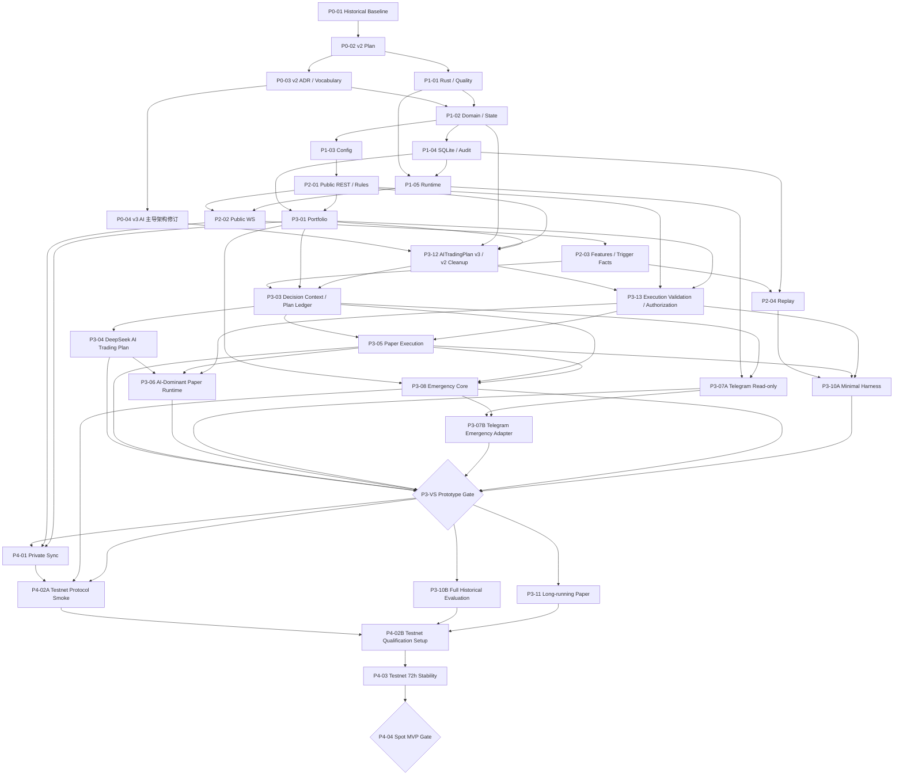
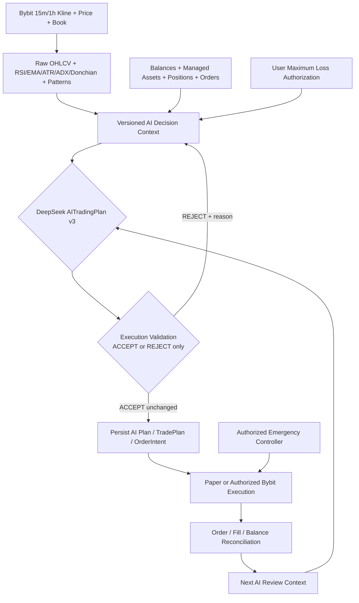

# IronPilot DEVELOPMENT_PLAN v3

> 文档状态：`AUTHORITATIVE`
>
> 版本：`3.1.0`
>
> 日期：2026-07-25
>
> 当前范围：AI 主导的 Bybit Spot Paper Vertical Slice、长期 Paper、完整历史证据与 Testnet Gate
>
> 核心方向：市场与账户事实完整提供给 AI；AI 独立制定精确交易方案；本地系统只做数据、协议、用户授权、执行、恢复和审计，不用 Materializer 或后置策略型 Risk Engine 重写 AI
>
> 明确边界：新闻风控暂不实现；默认链路、回放、Paper 与 Testnet Gate 均不包含新闻环节

---

## 0. 计划治理

### 0.1 权威性

本文件是 IronPilot 产品范围、架构边界、Task 定义、Task 依赖、验收标准、阶段顺序和 Gate 的唯一权威来源。

v3 依据用户在 2026-07-25 的明确确认建立：

> IronPilot 是 AI 主导交易系统。系统监听 Bybit 15m/1h 行情，计算本地指标和形态，连同账户、持仓、订单、交易所约束和用户可接受最大亏损金额提供给 AI；AI 制定完整交易方案；执行链按 AI 原始方案下单。不得用传统策略空间、确定性 Materializer 或后置策略型 Risk Engine 限制、替换或重写 AI 的交易判断。

发生冲突时，适用顺序为：

1. 用户最新明确确认；
2. 本文件；
3. ADR-0006；
4. 与 v3 不冲突的既有 ADR 和实现证据；
5. v2 修订文档、旧 ADR、`CONTEXT.md` 历史版本和旧计划。

`docs/AI_STRATEGY_AUTHORITY_REVISION.md`、`docs/MVP_DELIVERY_SCOPE_REVISION.md`、`docs/DEVELOPMENT_PLAN_V2_REVIEW_ACTIONS.md` 和 ADR-0005 属于 v2 历史依据，不得覆盖 v3。

当前 Task 状态、开始/完成时间、实施提交、证据、阻塞与下一步，只记录在 `docs/PROGRESS.md`。本文件不维护动态状态。

### 0.2 状态定义

| 状态 | 含义 |
|---|---|
| `DONE` | 交付物和本 Task 自身验收已完成 |
| `READY` | 依赖已满足，可以开始 |
| `IN_PROGRESS` | 已开始但尚未完成全部验收 |
| `PLANNED` | 已定义但依赖尚未全部满足 |
| `BLOCKED` | 已开始或已到 Gate，但存在明确阻断证据 |
| `DEFERRED` | 不属于当前排期 |
| `CANCELLED` | 已被方向修订取消，不得进入活动依赖图 |

Task 完成不等于 Gate 自动通过。Codex 不得自行批准阶段 Gate，也不得以收益覆盖安全或授权失败。

### 0.3 每个 Task 的完成闭环

1. 确认直接依赖、范围和 v3 权限边界。
2. 冻结最小接口、不可变量、失败语义和资源上限。
3. 先评估成熟、流行、持续维护且许可证兼容的开源库；优先复用通用协议与基础设施，只自行实现 IronPilot 领域语义和必要扩展。
4. 做最小充分实现，不顺手扩展平台能力。
5. 执行本 Task 的窄范围验收与全仓质量门禁。
6. 记录测试、审计或运行证据。
7. 只在 `docs/PROGRESS.md` 更新动态状态、实施提交、证据和限制。
8. 外部写操作、Testnet 写调用和阶段 Gate 仍需独立授权。

### 0.4 默认冻结与计划变更控制

`DEVELOPMENT_PLAN.md is DEFAULT-FROZEN.`

普通实施 Task 不得修改本文件。只有用户明确授权产品范围、权限、Task、依赖、验收或 Gate 变更时，才能独立修订本计划。计划修订必须：

1. 独立于普通业务实现；
2. 提升版本；
3. 记录原因和影响范围；
4. 同步 Task 表、依赖图、正文和 Gate；
5. 更新相关 ADR 与词汇；
6. 使用独立提交；
7. 不在同一提交中实现业务代码。

### 0.5 修订记录

| 版本 | 日期 | 内容 |
|---|---|---|
| `1.0.0—1.3.0` | 2026-07-24 | 历史 Spot-first、确定性参数、新闻守卫和组合式回测基线 |
| `2.0.0—2.2.0` | 2026-07-24 | 建立有界 AI Strategy Space、Materializer、Risk、Vertical Slice 优先路线和动态进度分离 |
| `3.0.0` | 2026-07-25 | 恢复 AI 主导交易初衷；取消活动链中的 Strategy Space 白名单、确定性 Materializer 和后置策略型 Risk Engine；AI 直接输出精确完整交易方案；新增只校验不改写的执行合法性与用户授权边界；重建 P3 Task、依赖图、正文和 Gate |
| `3.1.0` | 2026-07-25 | 建立开源优先、领域边界自有的工程原则；P3-04 优先采用成熟 OpenAI-compatible Rust 库承载通用客户端与协议能力；同步 Task 正文、质量 Gate 和工程重量限制；Task 表、依赖图、阶段顺序、AI 权限边界和 ADR 词汇不变 |

---

## 1. 产品定义

IronPilot 是由 AI 直接主导交易判断、由确定性系统提供可靠事实和忠实执行能力的自治交易系统。

核心产品假设是：

> AI 能否利用连续行情、原始 K 线序列、技术指标、K 线形态、盘口、账户资金、持仓、活动订单和用户最大亏损授权，独立形成包含精确入场、数量、止损、止盈、有效期和持仓管理的完整交易方案，并在不被本地传统策略框架改写的前提下取得可验证价值。

AI 是交易决策权威。Market Features 不是信号生成器；本地规则不是策略引擎；Execution Validator 不是 Risk Engine；Execution Adapter 不是交易决策者。

### 1.1 当前 MVP 目标

- 1—3 个配置化 Bybit Spot 标的。
- 15m 主决策周期和 1h 高周期上下文。
- 连续已闭合的原始 OHLCV 序列。
- 版本化 RSI、EMA、ATR、ADX、Donchian、成交量、关键位置与 K 线形态。
- 当前价格与一级盘口。
- Portfolio、余额、受管资产、活动订单、活动 AI TradePlan 和最近执行结果。
- 用户配置的单笔最大可接受亏损金额。
- DeepSeek `AITradingPlan v3`，由 AI 直接输出精确价格、数量和管理方案。
- 机械 Execution Validation 与 User Authorization Check，只能接受或拒绝，不得改写方案。
- Paper Execution、AI 持仓复评、正常退出和 Emergency Close。
- SQLite 审计与重启恢复。
- Telegram 通知和只读查询。
- `P3-VS` AI 主导 Spot Paper Vertical Slice。
- `P3-VS` 后并行积累长期 Paper 与完整历史策略证据。
- 通过独立 Gate 后进入 Bybit Testnet。

### 1.2 当前明确非目标

- 新闻风控、新闻 Provider、新闻 Prompt 输入和新闻交易。
- 真实资金。
- 永续合约、杠杆、保证金和做空。
- 多交易所、多 LLM Provider。
- Web UI、移动端、微服务、Kafka、Redis、Kubernetes。
- PostgreSQL、高可用、自动 Hyperopt、通用策略 DSL。
- Agent 工具调用、MCP 交易执行、AI 访问密钥、Shell、文件系统或 Exchange Adapter。
- 本地技术指标组合自动生成交易信号。
- 本地 Strategy Space 白名单限制 AI 只能选择预设策略模板。
- 用 Materializer 替 AI 推导入场、止损、止盈或数量。
- 用后置 Risk Engine 判断 AI 策略是否值得交易或修改 AI 方案。

### 1.3 “AI 主导”的准确含义

AI 拥有：

- 是否交易的决定权；
- Spot 合法方向内的交易方向决定权；
- 订单类型、精确入场价格或区间、精确数量；
- 精确止损、一个或多个止盈、最大滑点和有效期；
- 最大持有时间、复评时间、撤单、修改保护、减仓和退出；
- thesis、confidence、失效条件和风险说明。

AI 不拥有：

- 访问账户密钥、网络执行工具、配置、文件系统或 Shell；
- 扩大用户配置的最大亏损授权；
- 绕过余额、受管资产、Spot-only、交易所协议和幂等边界；
- 在数据、账户、订单或状态不可信时强制执行；
- 修改审计记录或伪造交易所事实；
- 自动授权 Testnet、实盘、永续或新闻能力。

### 1.4 新闻边界

当前默认业务链没有 `NewsRiskGuard`、新闻 Provider、新闻 Prompt 输入或 `disabled` 占位节点。未来引入新闻能力必须先修订本计划和相关 ADR，冻结数据合同、时效、失败语义、回放证据与 Gate。

---

## 2. 权限模型与不可妥协原则

### 2.1 权限分离

| 权限 | 权威组件 | 允许行为 |
|---|---|---|
| 市场与账户事实 | Market/Portfolio/Order/Reconciliation | 计算、同步和提供事实，不作策略判断 |
| 交易决策 | AI Trading Decision Provider | 形成完整精确 AITradingPlan |
| 用户资金授权 | 用户配置 + Execution Authorization Check | 定义最大亏损和部署权限，只能接受或拒绝 |
| 协议合法性 | Execution Validator | 校验 Schema、时效、余额和 Bybit 规则，只能接受或拒绝 |
| 执行 | TradePlan + Execution Adapter | 忠实执行已通过校验的 AI 原始方案 |
| 外部事实 | Bybit | 订单、成交、余额和持仓的最终事实来源 |

规范表述：

> AI has full trading-decision authority within the user-authorized account and product scope. Deterministic components may validate or reject, but must not design, materialize, optimize, resize, or rewrite the AI trading plan.

### 2.2 系统不变量

- **AI is the trading authority**：本地指标、Prefilter、Validator、TradePlan 和 Adapter 不得选择策略或交易参数。
- **No local strategy materialization**：活动链中不存在从 anchor/policy 推导精确交易参数的 Materializer。
- **No post-AI strategy risk adjudication**：活动链中不存在审批、收紧或替换 AI 策略的 Risk Engine。
- **Validate, never rewrite**：AI 方案要么原样通过，要么整体拒绝；不得本地调价、缩量、移动止损、替换目标或另选交易。
- **User authorization is hard**：AI 申报的最坏情形亏损不得超过用户配置的最大亏损金额；超限只能拒绝并反馈 AI。
- **Fail closed**：数据、时间、账户、余额、订单或状态不可信时，不得执行新动作。
- **Exchange compatibility**：价格和数量必须由 AI 按 Prompt 中的 instrument rules 输出为交易所可接受值；本地不做策略性舍入。
- **Exchange is external truth**：REST ack 不等于成交；订单、成交和余额最终以 Bybit 为准。
- **Audit before action**：AI 原始响应、解析结果、校验结果、TradePlan action 和 OrderIntent 必须先持久化，再产生执行副作用。
- **Exactly-once business effect**：通过稳定幂等键、持久化意图、查询确认和状态机保证一次业务效果。
- **Managed assets only**：任何卖出、减仓或紧急退出不得超过可证明受管数量。
- **Bounded resources**：队列、任务、上下文、LLM 并发、Token、数据库增长和拒绝后重规划次数均有硬上限。
- **No silent semantic migration**：Context、Prompt、Model、AITradingPlan Schema、Validator 和 Execution 分别版本化。

### 2.3 最大亏损授权不是策略 Risk Engine

用户最大亏损金额是账户授权，不是本地策略判断。Execution Authorization Check 只能计算 AI 方案在止损、数量、费用和允许滑点下的最坏情形亏损是否在授权内：

- 在授权内：允许继续；
- 超过授权：整体拒绝并把原因反馈 AI；
- 无法计算：整体拒绝；
- 禁止自动缩量、移动止损或修改目标；
- 禁止用历史盈利、confidence 或叙事放宽授权。

---

## 3. 权威业务主链

```text
Bybit REST / WebSocket 行情与账户事实
→ 连续已闭合 15m/1h K 线、当前价格与一级盘口
→ 本地 Market Features / Pattern Observations
→ Portfolio、余额、持仓、订单、受管资产与用户最大亏损授权
→ Versioned AI Decision Context
→ DeepSeek AITradingPlan v3
→ Schema / Freshness / Exchange Compatibility / User Authorization Validation
→ 持久化 AI 原始方案、Validation、TradePlan 与 OrderIntent
→ Paper Execution 或另行授权的 Bybit Execution
→ Order / Fill / Balance Reconciliation
→ 最新行情、账户和执行结果重新进入 AI Decision Context
→ AI HOLD / CANCEL / MODIFY_PROTECTION / REDUCE / EXIT
```

活动链中没有 Strategy Materializer 或策略型 Risk Engine。

### 3.1 决策触发

触发层只负责决定“何时调用 AI”，不得决定“是否存在交易机会”。允许触发：

- 15m K 线闭合；
- 1h K 线闭合；
- 结构、波动率、成交量、关键位置或形态发生信息增量；
- 活动订单或成交状态变化；
- 持仓复评到期；
- AI 计划失效条件接近；
- 恢复、对账或用户明确要求重新评估。

去重、冷却和预算可以减少重复 AI 调用，但不得依据 RSI、EMA、ADX、Donchian 或形态方向过滤掉 AI 可见的合法市场状态。

### 3.2 正常开仓

1. 使用已闭合、连续、未过期的 15m/1h K 线及当前盘口。
2. 构建完整 Context：原始序列、派生指标、形态、账户、持仓、订单、instrument rules、用户最大亏损和时间证据。
3. AI 输出 `OPEN_LONG` 或 `NO_TRADE`。
4. `OPEN_LONG` 必须包含精确 order、quantity、entry、stop、take-profit、最大滑点、有效期和管理方案。
5. Validator 只检查合法性、时效、余额、受管资产和用户授权；不得修改。
6. 合法方案原样持久化为 TradePlan/OrderIntent。
7. Execution 忠实执行；Paper 阶段不写 Bybit，Testnet 仍需独立授权。
8. 任何拒绝必须记录原因并有界反馈 AI；不得本地修复后继续下单。

### 3.3 持仓、订单复评与退出

AI 是正常持仓管理权威。每次 Context 必须包含当前订单、成交、持仓、成本、浮动盈亏、保护单和原始 AI 方案。AI 可以输出：

- `HOLD`
- `CANCEL_ENTRY`
- `MODIFY_PROTECTION`
- `REDUCE`
- `EXIT`

任何修改都必须由 AI 提供新的精确参数和理由，再走同一 Validator、持久化和 Execution 链。本地系统不得自动把止损移动到盈亏平衡、自动 trailing、自动分批止盈或替 AI 修改订单。

Emergency Close 是独立的用户授权安全路径，不代表本地策略权。

### 3.4 拒绝与恢复

- Schema、单位、Decimal、时效或字段失败：不执行，记录并反馈 AI。
- 价格/数量不符合 Bybit rules：不做舍入替换，拒绝并反馈 AI。
- 最大亏损无法计算或超过授权：拒绝并反馈 AI。
- 余额、受管资产或订单状态不可信：冻结同目的动作并对账。
- LLM 超时或无效输出：`NO_ACTION`，不得本地生成交易。
- Order 状态未知：进入 `RECOVERY_REQUIRED`，查询并收敛。
- 重启：先恢复 Context、AI 原始计划、订单和账户事实，不因启动自动开仓。

---

## 4. 组件职责

### 4.1 Market Data 与 Market Features

Market Data 负责 15m/1h K 线、当前价格、一级盘口、时效、连续性和来源证据。`ironpilot-market-features-v1` 继续提供 RSI、EMA、ATR、ADX、Donchian、成交量、关键位置和受控 K 线形态。

它们是 AI 的观察输入，不拥有：

- 交易机会认定；
- 方向、价格、数量、止损、止盈或退出决定；
- 对 Context 的方向性过滤；
- 自动订单或本地策略。

AI Context 必须同时提供足够的原始 OHLCV 序列和派生指标，避免只用传统指标摘要限制 AI。

### 4.2 Decision Trigger / Budget Gate

只负责数据完整性、事件去重、调用冷却、LLM 并发、Token 和成本预算。它可以拒绝一次调用，但不能用指标判断机会质量。

### 4.3 AI Decision Context Builder

每次 Context 至少包含：

- context/schema/prompt/model/version 与不可变 hash；
- instrument、server time、决策时间和 freshness；
- 最近 15m/1h 已闭合 OHLCV 序列；
- 当前价格和一级盘口；
- Market Features 与 Pattern Observations；
- instrument rules：tickSize、qtyStep、minNotional、价格限制；
- 余额、受管资产、活动持仓、活动订单和最近成交；
- 当前 AI TradePlan、保护单和执行状态；
- 用户单笔最大可接受亏损金额；
- Paper/Testnet 模式和已授权能力；
- 最近一次 AI 输出的接受/拒绝/执行结果。

Context Builder 不得删掉与本地规则观点不一致但合法、新鲜的事实，也不得加入本地推荐交易。

### 4.4 DeepSeek AI Trading Decision Provider

Provider 负责：

- 构建版本化 Prompt；
- 提供完整 Decision Context；
- 调用 DeepSeek；
- 记录原始 request/response、usage、费用、延迟和版本；
- 解析 `AITradingPlan v3`；
- 在拒绝后按硬上限进行有界重规划。

Provider 不得：

- 访问密钥、Exchange Adapter、Shell、文件系统或配置写入口；
- 在模型未输出交易时本地生成方案；
- 截断或替换 AI 的价格、数量、止损或目标；
- 把旧 `strategy-space-v1-vs` 模板注入为隐藏策略框架。

### 4.5 Execution Validator 与 Authorization Check

允许检查：

- Schema、字段、Decimal、单位、时间和 TTL；
- Spot-only、合法 side/order type/time-in-force；
- instrument rules 精确兼容；
- 余额、受管资产和活动订单冲突；
- AI 申报最大亏损与本地独立重算值；
- 用户最大亏损、部署模式和写权限；
- 幂等键、计划版本和状态迁移。

只允许 `ACCEPT` 或 `REJECT`。禁止：

- `ADJUST_DOWN`；
- 自动舍入后继续执行；
- 修改数量、entry、stop、take-profit、有效期或管理条件；
- 添加本地保护策略；
- 用 Risk Tier、Strategy Space、anchor 或本地指标重新解释方案。

### 4.6 TradePlan 与 Execution

- TradePlan 是 AI 原始计划的持久化生命周期，不是本地策略容器。
- 每个 action 绑定 context hash、AI 原始响应 hash、plan version 和 validation evidence。
- 每标的最多一个活动计划。
- 所有副作用先持久化。
- Adapter 只翻译协议字段，不改交易语义。
- REST ack 不当作成交。
- 未知结果查询和对账，不盲目补单。
- Paper、Historical Harness 和 Testnet 共用同一业务 port。

---

## 5. AITradingPlan v3 合同

### 5.1 最小示例

```json
{
  "schema_version": "3.0",
  "plan_id": "uuid",
  "context_id": "uuid",
  "instrument_id": "bybit:spot:BTCUSDT",
  "action": "OPEN_LONG",
  "order": {
    "type": "LIMIT",
    "quantity": "0.0025",
    "limit_price": "64250.00",
    "time_in_force": "GTC",
    "expires_at": 1785000000000,
    "max_slippage_quote": "1.50"
  },
  "protective_stop": {
    "trigger_price": "63120.00",
    "order_type": "MARKET"
  },
  "take_profits": [
    {
      "price": "65980.00",
      "quantity": "0.0025"
    }
  ],
  "declared_max_loss_quote": "4.33",
  "review": {
    "next_review_at": 1784999100000,
    "max_holding_until": 1785081600000
  },
  "confidence": "0.72",
  "thesis": "15m breakout retained strength while 1h structure and volume support continuation.",
  "invalidation": "Exit if the confirmed structure fails or liquidity conditions deteriorate.",
  "risks": [
    "Breakout may fail after a volatility expansion."
  ]
}
```

字段名可在 `P3-12` 中最小化收敛，但以下语义不可改变：

- AI 直接提供精确价格和数量；
- 所有金额和价格使用精确十进制字符串；
- AI 计划绑定不可变 Context；
- AI 声明最大亏损，本地只独立核对；
- Stop 和 Take Profit 属于 AI 方案，不由本地推导；
- 未知字段默认拒绝；
- 本地不得把非法计划转换为合法计划；
- `AITradingPlan v3` 不使用 Strategy Space、anchor、risk tier 或 Materialization Version。

### 5.2 动作集合

Spot Vertical Slice 最小动作：

- `OPEN_LONG`
- `NO_TRADE`
- `HOLD`
- `CANCEL_ENTRY`
- `MODIFY_PROTECTION`
- `REDUCE`
- `EXIT`

`OPEN_SHORT`、杠杆、保证金和反向开仓属于后续独立版本。

### 5.3 追溯链

```text
Market/Account Facts
→ AI Decision Context + hash
→ Prompt / Model / raw response
→ AITradingPlan v3 + hash
→ Execution Validation + User Authorization evidence
→ TradePlan Action
→ OrderIntent
→ Order / Fill / Reconciliation
→ Next AI Decision Context
```

---

## 6. 最小架构与存储

### 6.1 模块边界

```text
src/
  config/
  domain/
  runtime/
  storage/
  audit/
  exchange/bybit/
  market_data/
  market_features/
  decision_trigger/
  decision_context/
  ai/
  ai_trading_plan/
  execution_validation/
  trade_plan/
  portfolio/
  reconciliation/
  execution/paper/
  execution/bybit/
  backtest/
  notification/telegram/
  emergency/
  api/
```

活动架构不包含 `strategy_materializer/`、`trade_parameters/`、策略型 `risk/` 或 `news_guard/`。

### 6.2 允许依赖方向

```text
Adapters / Runtime
        ↓
Application orchestration
        ↓
Domain ports and services
        ↓
Pure domain types and invariants
```

- AI Provider 不依赖 Execution Adapter。
- Validator 不依赖 LLM Provider，也不拥有策略选择权。
- Backtest 复用 AITradingPlan、Validator、TradePlan 和 Execution 语义。
- 任何执行结果必须重新作为事实反馈给 AI，而不是由本地策略继续管理。

### 6.3 Vertical Slice 前核心表

- system state；
- market snapshots / trigger events；
- AI decision contexts；
- AI requests / raw responses / usage；
- AI trading plans；
- execution validations / authorization evidence；
- trade plans / trade plan actions；
- order intents / paper orders / fills；
- managed lots / reconciliation runs；
- emergency actions；
- audit log / outbox。

v2 已创建的 `materialized_trade_parameters` 和 `risk_decisions` 表属于遗留审计结构。v3 活动链不得写入或依赖它们；是否物理删除由 `P3-12` 以安全 migration 决定，不得删失历史证据。

### 6.4 2C2G 资源预算

```yaml
runtime:
  target_cpu_cores: 2
  target_memory_mb: 2048
  memory_soft_limit_mb: 1400
  max_enabled_instruments: 3
  max_active_trade_plans: 2

llm:
  max_concurrency: 1
  daily_call_limit: 40
  daily_token_limit: 200000
  daily_cost_limit_usd: "2.00"
  max_replans_per_context: 1

market:
  candle_window_per_timeframe: 500
  prompt_candles_per_timeframe: 120
  max_timeframes_per_instrument: 2

storage:
  sqlite_max_connections: 4
  sqlite_write_concurrency: 1

queues:
  market_event_capacity_per_instrument: 1024
  critical_event_capacity: 256
```

超限必须 fail closed。预算耗尽时不生成本地交易；已有计划只按已持久化指令或 Emergency 路径处理。

---

## 7. 历史与运行证据

### 7.1 Market Replay

证明相同历史输入、时钟和版本产生相同原始 Context、Features 和 Trigger，不计算策略 PnL，不调用实时 LLM。

### 7.2 Minimal Historical Harness

在 `P3-VS` 前证明：

- 固定历史时钟和 Context；
- 使用录制 `AITradingPlan v3` 或确定性 AI Plan Stub；
- 不使用 Materializer 或 Risk Engine；
- Validator 只接受或拒绝，不改写；
- 复用 TradePlan 和 Paper Execution；
- 不在产生决策的同一收盘价虚假成交；
- 相同输入和录制计划产生相同交易账本；
- 前缀不变、无 future data。

### 7.3 Full Historical Strategy Evaluation

在 `P3-VS` 后比较 Rule-only Baseline、Deterministic AI Plan Stub 和录制 AI Trading Plan。三组保持市场事实、用户最大亏损授权和执行模型可比。报告至少包含收益、回撤、期望、交易次数、AI 决策贡献、拒绝原因、成本、样本外、压力情景和逐笔差异。

Rule-only 只作为离线对照，不进入生产决策链。

---

## 8. Telegram 与紧急控制

Telegram 提供已确认事实通知、状态/持仓/AI TradePlan/交易/授权拒绝查询和 Emergency Close All。

EmergencyController：

- 不依赖 AI 或 Telegram 可用性；
- 接收已认证、已确认的 `AuthorizedEmergencyCommand`；
- 只撤销可证明归属的订单、关闭受管资产；
- 每步持久化并可恢复；
- 重复请求业务效果为 0；
- 完成后不自动恢复 AI 开仓。

普通菜单不提供 Pause、Resume 或 Cancel All。若通过受保护管理入口实现，Resume 只触发同步、Context 重建和 AI 重新评估，不直接下单。

---

## 9. 开发路线与依赖图

### 9.1 阶段路线

1. **Phase A — Reliability Kernel**
   - Rust、Decimal、配置、SQLite、审计、状态机、运行时监督。
2. **Phase B — Market and Account Facts**
   - Bybit 公共 REST/WS、15m/1h、Market Features、Replay、Portfolio。
3. **Phase C — AI-Dominant Paper**
   - AITradingPlan v3、Context、Provider、Validator、TradePlan、Paper、复评、Telegram、Emergency、Minimal Harness。
4. **Phase D — Prototype Vertical Slice**
   - 通过 `P3-VS`，形成 AI 完整计划直接驱动 Paper 的首条闭环。
5. **Phase E — Parallel Hardening**
   - 30 天 Paper、完整历史证据、Testnet Protocol Smoke、故障注入和资源治理。
6. **Phase F — Testnet and Release**
   - Qualification Setup、72h 稳定性与恢复、Testnet Qualification Gate、Spot MVP Release Gate。

### 9.2 v3 活动依赖图



`P3-02` 和 `P3-09` 是 v2 遗留 Task，不进入 v3 活动依赖图。

---

## 10. Task 目录与依赖基线

| Task | 名称 | 直接依赖 |
|---|---|---|
| `P0-01` | 历史架构基线 | 无 |
| `P0-02` | DEVELOPMENT_PLAN v2 历史重建 | `P0-01` |
| `P0-03` | v2 ADR 与词汇对齐 | `P0-02` |
| `P0-04` | DEVELOPMENT_PLAN v3 AI 主导架构修订 | `P0-03` |
| `P1-01` | Rust 工程骨架与质量门禁 | `P0-02` |
| `P1-02` | 核心领域、v2 Strategy Intent 与状态机（基础） | `P0-03`,`P1-01` |
| `P1-03` | 配置、多标的与启动校验 | `P1-02` |
| `P1-04` | SQLite、审计与单实例锁 | `P1-02` |
| `P1-05` | 可观测性与运行时监督 | `P1-01`,`P1-04` |
| `P2-01` | Bybit 公共 REST 元数据 | `P1-03` |
| `P2-02` | 多标的公共 WebSocket | `P2-01`,`P1-05` |
| `P2-03` | Market Features 与 Decision Trigger Facts | `P2-02` |
| `P2-04` | 历史回放与可复现快照（v2 基础） | `P2-03`,`P1-04` |
| `P3-01` | Portfolio、受管资产与对账 | `P1-04`,`P2-01` |
| `P3-02` | v2 确定性 Risk Engine（遗留，退出活动链） | `P1-02`,`P3-01` |
| `P3-09` | v2 Strategy Materializer（取消） | `P1-02`,`P2-03`,`P3-01` |
| `P3-12` | AITradingPlan v3 合同与 v2 权限迁移 | `P0-04`,`P1-02`,`P2-01`,`P3-01` |
| `P3-03` | AI Decision Context 与 TradePlan Ledger | `P2-03`,`P3-01`,`P3-12` |
| `P3-04` | DeepSeek AI Trading Plan Provider | `P3-03` |
| `P3-13` | Execution Validation 与 User Authorization | `P2-01`,`P3-01`,`P3-12` |
| `P3-05` | 现货 Paper Execution | `P3-03`,`P3-13` |
| `P3-10A` | Minimal Historical Harness | `P2-04`,`P3-05`,`P3-13` |
| `P3-06` | AI 主导现货 Paper Runtime | `P3-04`,`P3-05`,`P3-13` |
| `P3-07A` | Telegram 通知与只读查询 | `P1-05`,`P3-03` |
| `P3-08` | Emergency Core | `P3-01`,`P3-03`,`P3-05` |
| `P3-07B` | Telegram Emergency Adapter | `P3-07A`,`P3-08` |
| `P3-VS` | AI-Dominant Spot Paper Vertical Slice Gate | `P3-04`,`P3-05`,`P3-06`,`P3-07A`,`P3-07B`,`P3-08`,`P3-10A` |
| `P3-10B` | Full Historical Strategy Evaluation | `P3-VS` |
| `P3-11` | Long-running Paper Safety | `P3-VS` |
| `P4-01` | Bybit 私有流与订单同步 | `P3-VS`,`P2-02`,`P3-01` |
| `P4-02A` | Testnet Protocol Smoke | `P3-VS`,`P4-01`,`P3-08` |
| `P4-02B` | Testnet Qualification Setup | `P4-02A`,`P3-10B`,`P3-11` |
| `P4-03` | Testnet 72h Stability and Recovery | `P4-02B` |
| `P4-04` | Spot MVP Release Gate | `P4-03` |
| `D-NEWS-01` | 新闻风控重新立项 | 不进入当前依赖图 |
| `P5-*` | 永续合约 | `P4-04` 后重新授权 |
| `P6-*` | 真实资金与扩容 | 独立 Release Gate 与明确授权 |

---

## 11. 可提交任务

### P0 — Governance

#### `P0-04` DEVELOPMENT_PLAN v3 AI 主导架构修订

- **目标**：恢复 AI 完整交易决策权，消除 v2 的 Materializer/Risk 限制。
- **交付物**：本计划、ADR-0006、相关 ADR/词汇/进度同步。
- **依赖**：`P0-03`。
- **验收**：Task 表、依赖图、正文和 Gate 一致；计划版本提升；独立提交；无业务代码。

### P1/P2/P3 已完成基础

`P1-01` 至 `P3-01` 的工程、数据、指标、Replay 和 Portfolio 交付继续作为 v3 基础。其 v2 Strategy Space、Prefilter 方向过滤或 Risk 相关语义不进入 v3 活动链；迁移由后续 Task 显式完成。

#### `P3-02` v2 确定性 Risk Engine

- **分类**：历史已实现、v3 遗留。
- **边界**：不得进入 v3 Runtime、Paper、Harness 或 Testnet 活动链。
- **迁移**：代码和表的安全退役由 `P3-12` 完成；历史提交和审计证据保留。

#### `P3-09` v2 Strategy Materializer

- **分类**：取消。
- **原因**：与 AI 直接输出完整精确交易方案的 v3 权限模型冲突。
- **边界**：不得开始实现，不得被任何 v3 Task 依赖。

### P3 — AI-Dominant Spot Paper Vertical Slice

#### `P3-12` AITradingPlan v3 合同与 v2 权限迁移

- **目标**：建立 AI 完整交易方案合同并清除活动链中的 v2 权限模型。
- **任务**：
  - 冻结 `AITradingPlan v3`、精确 Decimal、动作和状态；
  - 允许 AI 输出精确 entry/quantity/stop/take-profit/validity/management；
  - 删除运行时 Strategy Space、anchor、risk tier 和 Materialization 依赖；
  - 使 v2 Risk Engine 无法产生 v3 Execution 输入；
  - 把 v2 Replay manifest 的 Strategy Space 绑定迁移为 v3 Context/Plan 版本证据；
  - 安全处理遗留表和代码，不删除历史审计。
- **测试**：完整方案 roundtrip、未知字段、浮点/单位、Spot 非法方向、动作字段、遗留 v2 输入隔离。
- **验收**：活动领域合同没有 Materializer 或策略型 RiskDecision；AI 方案可表达完整交易；本地组件无法构造替代策略。

#### `P3-03` AI Decision Context 与 TradePlan Ledger

- **目标**：给 AI 完整事实并持久化 AI 原始交易方案生命周期。
- **任务**：原始 15m/1h 序列、指标、形态、盘口、账户、持仓、订单、instrument rules、用户最大亏损、版本/hash；Context 与原始 AI plan 原子持久化。
- **验收**：Context 可复现、无 future data、无本地交易推荐；每个 action 可追溯到原始 Context/response；每标的最多一个活动计划。

#### `P3-04` DeepSeek AI Trading Plan Provider

- **目标**：让 AI 独立产生完整 `AITradingPlan v3`。
- **任务**：Prompt、基于成熟 OpenAI-compatible Rust 库的 client、raw response、strict parse、usage/cost/latency、一次有界 replan；通用 HTTP、认证、请求/响应协议和中间件不得无理由重复实现，DeepSeek 特有字段通过库支持的扩展类型或 BYOT 能力接入。
- **测试**：精确订单、止损/止盈、多动作、空/截断/未知字段、超时、预算、拒绝反馈重规划。
- **验收**：真实输出不依赖 Strategy Space 或 Materializer；AI 未输出计划时订单为 0；Prompt 同时包含原始行情、派生指标、账户和授权；复用库的隐藏重试必须关闭或显式纳入调用预算、费用、延迟与原始证据。

#### `P3-13` Execution Validation 与 User Authorization

- **目标**：只验证、不改写 AI 方案。
- **任务**：Schema、TTL、Spot、Bybit rules、余额、受管资产、订单冲突、最大亏损独立核对、权限和幂等。
- **测试**：tick/qty/minNotional、价格限制、费用/滑点最坏亏损、超授权、陈旧 Context、冲突订单、任何字段改写检测。
- **验收**：只有 `ACCEPT/REJECT`；非法方案订单为 0；Validator 修改 entry/quantity/stop/target 的次数为 0；拒绝原因可反馈 AI。

#### `P3-05` 现货 Paper Execution

- **目标**：原样模拟 AI 的 Market/Limit、部分成交、费用、滑点、保护单和 ManagedLot。
- **验收**：Paper/Backtest/Testnet 共用 port；不使用产生 AI 决策的同一收盘价虚假成交；重复请求效果为 0；实际提交字段与已接受 AI Plan 一致。

#### `P3-10A` Minimal Historical Harness

- **目标**：证明 AI Plan → Validation → TradePlan → Paper 链可复现且无前视。
- **任务**：固定 Context、录制 AI Plan/Stub、同一 Validator/TradePlan/Paper、费用和滑点。
- **验收**：无 Materializer/Risk；相同输入产生相同账本；前缀不变；不调用实时 LLM；不要求完整绩效平台。

#### `P3-06` AI 主导现货 Paper Runtime

- **目标**：运行 Facts → Context → AITradingPlan → Validation → TradePlan → Paper → AI Review/Exit。
- **测试**：多标的、预算耗尽、陈旧数据、AI 无效方案、超授权、restart、订单变化、持仓复评。
- **验收**：所有正常交易参数来自 AI；本地生成或改写交易参数次数为 0；完整追溯率 100%；主链无新闻、Materializer 或策略型 Risk Engine。

#### `P3-07A` Telegram 通知与只读查询

- **范围**：已确认事件、AI 原始计划、Validation 结果、持仓、订单、交易、用户授权与拒绝原因；不实现策略控制。

#### `P3-08` Emergency Core

- **范围**：统一授权命令、TTL/幂等、撤冲突订单、关闭受管敞口、步骤持久化和恢复；不依赖 AI 可用性。

#### `P3-07B` Telegram Emergency Adapter

- **范围**：身份、chat 白名单、nonce、二次确认，构造统一 Emergency Command；不复制退出业务。

#### `P3-VS` AI-Dominant Spot Paper Vertical Slice Gate

- **目标**：证明 AI 完整交易方案直接驱动 Paper 闭环。
- **边界**：Gate 不授权 Testnet 写、实盘、永续或新闻能力。

#### `P3-10B` Full Historical Strategy Evaluation

- **目标**：建立 AI 相对基线的收益、回撤、成本、稳定性和样本外证据。

#### `P3-11` Long-running Paper Safety

- **目标**：30 天 Paper soak、故障注入、资源、数据库增长、预算和恢复证据。

### P4 — Testnet and Release

#### `P4-01` Bybit 私有流与订单同步

- **验收**：REST ack 不当成交；重复事件效果为 0；断线后最终收敛；所有事实反馈下次 AI Context。

#### `P4-02A` Testnet Protocol Smoke

- **范围**：极少量 Testnet 下单/查询/撤单、私有订单/成交、幂等、Emergency 和重启对账；仍需当时明确写授权。

#### `P4-02B` Testnet Qualification Setup

- **范围**：冻结 Context、Prompt、Model、AITradingPlan Schema、Validator、Execution、用户最大亏损、回滚和停止条件。

#### `P4-03` Testnet 72h Stability and Recovery

- **验收**：满足第 12.6 节。

#### `P4-04` Spot MVP Release Gate

- **边界**：不授权真实资金、永续或新闻能力。

---

## 12. 阶段 Gate

### 12.1 全阶段安全与权限不变量

| 不变量 | 目标 |
|---|---:|
| 无合法 AITradingPlan 的正常订单 | 0 |
| 本地组件生成交易方向、entry、quantity、stop 或 target | 0 |
| 本地组件改写已接受 AI Plan | 0 |
| Materializer 或策略型 Risk Engine 进入 v3 活动链 | 0 |
| 超过用户最大亏损授权的订单 | 0 |
| 无法独立计算最大亏损仍执行 | 0 |
| 陈旧/非法 Context 或 Plan 产生订单 | 0 |
| 未持久化 AI 原始响应、Validation 或 OrderIntent 就执行 | 0 |
| 未授权资产卖出 | 0 |
| 重复业务订单效果 | 0 |
| AI Context → Plan → Validation → Order 追溯率 | 100% |
| 交易所状态未知时同目的盲目补单 | 0 |
| 未记录例外而自研已有成熟开源实现的通用协议基础设施 | 0 |

### 12.2 Prototype Vertical Slice Gate

必须证明：

- 真实 15m/1h + Market Features + Account Context 进入 DeepSeek；
- AI 输出至少一个合法 `OPEN_LONG` 和 `NO_TRADE` 路径；
- AI 精确 entry/quantity/stop/take-profit 原样进入 Paper；
- Validator 只接受或拒绝；
- 超用户授权、非法 tick/qty、陈旧数据和无效输出订单为 0；
- 订单/成交/持仓反馈后，AI 可输出 HOLD、修改保护或 EXIT；
- restart、审计、对账、Telegram 和 Emergency 路径可用；
- 2C2G 资源证据；
- 活动链无 Materializer、策略型 Risk Engine 和新闻节点。

### 12.3 Long-running Paper Safety Gate

- 连续 30 天；
- 无未解释状态分叉、未受管卖出、重复业务效果或审计缺口；
- LLM 预算、拒绝重规划上限、队列、RSS/CPU 和数据库增长有证据；
- 模型超时、无效输出、断连、重启和资源压力均 fail closed；
- 正常持仓管理持续由 AI 输出，Emergency 路径独立可用。

### 12.4 Historical Strategy Evidence Gate

- 不可变 manifest 绑定 Context、Prompt、Model、AI Plan、Validator、Execution、费用和滑点版本；
- 无 future data；
- Rule-only 只作离线对照；
- AI 计划不得被本地改写；
- 样本外、压力测试、逐笔差异和必要独立参考完成；
- 盈利不能覆盖权限或安全不变量失败。

### 12.5 Testnet Protocol Smoke Gate

- 仅协议和状态同步；
- 极少量已授权 Testnet 动作；
- AI Plan 到实际 Bybit 请求字段一致；
- `orderLinkId` 幂等；
- REST ack 与最终状态分离；
- 私有流、对账、重启和 Emergency 收敛。

### 12.6 Bybit Testnet Qualification Gate

- Protocol Smoke、Long-running Paper 和 Historical Evidence 均通过；
- 72h 稳定运行；
- Context、Prompt、Model、AITradingPlan、Validator、Execution 和用户授权冻结；
- 无超授权订单、无本地改写、无状态分叉；
- 故障恢复、停止条件和回滚证据完成。

### 12.7 Live Release Gate

当前计划不自动进入真实资金。必须独立立项，明确专用账户、密钥权限、IP、资金上限、用户最大亏损、模型证据、on-call、回滚和剩余风险。

---

## 13. 测试与证据策略

### 13.1 纯领域

- Decimal、单位、价格、数量和最大亏损算术；
- AITradingPlan Schema、动作和状态机；
- Validator 只有 ACCEPT/REJECT；
- 属性测试证明本地输出字段与 AI Plan 完全一致；
- Spot、受管资产和用户授权边界。

### 13.2 Adapter contract

- Bybit REST/WS fixtures；
- tickSize、qtyStep、minNotional 和价格限制；
- DeepSeek raw response/usage/timeout；
- Paper/Bybit port 一致性；
- REST ack、私有事件和对账。

### 13.3 集成

- Facts → Context → AI Plan → Validation → TradePlan → Paper；
- AI invalid → reject → bounded replan；
- Fill/Order → next Context → AI review；
- restart、未知状态、幂等和审计；
- Emergency 独立于 AI。

### 13.4 历史正确性

- 不可变 manifest；
- 前缀不变和无 future data；
- 录制 AI Plan 可复现；
- 费用、滑点、成交和资金曲线；
- 本地改写 AI Plan 检测；
- Rule-only 只作离线参考。

### 13.5 依赖复用与供应链

- 每个新增通用基础设施实现先记录候选开源库比较，包括维护活跃度、社区采用、许可证、安全、资源重量、可审计性和边界适配；
- 版本锁定并执行格式、静态检查、测试、`cargo deny check` 和依赖来源审计；
- Provider SDK 的自动重试、遥测或请求改写必须显式配置并纳入调用预算和审计证据；
- 只有在成熟库缺失必要能力、无法满足安全/证据语义或引入重量明显不合算时才允许自研，并在 `docs/PROGRESS.md` 记录理由、边界和测试证据。

---

## 14. 最大风险与反方校验

### 14.1 名义 AI 主导，实际被本地框架吞掉

- **失败路径**：隐藏 Strategy Space、Materializer、Risk Tier、自动止损/止盈或本地策略回退。
- **控制**：所有正常交易参数必须逐字段来自 AI 原始 Plan；本地新增或改写次数为 0。

### 14.2 只在 Prompt 声明最大亏损，执行不核对

- **失败路径**：模型计算错误或忽略授权。
- **控制**：独立算术核对；超限只拒绝、不缩量、不改止损。

### 14.3 Context 只有指标摘要，限制 AI 行情判断

- **失败路径**：只提供 RSI/EMA 等汇总，AI 看不到价格路径和账户细节。
- **控制**：提供有界原始 15m/1h 序列、盘口、派生指标、账户、订单和执行反馈。

### 14.4 AI 输出无效或不稳定

- **失败路径**：非法 Decimal、tick/qty、过期价格、缺保护或自相矛盾。
- **控制**：strict Schema、Validator、一次有界 replan；仍失败则 NO_ACTION。

### 14.5 忠实执行被误解为 AI 拥有系统权限

- **失败路径**：模型直接访问密钥、工具或交易 Adapter。
- **控制**：AI 只输出数据合同；应用持有唯一执行权限、幂等、审计和恢复。

### 14.6 收益掩盖权限或安全失败

- **控制**：任何本地改写、超授权、未审计执行、未受管卖出或状态分叉直接失败，盈利不能抵消。

---

## 15. 工程重量限制

- 保持模块化单体和 SQLite。
- 不因 AI 主导引入 Agent 工具、MCP 执行、通用 DSL 或多模型平台。
- 开源优先不是无条件增加依赖：优先选择成熟、流行、持续维护、许可证兼容且边界清晰的最小库，避免引入覆盖面远大于当前 Task 的框架。
- HTTP、TLS、WebSocket、序列化、标准 Provider 协议、数据库、迁移、指标和重试等通用基础设施，原则上复用成熟开源库，不重复造轮子。
- 自有代码聚焦 IronPilot 领域合同、AI 权限边界、Prompt、严格解析、预算、证据、幂等、恢复和 Provider 必要扩展。
- 开源库不得隐藏改变语义：自动重试、默认超时、请求改写、数据外发和遥测必须可关闭、可配置、可审计。
- Context 和 Prompt 有明确字节/Token 上限。
- 原始 K 线序列有固定窗口。
- 拒绝后最多一次 replan。
- 所有队列、任务、订单、上下文和审计增长有上限。
- 只实现 Vertical Slice 所需的 Market、AI Plan、Validator、TradePlan 和 Paper 闭环。

---

## 16. 默认流程图



图中没有 Strategy Materializer、策略型 Risk Engine 或新闻节点。

---

## 17. 完成定义

Spot MVP 只有在以下条件全部满足后才可审查完成：

- AI 直接制定并管理完整精确交易方案；
- 本地策略生成和 AI Plan 改写次数为 0；
- 用户最大亏损、余额、受管资产、协议、状态和审计边界不可绕过；
- Prototype、Long-running Paper、Historical Evidence 和 Bybit Testnet Qualification Gate 独立通过；
- 所有正常动作可从 Context 追溯到 AI 原始响应、Validation、Order 和 Fill；
- 无新闻、实盘、永续或额外权限的隐式扩展；
- 用户或授权评审者完成最终 Gate 决策，Codex 不自行批准。
