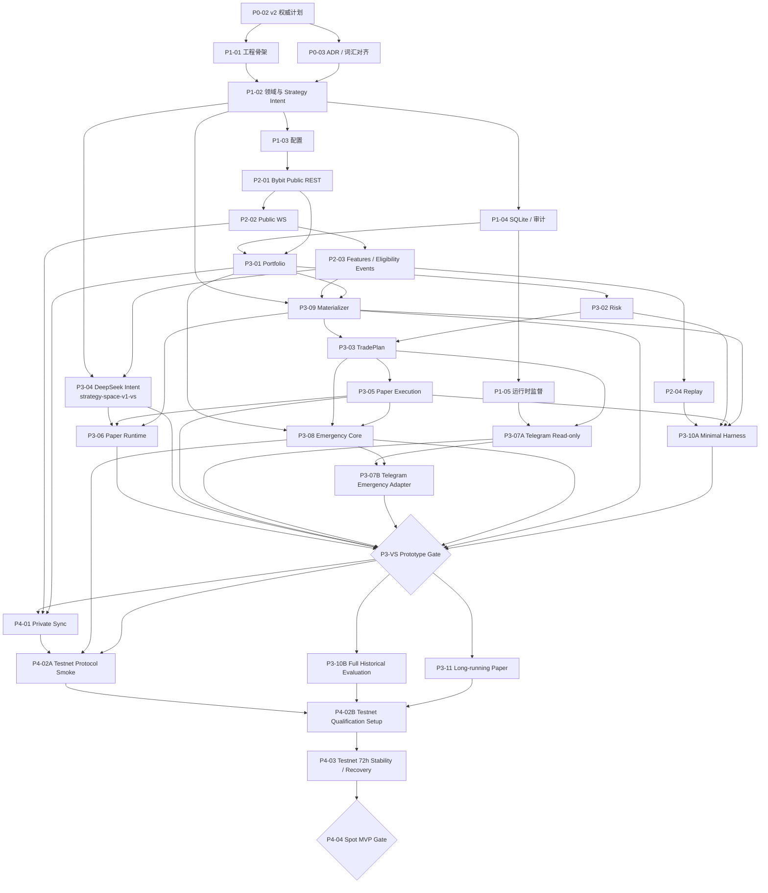
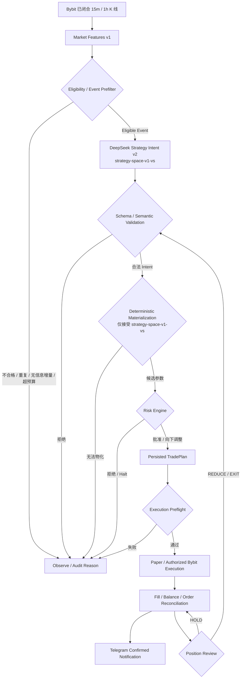

# IronPilot DEVELOPMENT_PLAN v2

> 文档状态：`AUTHORITATIVE`
>
> 版本：`2.1.1`
>
> 日期：2026-07-24
>
> 当前范围：AI 驱动的 Bybit Spot Paper Vertical Slice、长期 Paper、完整历史证据与 Testnet Gate
>
> 明确边界：新闻风控暂不实现；默认交易流程、任务依赖、回放、Paper 与 Testnet Gate 均不包含新闻环节

---

## 0. 计划治理

### 0.1 权威性

本文件是 IronPilot 当前任务状态、任务依赖、阶段顺序和 Gate 的唯一权威来源。它已经吸收以下修订：

- `docs/AI_STRATEGY_AUTHORITY_REVISION.md`
- `docs/MVP_DELIVERY_SCOPE_REVISION.md`
- `docs/DEVELOPMENT_PLAN_V2_REVIEW_ACTIONS.md`
- 用户确认：新闻风控先不实现，默认交易流程链路没有新闻环节

发生冲突时，适用顺序为：

1. 用户最新明确确认；
2. 本文件；
3. 上述修订文档；
4. 旧版 ADR、`CONTEXT.md` 和历史计划。

以下旧结论已被 v2 否决，不得继续生成实现依赖：

- `AI has no authority`；
- Rule Prefilter 决定最终方向或“有效交易机会”；
- AI 只输出市场语义，由本地代码独立设计完整交易；
- 结构化 News Risk Guard 是 AI、Replay、Paper 或 Testnet 的前置条件；
- 完整历史策略评估和独立参考阻塞第一个 Paper Vertical Slice；
- 30 天 Paper soak 阻塞第一次可运行原型；
- Telegram 普通用户菜单提供 Pause、Resume 或 Cancel All。

ADR-0002、ADR-0003、ADR-0004 和 `CONTEXT.md` 中与上述边界冲突的描述属于待同步文档债务，不得覆盖本计划。实施受影响代码前，应通过独立文档任务完成术语和 ADR 对齐，但该文档债务不恢复任何已删除的新闻依赖。

### 0.2 状态定义

| 状态 | 含义 |
|---|---|
| `DONE` | 交付物和本 Task 自身验收已完成 |
| `READY` | 依赖已满足，可以开始 |
| `PLANNED` | 已定义但依赖尚未全部满足 |
| `BLOCKED` | 已开始或已到 Gate，但存在明确阻断证据 |
| `DEFERRED` | 不属于当前排期，不得隐式拉入当前阶段 |
| `CANCELLED` | 已被方向修订取消 |

Task 完成不等于 Gate 自动通过。实现者不得自批独立 Release Gate，也不得用收益覆盖安全失败。

### 0.3 每个 Task 的完成闭环

1. 确认依赖和范围。
2. 冻结最小接口、关键不变量和失败语义。
3. 做最小充分实现，禁止顺手扩展平台能力。
4. 执行该 Task 定义的窄范围验证。
5. 记录测试、审计或运行证据。
6. 更新本计划状态；外部写操作和阶段 Gate 仍需独立授权。

### 0.4 v2 修订记录

| 版本 | 日期 | 内容 |
|---|---|---|
| `1.0.0–1.3.0` | 2026-07-24 | 历史基线：Spot-first、确定性参数、新闻守卫、市场特征和组合式回测 |
| `2.0.0` | 2026-07-24 | 重建 AI 策略权限、Vertical Slice 优先路线、回测分层和 Gate；删除新闻及完整回测对首个闭环的硬依赖 |
| `2.1.0` | 2026-07-24 | 解除 Paper Runtime 与 Replay 的非必要串行依赖；拆分 Testnet Smoke/Qualification Setup 与 Telegram/Emergency；冻结 Vertical Slice 最小策略空间和 2C2G Gate |
| `2.1.1` | 2026-07-24 | 修复修订文档数量、Strategy Space 运行时版本、Emergency 入口认证边界和 Testnet Qualification 命名的一致性问题；不改变产品范围、任务顺序和安全 Gate |

---

## 1. 产品定义

IronPilot 是受确定性风险、状态和执行边界约束的 AI 自治交易系统。

核心产品假设是：

> AI 能否在预授权、版本化、可验证的策略空间内持续形成有实际影响的交易策略，并由不可绕过的确定性系统安全物化、审批、执行、恢复和审计。

AI 不是交易所操作者，也不是风险规则拥有者；但 AI 必须真正拥有受控策略选择权。若本地规则已经决定方向、入场、止损和退出，AI 只负责“同意或拒绝”，则不满足 IronPilot 的产品定义。

### 1.1 当前 MVP 目标

- 1–3 个配置化 Bybit Spot 标的。
- 15m 主决策周期和 1h 确认周期。
- 版本化 Market Features 与受控 Pattern Observations。
- Eligibility / Event Prefilter。
- DeepSeek `StrategyIntent v2`。
- `strategy-space-v1-vs` 是 `P3-VS` 前唯一可执行的 Strategy Space 版本。
- 确定性 Strategy Materialization、Risk Engine 和 TradePlan。
- Paper Execution、持仓复评、正常退出和 Emergency Close。
- SQLite 审计与重启恢复。
- Telegram 通知和只读查询。
- 早期 `P3-VS` Prototype Vertical Slice。
- `P3-VS` 后并行积累长期 Paper 与完整历史策略证据。
- 通过独立 Gate 后进入 Bybit Testnet。

### 1.2 当前明确非目标

- 新闻风控、新闻 Provider、新闻解析、新闻交易和新闻 Prompt 输入。
- 真实资金。
- 永续合约、杠杆、保证金和做空。
- 多交易所、多 LLM Provider。
- Web UI、移动端、微服务、Kafka、Redis、Kubernetes。
- PostgreSQL、高可用、自动 Hyperopt、通用策略 DSL。
- Agent 工具调用、MCP 交易执行、自动模型选择。
- 在第一个 Vertical Slice 前建设通用回测平台或完整独立参考矩阵。

### 1.3 新闻边界

当前版本没有 `NewsRiskGuard` 运行模式，也不使用 `disabled` 占位节点。默认业务链中不存在新闻步骤：

- 不定义新闻为开仓前置门禁；
- 不把新闻状态放入 `StrategyIntent` Prompt；
- 不要求 Replay、Paper 或 Backtest manifest 提供新闻数据；
- 不为新闻预建 MVP 核心表；
- 不把新闻 Provider、freshness、outage 或 coverage 纳入当前 Gate；
- 不宣称系统具备新闻风险保护或黑天鹅识别能力。

未来如需引入新闻风控，必须先修订本计划和相关 ADR，明确新的权限、失败语义、数据合同、回放证据与 Gate。不得在现有 Task 内顺手加入。

---

## 2. 权限模型与不可妥协原则

### 2.1 三种权限

| 权限 | 权威组件 | AI 权限 |
|---|---|---:|
| 策略权限 | AI Strategy Decision Provider | 在版本化白名单内拥有 |
| 风险权限 | Deterministic Risk Engine | 无 |
| 执行权限 | TradePlan + Execution + Exchange Adapter | 无 |

规范表述：

> AI has bounded strategy authority, but no execution authority and no authority to override deterministic risk constraints.

### 2.2 系统不变量

- **Fail closed**：数据、时钟、账户、订单或状态不可信时，不允许新开仓。
- **Exchange is external truth**：交易所订单、成交和余额是外部事实；本地数据库是审计与恢复源。
- **Bounded AI strategy authority**：AI 可选择策略，但不能访问密钥、工具、配置、文件系统、Shell 或交易 Adapter。
- **Deterministic materialization**：精确价格、数量和订单参数必须由版本化确定性算法从合法 Strategy Intent 物化。
- **Risk cannot be bypassed**：Risk Engine 只能批准、收紧、拒绝或降权，不能扩大风险或替换策略。
- **Exactly-once business effect**：不承诺传输 exactly-once，通过稳定幂等键、持久化意图、查询确认和状态机保证一次业务效果。
- **Audit before action**：风险裁决、TradePlan action 和 OrderIntent 必须先持久化，再产生执行副作用。
- **Managed assets only**：任何卖出或紧急退出不得超过可证明归属的受管数量。
- **Bounded resources**：队列、任务、历史窗口、LLM 并发、Token、数据库增长均有硬上限。
- **No silent semantic migration**：Schema、Strategy Space、Prompt、Feature、Materialization 和 Risk Rules 均独立版本化。

---

## 3. 权威业务主链

```text
Bybit REST / WebSocket 行情与账户事实
→ 已闭合 K 线与版本化 Market Features / Pattern Observations
→ Eligibility / Event Prefilter
→ AI Strategy Intent v2
→ Schema / Serde / Semantic Validation
→ Deterministic Strategy Materialization
→ Deterministic Risk Engine
→ 持久化 TradePlan
→ Execution Preflight
→ Paper Execution 或已授权的 Bybit API Execution
→ Fill / Balance / Order Reconciliation
→ Position Review / Reduce / Exit
→ Telegram 通知已确认结果
```

新闻不在默认链路中。

### 3.1 正常开仓

1. 只使用连续、已闭合、未过期的 15m/1h K 线生成特征。
2. Prefilter 判断数据、事件、状态、去重、冷却和调用预算是否允许调用 AI。
3. AI 只能在 `strategy-space-v1-vs` 中输出 `OPEN_LONG` 或 `NO_TRADE` 等当前可执行 Strategy Intent。
4. 本地严格校验 Schema、组合、TTL、动作和策略权限。
5. Materializer 把 AI 选择的 anchor、policy 和 risk tier 转换为精确候选参数。
6. Risk Engine 批准、向下调整或拒绝。
7. 获批动作先写 TradePlan 和 OrderIntent，再进入 Execution preflight。
8. Execution 产生 Paper 业务效果；Testnet 阶段才允许经 Bybit Adapter 写入交易所。

### 3.2 持仓复评与退出

AI 可在同一受控策略模板中输出 `HOLD`、`REDUCE` 或 `EXIT`，并可收紧退出或失效条件。AI 不得：

- 放宽原始最大风险；
- 下移止损以扩大亏损；
- Martingale 或无上限补仓；
- 未经新 TradePlan 和完整风险审批反向开仓；
- 覆盖真实订单、成交和对账状态。

任何扩大风险的动作必须作为新候选重新走完整链；Spot MVP 默认拒绝。

### 3.3 拒绝与恢复

- Schema、语义、TTL 或版本失败：`NO_TRADE`，记录原因。
- Strategy Intent 无法物化：`REJECTED`，不得换策略继续交易。
- Risk 拒绝：不得构造 Execution 输入。
- Order 状态未知：冻结同目的新订单，进入 `RECOVERY_REQUIRED`。
- 重启：先恢复状态、对账和风险检查，不因进程启动自动启用新开仓。

---

## 4. 组件职责

### 4.1 Market Features

`ironpilot-market-features-v1` 包含：

- Donchian；
- EMA；
- Wilder RSI / ATR / ADX；
- 成交量比率；
- EMA 排列；
- 关键位置；
- 受控 K 线形态与语义；
- 15m 主周期与 1h 确认周期；
- 独立实时价差。

它们是只读观察，不产生开仓、平仓或反转权限。公式、warm-up、缺失值、量化、枚举或优先级变化必须发布新版本。

### 4.2 Eligibility / Event Prefilter

允许负责：

- candle 闭合、连续、freshness 和 warm-up；
- Feature Snapshot 完整性；
- 最低流动性、价差和数据质量；
- 系统、标的、冷却和活动 TradePlan 状态；
- LLM 调用、Token 和成本预算；
- 结构变化、复评事件、去重、限流和优先级。

允许生成的事件包括：

- `STRUCTURE_CHANGED`
- `KEY_LOCATION_REACHED`
- `VOLATILITY_EXPANDED`
- `VOLUME_ANOMALY`
- `BREAKOUT_ATTEMPT`
- `RETEST_EVENT`
- `POSITION_REVIEW_DUE`
- `INVALIDATION_RISK_INCREASED`

禁止负责：

- 断言“有效做多机会”“有效卖点”；
- 用 EMA、RSI、ADX、Donchian 或形态组合决定最终方向；
- 固定选择入场、止损、目标或退出策略；
- 为追求过滤率而压制合法策略空间。

过滤率只作为成本观测指标，不是策略正确性或 Gate 硬指标。

### 4.3 AI Strategy Decision Provider

Provider 只做：

- 构建版本化、受限 Prompt；
- 调用 DeepSeek；
- 记录 request/response、usage、费用、延迟和版本；
- 输出并严格校验 `StrategyIntent v2`。

Provider 不做：

- 访问交易所、账户密钥或执行工具；
- 修改配置、Prompt、模型、标的或运行模式；
- 决定绝对数量、账户资金百分比、杠杆或任意自由价格；
- 处理执行幂等、重试和订单 ID。

### 4.4 Deterministic Strategy Materializer

代码模块可暂时使用 `trade_parameters`，但领域职责是物化器，不是第二策略引擎。

输入：

- 已验证 Strategy Intent；
- 与其绑定的不可变 Market Feature Snapshot；
- Portfolio Snapshot；
- Instrument Constraints；
- Risk Config；
- Strategy Space Version；
- Materialization Algorithm Version。

允许负责：

- 校验 AI 选择的 anchor 是否存在；
- 将 Donchian、EMA、recent swing、key location 等 anchor 转为精确价格；
- 根据受控 buffer tier 计算 ATR buffer；
- 根据目标政策计算候选目标和 trailing 规则；
- 应用费用、滑点、tickSize、qtyStep 和最小金额；
- 计算不超过风险上限的最大允许数量。

禁止负责：

- 替换 AI 选择的 strategy family、entry、stop 或 target policy；
- 降低 AI 选择的最低盈亏比；
- 无法物化时改选另一策略；
- 根据 confidence 扩大仓位；
- 生成超出确定性上限的数量。

### 4.5 Risk Engine

允许结果：

- `APPROVE`
- `ADJUST_DOWN`
- `REJECT`
- `REDUCE_ONLY`
- `HALT_SYMBOL`
- `HALT_SYSTEM`

Risk Engine 不能改变 AI 方向、替换策略或扩大风险。历史盈利、confidence 和叙事均不能放宽硬边界。

### 4.6 TradePlan 与 Execution

- 一个标的最多一个活动 TradePlan。
- 所有 action 有稳定 ID、版本、TTL 和合法状态迁移。
- Execution 只消费已持久化、已审批、未过期的动作。
- REST ack 不等于成交。
- 未知结果必须查询和对账，不得盲目补单。
- Paper、Backtest 和 Testnet 共用同一 Execution 业务边界，Adapter 可以替换。

---

## 5. Strategy Intent v2 合同

### 5.1 最小语义

```json
{
  "schema_version": "2.0",
  "strategy_space_version": "strategy-space-v1-vs",
  "decision_id": "uuid",
  "snapshot_id": "uuid",
  "instrument_id": "bybit:spot:BTCUSDT",
  "action": "OPEN_LONG",
  "strategy_family": "trend_breakout",
  "entry_policy": {
    "type": "breakout_retest",
    "anchor": "donchian_upper",
    "max_wait_bars": 2,
    "confirmation": "close_confirmed"
  },
  "stop_policy": {
    "type": "structure_with_atr_buffer",
    "anchor": "recent_swing",
    "buffer_tier": "normal"
  },
  "target_policy": {
    "type": "fixed_rr_tier",
    "minimum_rr_tier": "2R",
    "trailing_anchor": "none"
  },
  "risk_tier": "conservative",
  "maximum_holding_bars": 12,
  "review_policy": "every_primary_close",
  "invalidation_conditions": ["breakout_failed"],
  "market_regime": "breakout",
  "confidence": 0.72,
  "thesis": "Breakout retest held above the confirmed Donchian upper anchor.",
  "data_quality_assessment": "acceptable",
  "risks": []
}
```

以上 JSON 是一个真实合法的 `strategy-space-v1-vs` `OPEN_LONG` 实例，不是枚举合集。完整 `StrategyIntent v2` Schema 可以描述未来协议边界，但不代表这些枚举当前可执行。字段名可在实现 Task 中最小化收敛，但以下边界不可改变：

- 所有枚举、组合、长度、TTL 和动作由本地验证；
- 未知字段默认拒绝；
- Intent 不包含自由绝对价格、数量、杠杆、账户、订单 ID 或风险上限；
- v1 决策只能用于历史审计和 Replay，不得静默映射为 v2 后进入 Paper/Testnet；
- Strategy Space、Prompt、Model、Schema、Materializer 和 Risk Rules 分别记录版本与 hash。
- `P3-VS` 前运行时 `strategy_space_version` 只能是 `strategy-space-v1-vs`；完整 Schema 的其他枚举必须被当前版本校验器拒绝。
- `strategy-space-v1` 不得作为 `P3-VS` 的运行时版本名。

### 5.2 Vertical Slice 最小可执行策略空间

完整 Schema 可以保留未来合法枚举，但 `P3-VS` 前唯一可执行版本是 `strategy-space-v1-vs`，不得把完整组合解释为 Vertical Slice 的交付范围。

新开仓最小子集：

```yaml
action:
  - OPEN_LONG
  - NO_TRADE
strategy_family:
  - trend_breakout
entry_policy:
  - breakout_retest
entry_anchor:
  - donchian_upper
  - key_location
entry_confirmation:
  - close_confirmed
  - rejection_confirmed
stop_policy:
  - structure_with_atr_buffer
stop_anchor:
  - recent_swing
  - key_location
buffer_tier:
  - normal
target_policy:
  - fixed_rr_tier
  - next_structure
minimum_rr_tier:
  - 2R
risk_tier:
  - conservative
  - normal
```

持仓管理最小子集：

```yaml
action:
  - HOLD
  - EXIT
review_policy:
  - every_primary_close
  - on_invalidation_risk
```

以下能力属于 Schema 的后续边界，不阻塞 `P3-VS`：

- `trend_pullback`、`range_reversion` 和多策略家族自动切换；
- `partial_then_trailing`、多档 trailing anchor 和复杂分批减仓；
- `wide` 风险 buffer；
- AI 加仓、亏损补仓和同一 TradePlan 内策略家族迁移。

`P3-VS` 后若扩展可执行 Strategy Space，必须发布新的明确版本（例如 `strategy-space-v2`），并同步增加 Schema 合法组合、Materializer、Risk、Replay/Harness fixtures 和 A/B/C 分段证据；不得静默扩展 `strategy-space-v1-vs`。

### 5.3 追溯链

```text
Market Snapshot
→ Eligibility Event
→ Prompt / Model
→ Strategy Intent
→ Strategy Space Version（`P3-VS` 前固定为 `strategy-space-v1-vs`）
→ Materialization Version
→ Risk Decision
→ TradePlan Action
→ Order Intent
→ Order / Fill / Reconciliation
```

---

## 6. 最小架构与存储

### 6.1 模块边界

```text
src/
  config/
  domain/
  runtime/
  storage/
  audit/
  exchange/
    bybit/
  market_data/
  market_features/
  event/
  strategy_context/
  ai/
  trade_parameters/
  risk/
  trade_plan/
  portfolio/
  reconciliation/
  execution/
    paper/
    bybit/
  backtest/
  notification/
    telegram/
  emergency/
  api/
```

当前不创建 `news_guard/`。

### 6.2 允许依赖方向

```text
Adapters / Runtime
        ↓
Application orchestration
        ↓
Domain ports and services
        ↓
Pure domain types and invariants
```

- Domain 不依赖 HTTP、数据库、Telegram 或 Bybit DTO。
- AI 不依赖 Execution Adapter。
- Risk 不依赖 LLM Provider。
- Backtest 复用生产领域服务，不复制第二套策略、风险或订单权威。

### 6.3 Vertical Slice 前核心表

- system state；
- market snapshots / eligibility events；
- strategy intents；
- materialized trade parameters；
- risk decisions；
- trade plans / trade plan actions；
- order intents / paper orders / fills；
- managed lots / reconciliation runs；
- emergency actions；
- audit log / outbox。

不为新闻、通用研究平台、高级绩效仓库或长期归档预建表。

### 6.4 2C2G 资源预算

2 核 CPU、2 GB RAM 是当前原型的目标运行约束，不是普通部署建议。Vertical Slice 使用以下安全默认值：

```yaml
runtime:
  target_cpu_cores: 2
  target_memory_mb: 2048
  memory_soft_limit_mb: 1400
  max_enabled_instruments: 3
  max_active_trade_plans: 2

llm:
  max_concurrency: 1
  daily_call_limit: 40
  daily_token_limit: 200000
  daily_cost_limit_usd: "2.00"

market:
  candle_window_per_timeframe: 500
  max_timeframes_per_instrument: 2

storage:
  sqlite_max_connections: 4
  sqlite_write_concurrency: 1

queues:
  market_event_capacity_per_instrument: 1024
  critical_event_capacity: 256
```

超限行为必须确定且 fail closed：

- 启用标的超过 3 个：启动失败；
- 活动 TradePlan 达到 2 个：Risk 拒绝新开仓；
- LLM 并发超过 1：排队至事件 TTL，过期转 `NO_TRADE`；
- LLM 日调用、Token 或成本预算耗尽：停止新 AI 开仓，已有 TradePlan 继续确定性管理；
- 内存超过 1400 MB 软门槛：停止新 AI 调用和新开仓，进入可见告警/观察状态；
- 关键队列饱和：禁止静默丢失，进入明确降级或 halt；
- SQLite 关键写超时：不得下单。

---

## 7. 历史证据分层

### 7.1 Market Replay

目标是证明相同历史输入、时钟和版本产生相同 Snapshot 与 Eligibility Event。它不计算策略 PnL，也不证明策略有效。

### 7.2 `P3-10A` Minimal Historical Harness

在 `P3-VS` 前只证明领域链正确：

- 可控历史时钟；
- 固定 K 线输入；
- 复用 Market Features、Strategy Intent Stub、Materializer、Risk、TradePlan 和 Paper Execution；
- 不在用于产生决策的同一收盘价成交；
- 有费用和基础滑点；
- 相同输入产生相同交易账本。

它不是通用回测平台，不要求独立引擎、完整绩效研究或多年数据。

### 7.3 `P3-10B` Full Historical Strategy Evaluation

在 `P3-VS` 后与长期 Paper 并行，至少包含同一不可变 manifest 下的三组对照：

1. Rule-only Baseline；
2. Deterministic Decision Stub；
3. AI Strategy Decision。

三组必须保持市场事实、风险约束、物化和执行模型可比。报告至少包括：

- 净收益、最大回撤、单笔期望和交易次数；
- 相对 Rule-only 的收益与回撤增量；
- AI 放弃基线交易的机会成本；
- strategy family / market regime 分段贡献；
- Risk 拒绝率和原因；
- Intent 无法物化、Schema 和语义失败率；
- Token、模型成本和每 1 USDT 增量收益成本；
- train/validation/forward 或 walk-forward；
- 费用、滑点、跳空和流动性压力；
- 必要的独立参考和逐笔差异解释。

AI 弱于 Rule-only 不代表工程失败，但该版本不得升级为 `entry_enabled`。任何安全不变量失败都不能由盈利抵消。

---

## 8. Telegram 与紧急控制

### 8.1 Emergency Core 边界

统一调用链：

```text
Telegram / Protected CLI / Loopback Admin API
→ 完成各自的入口认证与用户确认
→ 构造 AuthorizedEmergencyCommand
→ EmergencyController
```

每个入口 Adapter 负责：

- 验证入口身份、Telegram 用户/chat 白名单或本地权限；
- 执行入口特定的二次确认交互；
- 校验入口特定 nonce、防重放数据和消息状态；
- 构造统一的 `AuthorizedEmergencyCommand`。

`AuthorizedEmergencyCommand` 至少承载以下语义，具体字段名由实现 Task 最小化收敛：

- `request_id`
- `actor_identity`
- `source`
- `requested_scope`
- `authorization_proof` 或其不可逆 hash/reference
- `confirmation_proof` 或其不可逆 hash/reference
- `issued_at`
- `expires_at`

EmergencyController 是独立的领域/应用能力，不依赖 Telegram、Bot Token、Telegram API、通知 outbox 或外部消息服务。它负责：

- 生成或接收稳定的 `EmergencyActionId`；
- 验证统一命令的 TTL、业务幂等和请求范围；
- 受管资产边界、撤销冲突订单和降低或关闭受管敞口；
- 步骤持久化、中断和重启恢复；
- 审计和最终结果。

EmergencyController 只信任已经完成入口认证与确认的统一命令，不解释入口特定 nonce、白名单、Bot Token 或交互状态。不得为 Telegram、CLI 或 API 分别实现紧急退出业务逻辑；Telegram 不可用时，受保护 CLI 或 loopback port 仍必须能构造同一命令并调用同一个 EmergencyController。

### 8.2 默认用户能力

- `System Status`
- `Current Positions`
- `Active TradePlans`
- `Recent Trades`
- `Risk Status`
- `Emergency Close All`

`Emergency Close All` 必须鉴权、二次确认、幂等、只处理受管资产并完整审计。

### 8.3 不属于普通菜单的能力

- `Pause New Entries`
- `Resume`
- `Cancel All Orders`

这些能力如实现，只能位于受保护 CLI、loopback-only 管理 API 或隐藏管理员入口。Resume 只触发同步、对账和风险检查，不直接恢复交易。Cancel All 只能作用于可证明归属的订单，且不能让持仓失去保护。

---

## 9. 开发路线与依赖图

### 9.1 阶段路线

1. **Phase A — Minimal Safety Kernel**
   - Rust 工程、领域类型、最小配置、SQLite、审计、状态机、Risk 和 TradePlan。
2. **Phase B — Market to AI**
   - Bybit 公共 REST/WS、Market Features、Eligibility/Event Prefilter、DeepSeek Strategy Intent。
3. **Phase C — AI to Paper**
   - Strategy Materializer、Paper Execution、持仓复评、Telegram、Emergency Close、Minimal Historical Harness。
4. **Phase D — Prototype Vertical Slice**
   - 通过 `P3-VS`，形成第一条真实可运行闭环。
5. **Phase E — Parallel Hardening**
   - 30 天 Paper、Full Historical Strategy Evaluation、Testnet Protocol Smoke、故障注入、资源和数据库增长治理。
6. **Phase F — Testnet and Release**
   - Testnet Qualification Setup、72 小时稳定性与故障恢复、Bybit Testnet Qualification Gate 和 Spot MVP Release Gate。

### 9.2 默认依赖图



图中没有新闻任务或新闻依赖。

---

## 10. 当前进度总表

| Task | 名称 | 状态 | 直接依赖 |
|---|---|---|---|
| `P0-01` | 历史架构基线 | `DONE` | 无 |
| `P0-02` | DEVELOPMENT_PLAN v2 权威计划重建 | `DONE` | `P0-01` |
| `P0-03` | ADR 与领域词汇对齐 | `READY` | `P0-02` |
| `P1-01` | Rust 工程骨架与质量门禁 | `READY` | `P0-02` |
| `P1-02` | 核心领域、Strategy Intent 与状态机 | `PLANNED` | `P0-03`,`P1-01` |
| `P1-03` | 配置、多标的与启动校验 | `PLANNED` | `P1-02` |
| `P1-04` | SQLite、审计与单实例锁 | `PLANNED` | `P1-02` |
| `P1-05` | 可观测性与运行时监督 | `PLANNED` | `P1-01`,`P1-04` |
| `P2-01` | Bybit 公共 REST 元数据 | `PLANNED` | `P1-03` |
| `P2-02` | 多标的公共 WebSocket | `PLANNED` | `P2-01`,`P1-05` |
| `P2-03` | Market Features 与 Eligibility/Event Engine | `PLANNED` | `P2-02` |
| `P2-04` | 历史回放与可复现快照 | `PLANNED` | `P2-03`,`P1-04` |
| `P3-01` | Portfolio、受管资产与对账 | `PLANNED` | `P1-04`,`P2-01` |
| `P3-02` | 确定性 Risk Engine | `PLANNED` | `P1-02`,`P3-01` |
| `P3-09` | 确定性策略物化与交易参数 | `PLANNED` | `P1-02`,`P2-03`,`P3-01` |
| `P3-03` | TradePlan Engine 与持仓管理 | `PLANNED` | `P1-02`,`P3-02`,`P3-09` |
| `P3-04` | DeepSeek Strategy Intent Provider | `PLANNED` | `P1-02`,`P2-03` |
| `P3-05` | 现货 Paper Execution | `PLANNED` | `P3-01`,`P3-03` |
| `P3-10A` | Minimal Historical Harness | `PLANNED` | `P2-04`,`P3-02`,`P3-05`,`P3-09` |
| `P3-06` | AI 驱动现货 Paper Runtime | `PLANNED` | `P3-04`,`P3-05`,`P3-09` |
| `P3-07A` | Telegram 通知与只读查询 | `PLANNED` | `P1-05`,`P3-03` |
| `P3-08` | Emergency Core | `PLANNED` | `P3-01`,`P3-03`,`P3-05` |
| `P3-07B` | Telegram Emergency Adapter | `PLANNED` | `P3-07A`,`P3-08` |
| `P3-VS` | AI Spot Paper Vertical Slice Gate | `PLANNED` | `P3-04`,`P3-05`,`P3-06`,`P3-07A`,`P3-07B`,`P3-08`,`P3-09`,`P3-10A` |
| `P3-10B` | Full Historical Strategy Evaluation | `PLANNED` | `P3-VS` |
| `P3-11` | Long-running Paper Safety | `PLANNED` | `P3-VS` |
| `P4-01` | Bybit 私有流与订单同步 | `PLANNED` | `P3-VS`,`P2-02`,`P3-01` |
| `P4-02A` | Testnet Protocol Smoke | `PLANNED` | `P3-VS`,`P4-01`,`P3-08` |
| `P4-02B` | Testnet Qualification Setup | `PLANNED` | `P4-02A`,`P3-10B`,`P3-11` |
| `P4-03` | Testnet 72h Stability and Recovery | `PLANNED` | `P4-02B` |
| `P4-04` | Spot MVP Release Gate | `PLANNED` | `P4-03` |
| `D-NEWS-01` | 新闻风控重新立项 | `DEFERRED` | 不进入当前依赖图 |
| `P5-*` | 永续合约 | `DEFERRED` | `P4-04` 后重新授权 |
| `P6-*` | 真实资金与扩容 | `DEFERRED` | 独立 Release Gate 与明确授权 |

---

## 11. 可提交任务

### P0 — Governance

#### `P0-02` DEVELOPMENT_PLAN v2 权威计划重建 — `DONE`

- **目标**：把两份修订与用户确认转成单一可执行计划。
- **交付物**：本文件。
- **依赖**：`P0-01`。
- **验收**：默认链路无新闻；AI 有有界策略权限；`P3-10A/B` 分层；Prototype、长期 Paper、历史证据和 Testnet Gate 分离；被否决依赖已删除。
- **边界**：不授权代码实现、外部调用或交易写操作。

#### `P0-03` ADR 与领域词汇对齐

- **目标**：消除 ADR-0002/0003/0004、`CONTEXT.md` 与 v2 的术语冲突。
- **任务**：建立有界 AI 策略权限 ADR；标记旧决策被 superseded 的范围；将 Candidate Decision、Rule Prefilter、Trade Parameters 和新闻默认链更新为 v2 语言。
- **依赖**：`P0-02`。
- **验收**：文档不再把新闻写成默认环节，不再把 AI 降为规则候选审批器。
- **前进门禁**：受影响实现合并前完成；不阻塞无关工程骨架工作。

### P1 — Minimal Safety Kernel

#### `P1-01` Rust 工程骨架与质量门禁

- **目标**：建立可重复构建、测试和静态检查的模块化单体骨架。
- **任务**：Cargo、固定 toolchain、最小模块边界、CI、license/advisory/secret scan、示例配置。
- **依赖**：`P0-02`。
- **验收**：空应用可构建；直接依赖有用途、许可证、维护状态、feature 最小化和退出方案；无业务伪实现。

#### `P1-02` 核心领域、Strategy Intent 与状态机

- **目标**：冻结 Decimal、Instrument、Strategy Intent、Strategy Space、系统、TradePlan 和 Order 状态。
- **任务**：纯领域类型、稳定 ID、`strategy-space-v1-vs` 合法组合、状态迁移和属性测试。
- **依赖**：`P0-03`,`P1-01`。
- **验收**：金额无 `f64`；Spot 不可 OpenShort；未知枚举拒绝；`P3-VS` 前任何非 `strategy-space-v1-vs` Intent 均不可执行；Strategy Intent 不能携带自由绝对价格、数量、杠杆或执行权限；非法状态迁移 fail closed。

#### `P1-03` 配置、多标的与启动校验

- **目标**：实现 1–3 个非硬编码 Spot 标的、分层权限和资源保护。
- **任务**：YAML/环境变量加载、Schema、环境指纹、feature/strategy/risk 版本、保守热加载，以及第 6.4 节 2C2G 安全默认值。
- **依赖**：`P1-02`。
- **验收**：错误环境、未知版本、超过 3 个标的、超资源、Spot 非法字段和扩大权限的热加载均在产生副作用前失败。

#### `P1-04` SQLite、审计与单实例锁

- **目标**：建立恢复源、不可变审计、outbox 和唯一运行实例。
- **任务**：SQLx migration、WAL、Repository、transaction、lease/lock、备份原型。
- **依赖**：`P1-02`。
- **验收**：关键写原子；审计 append-only；第二实例不能进入可交易状态；备份可恢复。

#### `P1-05` 可观测性与运行时监督

- **目标**：异步任务有界、可取消、可观测并能安全关闭。
- **任务**：Tokio supervisor、有界 channel、shutdown、health、correlation IDs、RSS/CPU/队列水位和内存软门槛降级。
- **依赖**：`P1-01`,`P1-04`。
- **验收**：队列容量符合第 6.4 节；饱和时明确降级或 halt；关键事件不静默丢失；健康状态反映可信度而非仅进程存活。

### P2 — Market to Eligibility Event

#### `P2-01` Bybit 公共 REST 元数据

- **目标**：获取标的约束、服务器时间和交易状态。
- **任务**：优先评估合格 SDK，否则实现最薄 public adapter 和错误分类。
- **依赖**：`P1-03`。
- **验收**：动态规则有 TTL/hash；Bybit DTO 不泄漏到 domain；精度和分页合同有 fixtures。

#### `P2-02` 多标的公共 WebSocket

- **目标**：稳定订阅 1–3 个 Spot 标的并安全恢复。
- **任务**：连接、heartbeat、去重、乱序、重连、重订阅和 backpressure。
- **依赖**：`P2-01`,`P1-05`。
- **验收**：重订阅集合可证明；每标的新鲜度可观测；无无界缓存。

#### `P2-03` Market Features 与 Eligibility/Event Engine

- **目标**：产生可信 Market Feature Snapshot 和不包含隐藏方向判断的稀疏事件。
- **任务**：实现 `ironpilot-market-features-v1`、K 线完整性、实时价差、Eligibility/Event Prefilter、去重、TTL、冷却和预算。
- **依赖**：`P2-02`。
- **测试**：指标已知向量、alphaMind parity、两周期对齐、future/stale/gap/duplicate、形态冲突、重启/REST/WS 等价、事件去重和预算耗尽。
- **验收**：
  - 相同规范输入产生相同 snapshot/event hash；
  - Prefilter 的每次放行或拒绝可由数据、状态、信息增量和预算解释；
  - 不包含决定最终方向、策略家族、入场、止损或目标的规则；
  - 不以 90% 过滤率作为 Gate。

#### `P2-04` 历史回放与可复现快照

- **目标**：无交易地复现 Snapshot 与 Eligibility Event。
- **任务**：replay clock、market manifest/hash、Strategy Space 版本、固定随机性和报告。
- **依赖**：`P2-03`,`P1-04`。
- **验收**：相同 manifest 两次结果 hash 一致；`P3-VS` Replay 明确绑定 `strategy-space-v1-vs`；无 future candle；产物不包含 PnL 结论；manifest 不含新闻依赖。

### P3 — AI Spot Paper Vertical Slice

#### `P3-01` Portfolio、受管资产与对账

- **目标**：区分交易所余额、本地受管数量和未知资产。
- **依赖**：`P1-04`,`P2-01`。
- **验收**：卖出不超过可证明受管数量；余额差异阻止新开仓；重复 Fill 业务效果为 0。

#### `P3-02` 确定性 Risk Engine

- **目标**：建立不可绕过的风险裁决。
- **依赖**：`P1-02`,`P3-01`。
- **验收**：`P3-VS` 前只裁决可追溯到 `strategy-space-v1-vs` 的已验证/已物化输入；未获批动作不能构造 Execution 输入；只能批准、向下调整、拒绝或降权；不能替换 AI 策略。

#### `P3-09` 确定性策略物化与交易参数

- **目标**：把合法 Strategy Intent 物化为精确、可复现、可审计的交易参数。
- **依赖**：`P1-02`,`P2-03`,`P3-01`。
- **范围**：`P3-VS` 前只接受并实现 `strategy-space-v1-vs`；完整 Schema 中的其余组合必须拒绝，不属于当前 Task 的前置范围。
- **测试**：最小策略子集、缺失 anchor、非法组合、零/极端 ATR、tick/qty、费用/滑点、最低金额、相同输入可复现。
- **验收**：
  - 精确参数可追溯到 AI 选择的受控 anchor 与算法版本；
  - 无法物化时订单为 0；
  - 不替换 strategy、entry、stop 或 target policy；
  - 不根据 confidence 扩大数量。

#### `P3-03` TradePlan Engine 与持仓管理

- **目标**：绑定意图、物化、风险、执行、持有、复评和退出生命周期。
- **依赖**：`P1-02`,`P3-02`,`P3-09`。
- **范围**：`P3-VS` 前持仓管理只要求 `HOLD`、`EXIT`、`every_primary_close` 和 `on_invalidation_risk`。
- **验收**：`P3-VS` 前每个 TradePlan 都绑定 `strategy-space-v1-vs`；每标的最多一个活动计划；所有 action 版本化并审计；AI 不能扩大已有计划风险；复杂分批减仓和策略家族迁移不阻塞 `P3-VS`。

#### `P3-04` DeepSeek Strategy Intent Provider

- **目标**：产生并严格验证 `StrategyIntent v2`。
- **依赖**：`P1-02`,`P2-03`。
- **任务**：使用冻结 Market Feature Snapshot fixtures 开发 DeepSeek-compatible client、Prompt/version、Schema/Serde/semantic validator、TTL、预算、usage 和真实 smoke；不得复制 Market Feature 或 Replay 逻辑。
- **范围**：Provider Schema 可以描述未来枚举，但 DeepSeek 真实输出和本地校验在 `P3-VS` 前只能使用 `strategy-space-v1-vs`；其他版本或组合不得进入可执行链。
- **测试**：空/截断/未知字段、非法策略组合、不存在 anchor、自由绝对价格/数量/杠杆注入、风险边界修改、持仓扩大风险、超时和预算竞争。
- **验收**：非法输出产生 0 订单；usage 可核对；AI 具有实际策略选择字段；无新闻输入或新闻依赖。

#### `P3-05` 现货 Paper Execution

- **目标**：模拟 Limit/Market、部分成交、费用、滑点和 ManagedLot。
- **依赖**：`P3-01`,`P3-03`。
- **验收**：Paper/Backtest/Testnet 共用业务 port；不使用产生信号的同一收盘价完成成交；重复请求业务效果为 0。

#### `P3-10A` Minimal Historical Harness

- **目标**：在 Vertical Slice 前证明领域链可复现且无明显前视。
- **依赖**：`P2-04`,`P3-02`,`P3-05`,`P3-09`。
- **任务**：确定性时钟、固定 K 线、`strategy-space-v1-vs` Strategy Intent Stub、同一 Materializer/Risk/TradePlan/Paper Execution、费用和基础滑点。
- **验收**：仅接受绑定 `strategy-space-v1-vs` 的 Stub；相同输入产生相同交易账本；前缀不变；不调用实时 LLM；不要求独立回测引擎、完整绩效报告或新闻数据。

#### `P3-06` AI 驱动现货 Paper Runtime

- **目标**：运行 Market Features → Eligibility Event → AI Strategy Intent → Materialization → Risk → TradePlan → Paper → Review/Exit 主链。
- **依赖**：`P3-04`,`P3-05`,`P3-09`。
- **测试**：多标的并发、预算耗尽、数据陈旧、非 `strategy-space-v1-vs` Intent 拒绝、Risk 拒绝、restart、持仓复评。
- **验收**：Paper Runtime 只接受 `strategy-space-v1-vs`；未经合法 Intent 或 Risk 的 Paper 订单为 0；完整追溯率 100%；主链没有新闻节点；可与 `P3-10A` 并行开发，但不能替代其历史正确性证据。

#### `P3-07A` Telegram 通知与只读查询

- **目标**：通知已确认事实并提供带时效的只读状态。
- **依赖**：`P1-05`,`P3-03`。
- **范围**：只负责已确认事件通知、状态/仓位/TradePlan/交易/风险查询、outbox 和脱敏，不实现紧急退出业务。
- **验收**：通知失败不阻断交易主链且不丢审计；只读查询显示 `as_of` 和可信状态。

#### `P3-08` Emergency Core

- **目标**：建立不依赖 Telegram 的统一 EmergencyController，在重复请求、中断和重启下安全降低全部受管 Paper 敞口。
- **依赖**：`P3-01`,`P3-03`,`P3-05`。
- **范围**：接收统一 `AuthorizedEmergencyCommand`、验证命令 TTL/幂等/请求范围、EmergencyAction 状态机、撤冲突订单、关闭受管敞口、步骤持久化和重启恢复；不实现任何入口认证或交互确认。
- **验收**：Core 不读取 Bot Token、Telegram 用户/chat 白名单、入口 nonce 或消息状态；Telegram 不可用时仍可通过受保护入口构造统一命令并执行；只作用于受管资产；每步可恢复；重复卖出效果为 0；完成后不自动恢复开仓。

#### `P3-07B` Telegram Emergency Adapter

- **目标**：把 Telegram `Emergency Close All` 作为统一 EmergencyController 的一个入口。
- **依赖**：`P3-07A`,`P3-08`。
- **范围**：验证用户/chat 白名单、callback nonce/防重放数据和 Telegram 交互确认，构造 `AuthorizedEmergencyCommand`，调用统一 Controller，展示进度和最终报告。
- **验收**：Telegram Adapter 完成入口认证与确认，但不包含独立撤单、卖出、业务幂等或恢复逻辑；默认菜单只额外暴露已鉴权的 Emergency Close。

#### `P3-VS` AI Spot Paper Vertical Slice Gate

- **目标**：证明核心产品链真实可运行，而不是只有模块和文档。
- **依赖**：`P3-04`,`P3-05`,`P3-06`,`P3-07A`,`P3-07B`,`P3-08`,`P3-09`,`P3-10A`。
- **范围**：1–3 个 Spot 标的，`strategy-space-v1-vs`，真实公共行情，Paper 执行。
- **必须证据**：
  - 至少一条正常开仓到正常退出的可审计生命周期；
  - 至少一条 AI `NO_TRADE` 或 Risk `REJECTED` 生命周期；
  - 服务重启后恢复活动 TradePlan 且不重复入场；
  - Telegram 已确认结果通知；
  - Telegram Adapter 与受保护 CLI/loopback Adapter 均通过 `AuthorizedEmergencyCommand` 调用同一个 EmergencyController，且 Emergency Close 可安全收敛。
- **资源证据**：在 2C2G 目标约束下记录基础 RSS、CPU、队列、SQLite 增长和 LLM 预算画像；不要求 30 天数据。
- **不属于 Gate**：30 天 soak、72 小时 Testnet、完整 A/B/C、独立引擎、盈利证明、新闻 Provider。

#### `P3-10B` Full Historical Strategy Evaluation

- **目标**：验证完整历史正确性和 AI 相对 Rule-only 的增量价值。
- **依赖**：`P3-VS`。
- **验收**：A/B/C 三组覆盖 100%；同 manifest 可复现；无前视；样本外、成本和压力报告齐全；必要的独立差异全部解释；不读取生产密钥或访问交易端点。

#### `P3-11` Long-running Paper Safety

- **目标**：证明 Vertical Slice 能长期稳定、安全和可重复运行。
- **依赖**：`P3-VS`。
- **任务**：30 天 Paper soak、受控断连/重启/资源故障、数据库增长、预算和告警证据。
- **验收**：满足第 12.3 节 Gate；在 2C2G 下记录 RSS 峰值/稳态、CPU 均值/峰值、队列峰值、数据库日增长、LLM 成本和预算行为；不得用人工清账或删库重跑掩盖失败。

### P4 — Testnet and Spot MVP Release

#### `P4-01` Bybit 私有流与订单同步

- **目标**：获得订单、成交和余额的真实异步状态并完成对账。
- **依赖**：`P3-VS`,`P2-02`,`P3-01`。
- **验收**：REST ack 不当作成交；重复事件效果为 0；断线后最终收敛。

#### `P4-02A` Testnet Protocol Smoke

- **目标**：在不进行策略资格认证和长期稳定性测试的情况下，尽早验证 Bybit 写协议与私有状态同步。
- **依赖**：`P3-VS`,`P4-01`,`P3-08`。
- **范围**：极少量 Testnet Limit 下单/查询/撤单、必要的 Market 字段、`orderLinkId` 幂等、私有订单/成交事件、REST ack 与最终状态区分、通过统一 `AuthorizedEmergencyCommand`/EmergencyController 的基础 Emergency Close，以及重启后按 Testnet 事实对账。
- **边界**：任何 Testnet 写调用仍需当时明确授权。
- **不属于本 Task**：72 小时稳定性、策略收益、30 天 Paper、完整 A/B/C、Testnet Release Gate 和真实资金授权。
- **验收**：极小范围订单按幂等键和交易所事实对账；重复效果为 0；Emergency Close 基础协议路径可收敛。

#### `P4-02B` Testnet Qualification Setup

- **目标**：在长期 Paper 和完整历史策略证据通过后，为正式 Testnet 资格测试冻结输入与运行环境；本 Task 不宣告资格通过。
- **依赖**：`P4-02A`,`P3-10B`,`P3-11`。
- **范围**：确认 Protocol Smoke、Long-running Paper Gate 和 Historical Strategy Evidence Gate 已通过；冻结资格测试配置、策略、Prompt、`strategy-space-v1-vs`、Materializer、Risk、Execution 版本、回滚和停止条件；准备 `P4-03` 运行环境。
- **边界**：不得把 Protocol Smoke 或 Qualification Setup 当作资格认证；任何 Testnet 写调用仍需当时明确授权；不授权真实资金。
- **验收**：所有前置 Gate 与冻结版本可追溯，`P4-03` 运行配置和回滚包就绪；不存在“P4-02B 已取得 Testnet 资格”的表述。

#### `P4-03` Testnet 72h Stability and Recovery

- **目标**：使用 `P4-02B` 冻结的配置执行 72 小时 Testnet 稳定性与故障恢复，形成 Qualification Gate 的运行证据。
- **依赖**：`P4-02B`。
- **验收**：连续 72 小时；关键 Failure Modes 有证据；未知订单最终安全收敛；无关键开放缺陷。

#### `P4-04` Spot MVP Release Gate

- **目标**：独立确认 Spot MVP 工程和安全证据完整，不评价是否适合真实资金。
- **依赖**：`P4-03`。
- **验收**：Prototype、Long-running Paper、Historical Strategy Evidence 和 Bybit Testnet Qualification Gate 全部独立通过；无未解释关键差异。
- **边界**：通过不授权真实资金、永续合约或新闻能力。

### Deferred

#### `D-NEWS-01` 新闻风控重新立项 — `DEFERRED`

- 当前不排期、不实现、不出现在默认链路和任何当前 Gate 中。
- 不允许其他 Task 依赖本 Task。
- 若未来激活，至少需要新的 ADR、数据来源合同、权限单调性、freshness、失败语义、Replay/Backtest 版本和新的 Gate。
- 激活新闻能力不得静默改变已有 `strategy-space`、Prompt 或 manifest 的语义。

---

## 12. 阶段 Gate

### 12.1 全阶段安全不变量

| 指标 | 目标 |
|---|---:|
| 未经合法 Strategy Intent 产生的订单 | 0 |
| AI 自由绝对数量、价格或杠杆进入执行 | 0 |
| Materializer 擅自替换 AI 策略 | 0 |
| anchor 不存在仍生成参数 | 0 |
| 未经过 Risk Engine 的订单 | 0 |
| AI 扩大已有 TradePlan 风险成功 | 0 |
| 重复业务订单效果 | 0 |
| 未审计 TradePlan 动作 | 0 |
| 未授权资产卖出 | 0 |
| Strategy Intent 可复现与追溯率 | 100% |

### 12.2 Prototype Vertical Slice Gate

| 指标 | 目标 |
|---|---:|
| 正常完整 TradePlan 生命周期 | 至少 1 条 |
| NO_TRADE 或 Risk REJECTED 生命周期 | 至少 1 条 |
| 重启后重复入场 | 0 |
| Emergency Close 重复卖出 | 0 |
| 相同 Harness 输入账本 hash | 100% 一致 |
| 可执行 Strategy Space | 仅 `strategy-space-v1-vs` |
| 非 `strategy-space-v1-vs` Intent 进入 AI/Materializer/Risk/TradePlan/Paper/Harness | 0 |
| Emergency 入口边界 | Adapter 完成认证与确认后构造统一命令；Core 不含入口特定逻辑 |
| 2C2G 基础资源画像 | RSS、CPU、队列、SQLite、LLM 预算记录完整 |
| 新闻能力 | 不要求，且默认链中不存在 |

### 12.3 Long-running Paper Safety Gate

| 指标 | 目标 |
|---|---:|
| Paper 连续运行 | ≥ 30 天 |
| 标的范围 | 1–3 个配置化 Spot 标的 |
| 重复业务订单效果 | 0 |
| Risk bypass | 0 |
| LLM 预算超限调用 | 0 |
| 数据不可信期间新开仓 | 0 |
| 重启/断连后最终安全收敛 | 100% |
| 关键审计缺口 | 0 |
| 运行资源 | 2 CPU / 2 GB RAM |
| RSS | 峰值与稳态均已记录，超过 1400 MB 时按预定规则降级 |
| CPU | 均值与异常峰值已记录并可解释 |
| 队列 | 峰值不超过配置容量，饱和时无静默丢失 |
| 数据库增长 | 日增长已记录且在 2C2G 与保留策略预算内 |
| LLM 资源 | 并发、调用、Token 和成本均未突破第 6.4 节预算 |

### 12.4 Historical Strategy Evidence Gate

| 指标 | 目标 |
|---|---:|
| A/B/C 对照覆盖率 | 100% |
| Backtest 可复现率 | 100% |
| 明显前视错误 | 0 |
| 样本外与成本压力报告 | 100% |
| 未解释独立参考差异 | 0 |
| 安全不变量失败 | 0 |

收益为负或 AI 弱于 Rule-only 会阻止策略版本升级，但不会改写工程正确性结论。收益为正也不能豁免安全失败。

### 12.5 Testnet Protocol Smoke Gate

此 Gate 只验证真实协议，不要求 `P3-10B` 或 30 天 Paper 先完成。

| 指标 | 目标 |
|---|---:|
| 执行当时明确授权 | 已获得 |
| Limit 下单/查询/撤单 | 与 Testnet 事实一致 |
| `orderLinkId` 幂等 | 重复业务效果为 0 |
| REST ack 与最终状态 | 明确分离并完成对账 |
| 私有订单/成交事件 | 可接收、去重和恢复 |
| 重启后 Testnet 对账 | 100% 安全收敛 |
| Emergency Close 基础协议路径 | Adapter 构造统一命令并由同一 Controller 达到明确终态 |
| 真实资金操作 | 0 |

Protocol Smoke 通过不代表策略合格、Testnet 稳定或允许进入真实资金。

### 12.6 Bybit Testnet Qualification Gate

`P4-02B` 只完成 Qualification Setup；`P4-03` 执行 72 小时稳定性与故障恢复。只有 `P4-03` 完成并形成下表证据后，才可审查本 Gate。

| 指标 | 目标 |
|---|---:|
| Testnet Protocol Smoke Gate | 已通过 |
| Testnet Qualification Setup | 已完成，但不单独代表资格通过 |
| Long-running Paper Gate | 已通过 |
| Historical Strategy Evidence Gate | 已通过 |
| Testnet 连续运行 | ≥ 72 小时 |
| 订单/成交/余额最终对账 | 100% |
| 未知订单安全收敛 | 100% |
| Emergency Close 演练 | 20/20 达到明确终态 |
| 未授权写操作 | 0 |

本 Gate 通过后才表示 Bybit Testnet 资格验证完成；仍不授权真实资金。

### 12.7 Live Release Gate

真实资金不属于当前计划的自动下一阶段。必须重新立项、独立审批并明确：

- 专用账户、密钥权限、IP 和限额；
- 策略版本及历史/Paper/Testnet 证据；
- 风险预算、停止条件、on-call 和回滚；
- 新闻风控是否需要重新纳入，以及若不纳入的显式剩余风险。

在新计划批准前，不得把 `D-NEWS-01` 或真实资金写入当前任务依赖。

---

## 13. 测试与证据策略

### 13.1 纯领域

- Decimal 和舍入属性；
- Strategy Intent 合法组合；
- `strategy-space-v1-vs` 版本隔离及其他版本/未来枚举拒绝；
- Strategy Space 越权；
- 状态机非法迁移；
- Risk 权限单调不增；
- Materializer 不替换策略；
- 幂等业务效果。

### 13.2 Adapter contract

- Bybit public/private fixtures；
- 时间偏差、分页、未知字段和精度；
- WS 重复、乱序、断连和补偿；
- DeepSeek 空响应、截断、Schema 漂移、usage 和超时；
- Telegram、CLI 和 loopback 入口认证/确认及统一 `AuthorizedEmergencyCommand` 构造；
- Telegram 脱敏、限流和 outbox。

### 13.3 集成

- Snapshot → Event → Intent → Materialization → Risk → TradePlan；
- Paper 部分成交、拒单、过期、费用和滑点；
- 重启恢复与对账；
- 各入口 Adapter → `AuthorizedEmergencyCommand` → 单一 EmergencyController，以及 Emergency Close 中断恢复；
- 多标的预算和 backpressure。

### 13.4 历史正确性

- 同 manifest 重复运行；
- prefix invariance；
- 多周期时间对齐；
- 下一可执行事件成交；
- 同 K 线止损/目标歧义使用保守顺序；
- 费用、价差、滑点、跳空、部分成交和拒单；
- A/B/C 可比性和分段报告。

---

## 14. 最大风险与反方校验

### 14.1 AI 权限名义存在、实际被本地规则吞掉

- **失败路径 A**：Prefilter 用技术指标组合预先决定方向。
- **失败路径 B**：Materializer 在 Intent 无法执行时自行换策略。
- **控制**：Prefilter 只解释资格和信息增量；Intent 选择策略；Materializer 替换策略次数必须为 0。

### 14.2 Vertical Slice 过快，安全内核缺失

- **失败路径 A**：为了演示绕过持久化、Risk 或对账。
- **失败路径 B**：用 mock 模块之间的调用冒充真实运行闭环。
- **控制**：P3-VS 仍要求 Decimal、Risk、TradePlan、审计、重启恢复和 Emergency Close，并提供真实公共行情下的生命周期证据。

### 14.3 工程完备性再次阻塞核心产品

- **失败路径 A**：在 P3-VS 前建设通用回测平台。
- **失败路径 B**：为未来多 Provider、多交易所或全部策略建立抽象。
- **控制**：P3-10A 只验证领域正确性；P3-10B 和长期 Paper 在 P3-VS 后并行；一个实现不证明需要通用插件系统。

### 14.4 新闻缺失被误当成已有保护

- **失败路径 A**：日志或 UI 暗示“新闻风险已检查”。
- **失败路径 B**：实现者在 Prefilter 中悄悄加入无法回放的新闻判断。
- **控制**：默认链没有新闻节点；UI、审计和文档不得声称新闻保护；未来新增必须重新立项。

### 14.5 回测盈利掩盖策略或安全缺陷

- **失败路径 A**：单一高收益样本推动升级。
- **失败路径 B**：把独立引擎一致当作未来盈利证明。
- **控制**：A/B/C、样本外、成本压力和 regime 分段；安全失败不可豁免；独立参考不是 Oracle。

### 14.6 Testnet 阶段命名被误当授权

- **失败路径 A**：把 Protocol Smoke 通过误认为策略或稳定性已合格。
- **失败路径 B**：把 `P4-02B Testnet Qualification Setup` 完成误认为已通过 Bybit Testnet Qualification Gate。
- **控制**：`P4-02A` 只验证协议，`P4-02B` 只冻结资格测试输入，`P4-03` 执行 72 小时稳定性与恢复；完成后再独立审查 Qualification Gate，任何写调用仍需当时授权且所有阶段均不授权真实资金。

---

## 15. 工程重量限制

在 `P3-VS` 完成前：

- 只实现当前 Task 的最小接口；
- 不建设通用插件、策略 DSL、回测引擎或新闻平台；
- 不同时做多个大型框架完整 PoC；
- 不为未来需求预建数据库表；
- 不创建第二套 Risk、TradePlan 或订单状态机；
- 不把文档完整性等同于可运行产品；
- 不允许因“以后可能需要”增加当前 Task 的硬依赖。

每个 Task 文档只需覆盖目标、范围、不变量、最小接口、验收测试和已知限制。

---

## 16. 默认流程图



新闻环节不存在于此默认流程。

---

## 17. 完成定义

Spot MVP 只有在以下条件同时成立时才完成：

1. `P3-VS` 证明核心产品链存在；
2. Long-running Paper Safety Gate 通过；
3. Historical Strategy Evidence Gate 通过；
4. `P4-03` 完成 72 小时稳定性与恢复，且 Bybit Testnet Qualification Gate 通过；
5. `P4-04` 由独立审查确认。

这不授权真实资金、永续合约、新闻能力或资金扩容。

最终原则：

> 先跑通一个安全、真实、可审计的 AI Paper 闭环；AI 在围栏内真正选择策略，确定性系统负责物化、风险与执行；新闻不属于当前默认链路。
