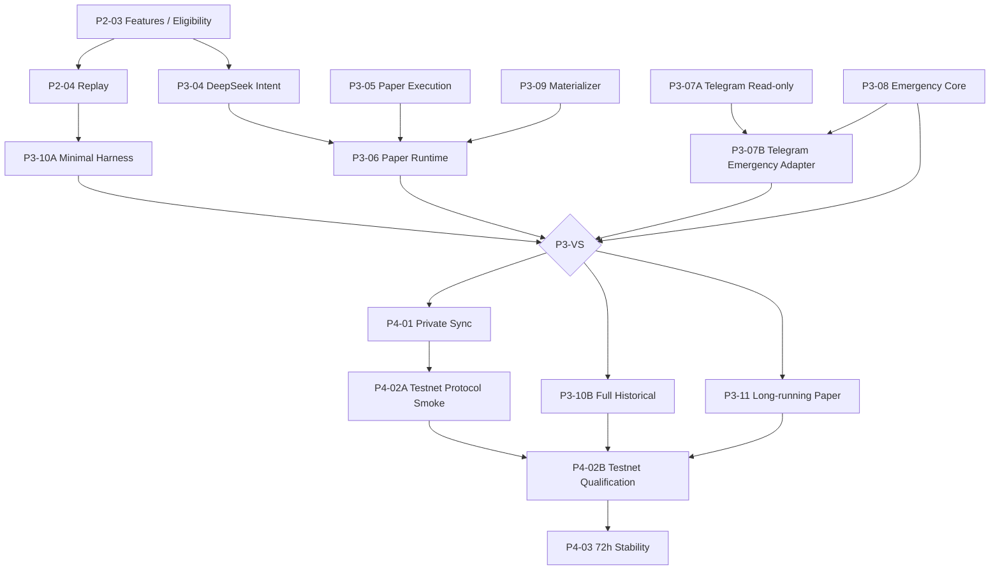

# IronPilot DEVELOPMENT_PLAN v2 审阅修订清单

> 文档状态：`REVIEW_ACTIONS`
>
> 日期：2026-07-24
>
> 适用范围：`docs/DEVELOPMENT_PLAN.md` v2.0.0
>
> 目的：在不改变现有产品方向和安全边界的前提下，进一步减少不必要的串行依赖，提前暴露真实集成问题，并收紧 Vertical Slice 的最小实现范围。

---

## 1. 总体结论

当前 `DEVELOPMENT_PLAN v2` 已经正确完成以下方向修订：

- AI 在版本化策略空间内拥有真实策略选择权。
- Eligibility / Event Prefilter 不再替 AI 决定方向和完整交易策略。
- Deterministic Strategy Materializer 只负责物化，不得替换 AI 策略。
- 完整历史策略评估不再阻塞第一个 Paper Vertical Slice。
- 新闻风控已移出当前默认链路。
- Telegram 普通用户菜单不再提供 Pause、Resume 和 Cancel All。
- 已增加早于 30 天 Paper 的 `P3-VS` 可运行原型 Gate。
- 已增加工程重量限制，防止 Vertical Slice 前建设通用平台能力。

当前计划已经可以作为开发基线。本文件不要求重写整体计划，只要求完成以下六项范围与依赖微调。

---

## 2. 修订一：P3-10A 不再阻塞 P3-06 Paper Runtime

### 2.1 当前依赖

```text
P3-10A Minimal Historical Harness
→ P3-06 AI 驱动现货 Paper Runtime
→ P3-VS
```

这仍然会导致 Paper Runtime 集成等待历史 Harness 完成。

虽然 `P3-10A` 已经被压缩为最小历史正确性工具，但它不应阻止以下模块先进行实时集成：

- DeepSeek Strategy Intent Provider；
- Strategy Materializer；
- Risk Engine；
- TradePlan；
- Paper Execution；
- 持仓复评与退出。

### 2.2 修改后的依赖

```text
P3-04 DeepSeek Strategy Intent
P3-05 Paper Execution
P3-09 Strategy Materializer
        ↓
P3-06 AI Spot Paper Runtime

P3-10A Minimal Historical Harness
        ↓
P3-VS

P3-06 AI Spot Paper Runtime
        ↓
P3-VS
```

### 2.3 具体修改

从 `P3-06` 的直接依赖中删除：

```text
P3-10A
```

保留 `P3-VS` 对 `P3-10A` 的依赖。

### 2.4 原则

- Paper Runtime 可以与 Minimal Historical Harness 并行开发。
- `P3-VS` 前两者必须都完成。
- 不降低无明显前视和可复现交易账本的 Gate。
- 不允许用实时 Paper 结果替代 P3-10A 的历史正确性证据。

---

## 3. 修订二：P3-04 不等待完整 P2-04 Replay Runner

### 3.1 当前依赖

```text
P2-03 Market Features / Eligibility Events
→ P2-04 Historical Replay
→ P3-04 DeepSeek Strategy Intent Provider
```

DeepSeek Provider 的核心开发实际需要：

- `StrategyIntent v2` 领域类型；
- `strategy-space-v1`；
- 固定 Market Feature Snapshot fixtures；
- Prompt 与 Schema；
- Serde 和语义验证器；
- TTL、预算与 usage；
- Provider contract test。

它不需要等待完整 Replay Runner 才能开始。

### 3.2 修改后的依赖

```text
P1-02 Core Domain / Strategy Intent
P2-03 Market Features / Eligibility Events
        ↓
P3-04 DeepSeek Strategy Intent Provider
```

### 3.3 具体修改

将 `P3-04` 的直接依赖从：

```text
P1-02, P2-04
```

改为：

```text
P1-02, P2-03
```

`P2-04` 继续作为 `P3-10A` 的依赖，并通过 `P3-10A` 间接进入 `P3-VS` Gate。

### 3.4 原则

- AI Provider 可以使用冻结 fixtures 开发和测试。
- 完整 Replay 仍必须在 P3-VS 前通过 P3-10A 提供历史证据。
- 不允许 Provider 自己复制 Market Feature 或 Replay 逻辑。

---

## 4. 修订三：拆分 Testnet Protocol Smoke 与 Testnet Qualification

### 4.1 当前问题

当前 `P4-02 Bybit Spot Testnet Execution` 同时依赖：

- `P4-01` 私有流与订单同步；
- `P3-10B` 完整历史策略证据；
- `P3-11` 30 天 Paper。

因此，第一次真实调用 Bybit Testnet 下单接口，要等完整回测和 30 天 Paper 全部结束。

这会延迟暴露真实协议问题：

- 签名与时间偏差；
- `orderLinkId`；
- 下单、查单、撤单字段；
- Market/Limit 语义；
- 私有 WebSocket；
- 部分成交；
- 撤单与成交竞态；
- 交易所精度和错误码；
- Emergency Close 的真实协议路径。

Testnet 没有真实资金风险，适合在 P3-VS 后尽早做极小范围协议验证。

### 4.2 新增任务：`P4-02A Testnet Protocol Smoke`

#### 目标

在不进行策略资格认证和长期稳定性测试的情况下，尽早验证 Bybit 写协议与私有状态同步。

#### 依赖

```text
P3-VS
P4-01
P3-08
```

#### 范围

- 极少量 Bybit Testnet 订单；
- Limit 下单、查询和撤单；
- 必要时验证 Market 订单基本字段；
- `orderLinkId` 幂等；
- 私有订单/成交事件；
- REST ack 与最终状态区分；
- 基础 Emergency Close；
- 服务重启后按真实 Testnet 状态对账。

#### 不属于此任务

- 72 小时稳定性；
- 策略收益验证；
- 30 天 Paper；
- 完整 A/B/C 回测；
- Testnet Release Gate；
- 真实资金授权。

#### 授权

任何 Testnet 写调用仍须执行当时获得明确授权。

### 4.3 原 `P4-02` 改为：`P4-02B Testnet Qualification`

#### 依赖

```text
P4-02A
P3-10B
P3-11
```

#### 目标

在长期 Paper 和完整历史策略证据通过后，将已验证的 Testnet 协议链进入正式资格测试。

### 4.4 修改后的路线

```text
P3-VS
→ P4-01 Private Sync
→ P4-02A Testnet Protocol Smoke

P3-VS
→ P3-10B Full Historical Evaluation
→ P3-11 Long-running Paper

P4-02A + P3-10B + P3-11
→ P4-02B Testnet Qualification
→ P4-03 72h Stability
→ P4-04 Spot MVP Gate
```

---

## 5. 修订四：Emergency Core 不依赖 Telegram

### 5.1 当前依赖风险

当前任务依赖近似为：

```text
P3-07 Telegram
→ P3-08 Emergency Close
```

这容易让实现者将 Emergency Close 设计成 Telegram 内部业务，而不是独立的安全应用能力。

紧急退出必须在以下情况下仍然可用：

- Telegram 服务不可用；
- Telegram API 故障；
- Bot Token 配置异常；
- 通知 outbox 堵塞；
- 用户需要通过本机 CLI 或 loopback 管理 API 接管。

### 5.2 正确职责

```text
EmergencyController
→ 独立领域 / 应用服务

Telegram Adapter
→ 调用 EmergencyController

Protected CLI / Loopback API
→ 调用同一个 EmergencyController
```

所有入口必须复用同一套：

- 鉴权结果；
- `EmergencyActionId`；
- 二次确认状态；
- 幂等；
- 步骤持久化；
- 中断恢复；
- 受管资产边界；
- 审计。

不得为 Telegram、CLI 或 API 各自实现不同的紧急逻辑。

### 5.3 推荐任务调整

#### `P3-07A Telegram Notification and Read-only Queries`

依赖：

```text
P1-05, P3-03
```

只负责：

- 已确认事件通知；
- 状态、仓位、TradePlan、交易和风险查询；
- outbox 与脱敏。

#### `P3-08 Emergency Core`

依赖：

```text
P3-01, P3-03, P3-05
```

负责：

- Emergency Action 领域与状态机；
- 撤冲突订单；
- 关闭受管敞口；
- 幂等与重启恢复；
- CLI / loopback port。

#### `P3-07B Telegram Emergency Adapter`

依赖：

```text
P3-07A, P3-08
```

负责：

- Telegram `Emergency Close All` 按钮；
- 用户/chat 白名单；
- nonce、TTL 和二次确认；
- 调用统一 EmergencyController；
- 展示进度和最终报告。

若不希望新增多个 Task ID，也必须至少调整为：

```text
P3-08 不依赖 P3-07
P3-07 依赖 P3-08 以暴露紧急按钮
```

---

## 6. 修订五：冻结 Vertical Slice 最小策略空间

### 6.1 当前风险

`StrategyIntent v2` 合同展示了较完整的候选空间：

- `trend_breakout`
- `trend_pullback`
- `range_reversion`
- 多种 entry policy
- 多种 stop policy
- 多种 target / trailing policy
- 分批止盈和移动止盈

Schema 可以列出未来合法枚举，但不能被解释为 P3-VS 前必须全部实现。

若 Codex 为所有策略组合同时开发、物化、测试和回测，会重新出现组合爆炸和过度工程化。

### 6.2 `strategy-space-v1-vs` 最小子集

P3-VS 前建议只实现以下可执行策略子集。

#### 新开仓

```text
action:
- OPEN_LONG
- NO_TRADE

strategy_family:
- trend_breakout

entry_policy:
- breakout_retest

entry_anchor:
- donchian_upper
- key_location

entry_confirmation:
- close_confirmed
- rejection_confirmed

stop_policy:
- structure_with_atr_buffer

stop_anchor:
- recent_swing
- key_location

buffer_tier:
- normal

target_policy:
- fixed_rr_tier
- next_structure

minimum_rr_tier:
- 2R

risk_tier:
- conservative
- normal
```

#### 持仓管理

```text
action:
- HOLD
- EXIT

review_policy:
- every_primary_close
- on_invalidation_risk
```

#### P3-VS 前暂缓

- `range_reversion`
- 多策略家族自动切换
- `partial_then_trailing`
- 多档 trailing anchor
- 复杂分批减仓
- `wide` 风险 buffer
- AI 加仓
- 亏损补仓
- 同一 TradePlan 内策略家族迁移

### 6.3 后续扩展

P3-VS 完成后，可以按独立 Strategy Space 版本逐项加入：

1. `trend_pullback`
2. trailing exit
3. partial reduce
4. range reversion

每次扩展必须增加：

- Schema 合法组合；
- Materializer；
- Risk 约束；
- Replay / Harness fixtures；
- A/B/C 分段证据。

### 6.4 原则

> Schema 可以描述未来边界，但 Vertical Slice 只实现证明产品假设所需的最小策略子集。

---

## 7. 修订六：恢复明确的 2C2G 资源预算

### 7.1 当前问题

v2 保留了 `Bounded resources` 原则，但缺少足够明确的数值边界。

2 核 CPU、2 GB RAM 不是普通部署建议，而是 IronPilot 产品原型的核心约束之一。

若不冻结基础预算，后续可能因：

- 无界队列；
- 多 Provider；
- 过多并发 Task；
- 大量历史数据驻留；
- SQLite 连接过多；
- LLM 并发和上下文过大；

导致原型无法在目标服务器稳定运行。

### 7.2 建议最小资源配置

```yaml
runtime:
  target_cpu_cores: 2
  target_memory_mb: 2048
  memory_soft_limit_mb: 1400
  max_enabled_instruments: 3
  max_active_trade_plans: 2

llm:
  max_concurrency: 1
  daily_call_limit: 40
  daily_token_limit: 200000
  daily_cost_limit_usd: "2.00"

market:
  candle_window_per_timeframe: 500
  max_timeframes_per_instrument: 2

storage:
  sqlite_max_connections: 4
  sqlite_write_concurrency: 1

queues:
  market_event_capacity_per_instrument: 1024
  critical_event_capacity: 256
```

这些是安全默认值，不是策略参数。

### 7.3 超限行为

- 超过启用标的数：启动失败。
- 超过活动 TradePlan：Risk 拒绝新开仓。
- LLM 并发超过 1：排队至 TTL，过期转 `NO_TRADE`。
- LLM 日预算耗尽：停止新 AI 开仓，已有 TradePlan 继续确定性管理。
- 内存超过软门槛：停止新 AI 调用和新开仓，进入告警/观察模式。
- 关键队列饱和：禁止静默丢失，进入降级或 halt。
- SQLite 关键写超时：不得下单。

### 7.4 Gate

P3-VS 应记录基础资源画像，但不要求 30 天稳定性数据。

P3-11 必须验证：

- 2C2G 下长期运行；
- RSS 峰值和稳态；
- CPU 均值和异常峰值；
- 队列峰值；
- 数据库日增长；
- LLM 成本和预算行为。

---

## 8. 修改后的关键依赖图



---

## 9. Codex 修改验收清单

Codex 调整 `docs/DEVELOPMENT_PLAN.md` 后，应逐项确认：

- [ ] `P3-06` 不再依赖 `P3-10A`。
- [ ] `P3-VS` 仍然依赖 `P3-10A`。
- [ ] `P3-04` 依赖 `P2-03`，不等待完整 `P2-04`。
- [ ] Testnet 拆成 Protocol Smoke 和 Qualification 两个阶段。
- [ ] Protocol Smoke 不依赖 30 天 Paper 或完整历史策略评估。
- [ ] Testnet 写操作仍需执行当时明确授权。
- [ ] EmergencyController 是独立能力，不依赖 Telegram。
- [ ] Telegram 只是 EmergencyController 的一个入口。
- [ ] P3-VS 明确冻结最小可执行 Strategy Space 子集。
- [ ] 其余策略家族与复杂退出政策不阻塞 P3-VS。
- [ ] 恢复明确的 2C2G、LLM 并发、标的数量、TradePlan、SQLite 和队列预算。
- [ ] 资源超限行为是 fail closed 或降级，不是静默扩容。
- [ ] 更新任务总表、依赖图、可提交任务和 Gate，避免章节之间出现旧依赖残留。

---

## 10. 最终原则

本修订不降低以下标准：

- AI 不能绕过 Risk Engine；
- AI 无执行权限；
- 订单、成交和受管资产必须可审计、可恢复；
- P3-VS 前必须具备最小历史正确性证据；
- 完整历史证据和长期 Paper 仍然是 Testnet Qualification 的硬 Gate；
- 真实资金仍需完全独立立项。

本修订只调整开发顺序和最小实现范围：

> **让实时集成、历史正确性、Testnet 协议验证尽早并行暴露问题，同时把完整策略研究和长期稳定性保留为后续严格 Gate。**

最终目标不是减少安全，而是减少等待：

> **先用最小策略空间跑通真正的 IronPilot，再逐层增加策略、证据和交易所资格验证。**
